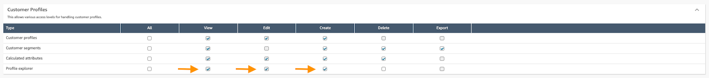
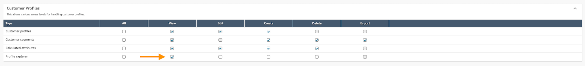

# Enable Profile explorer

The following steps will allow you to enable Profile explorer for your administrators
and users. This process involves setting up permissions for both layout configuration
and viewing access.

###### Contents

- [Enable administrators to
  define a layout](#enable-administrators-define-layout "#enable-administrators-define-layout")
- [Enable users to view Profile
  Explorer](#enable-users-view-profile-explorer "#enable-users-view-profile-explorer")
- [Verify Setup](#verify-setup "#verify-setup")

## Enable administrators to

define a layout

Administrators need specific permissions to create and edit Profile explorer
layouts:

- Assign the following permissions within the Profile explorer Security
  profile:
  - **Profile explorer - Edit**: Allows modification
    of existing Profile explorer layout.
  - **Profile explorer - Create**: Enables creation
    of the Profile explorer layout.
  - **Profile explorer - View**: Enables access to
    view configured Profile explorer layout.

## Enable users to view Profile

Explorer

Users need appropriate permissions to access and interact with Profile explorer
layout:

- Assign the following permissions within the Profile explorer Security
  profile:
  - **Profile explorer - View**: Enables access to
    view configured Profile explorer layout.

## Verify Setup

To confirm that Profile explorer can be successfully enabled:

Log in as an administrator to verify you can:

- Access the Profile explorer page.
- Create and modify your Profile explorer layout.

Log in as a regular user to verify you can:

- Access Profile explorer.
- View the Profile explorer layout.
- Interact with enabled features.
