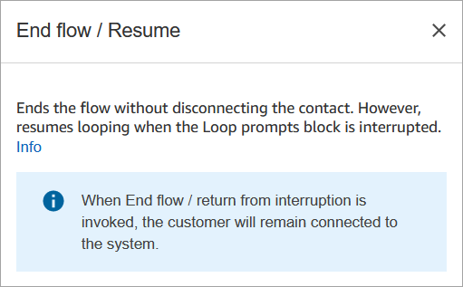
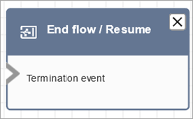

# Flow block in Amazon Connect: End flow / Resume

## Description

###### Important

The End flow / Resume block is a terminal flow block. It enables you to end a
paused flow and return the contact without terminating the overall interaction.
However, if you place the **End flow / Resume** block in an
inbound flow or disconnect flow, it functions identically to the
**Disconnect** block, and terminates the contact.

- Ends the current flow without disconnecting the contact.
- This block is often used for the **Success**
  branch of the **Transfer to queue** block. The flow doesn't
  end until the call is picked up by an agent.
- You also might use this block when a **Loop
  prompts** block is interrupted. You can return the customer to the
  **Loop prompts** block.
- You can also use this block to end a Paused flow and return the contact
  without terminating the overall interaction. For example, it's useful in
  flows where you are [pausing
  and resuming tasks](concepts-pause-and-resume-tasks.md "concepts-pause-and-resume-tasks.md").

## Supported channels

The following table lists how this block routes a contact who is using the
specified channel.

| Channel | Supported? |
| ------- | ---------- | --------------------------------------------------------------------------------------------------------------------------------------------------------------------------------------------------------------------------------------------------------------------------------------------------------------------------------------------------------------------------------------------------------------------------------------------------------------------------------------------------------------------------------------------------------------------------------------------------------------------------------------------------------------------------------------- |
| Voice   | Yes        |
| Chat    | Yes        |
| Task    | Yes        |
| Email   | Yes        | ## Flow types ###### Important If you place the **End flow / Resume** block in an inbound flow or disconnect flow, it functions identically to the **Disconnect** block, and terminates the contact.  • All flows ## Properties The following image shows the **Properties** page of the **End flow / Resume** block.  ## Configured block The following image shows an example of what this block looks like when it is configured. It does not have any The End flow / Resume termination event branches.  |
