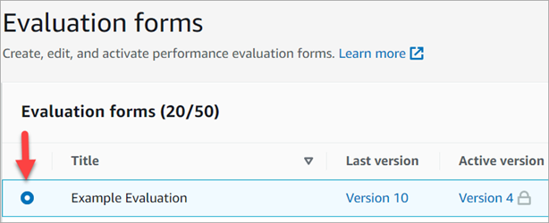
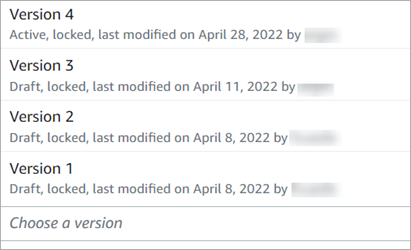

# View an evaluation form audit trail in

Amazon Connect

1. Select the evaluation form that you want to research.

 2. At the bottom of the page, under **Example Evaluation**, use
the dropdown menu to view previous versions, who accessed them, and when. The
following image shows an example audit trail.

 3. Optionally, choose one of the forms to open it.

## What do Active, Draft, and

Locked mean?

An form is in one of the following states:

- **Active**. A published version of the form that is
  available to evaluators.
- **Draft**. An inactive, locked version of the form. A
  draft is unlocked only when you are working on it.
- **Locked**. An evaluation form is locked when you
  activate or publish it. Even after you deactivate the form, it stays locked,
  and becomes a historical version of the form. However, you can activate the
  historical version to save it as new version.
