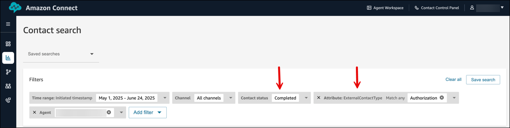
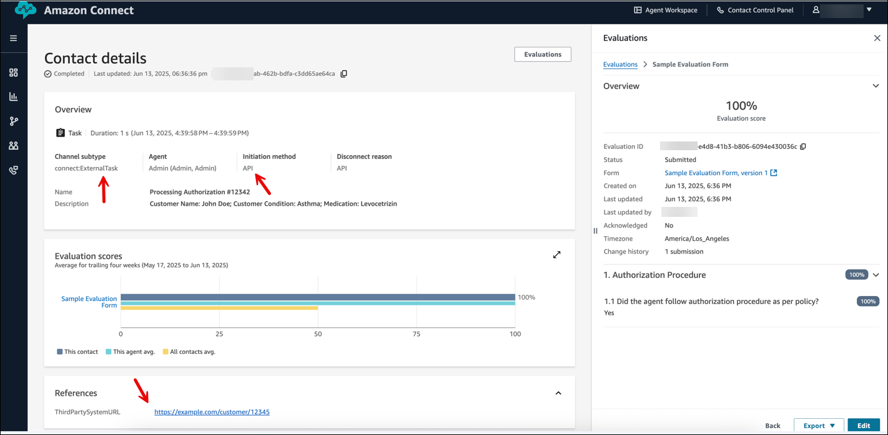

# Ingest agent activities from

third-party applications to evaluate agent performance

You can import agent activities completed in third-party applications into Amazon Connect.
These activities are imported as Amazon Connect tasks, which you can evaluate alongside work
completed in Amazon Connect. This provides managers with a unified application for quality
management.

To import activities completed in third-party applications (such as application
processing or social media interactions) as completed tasks, use the [CreateContact](../APIReference/API_CreateContact.md "../APIReference/API_CreateContact.md") API. When you import these activities, you can capture
details relevant for performance evaluation as task attributes. Unlike tasks created in
the Amazon Connect admin website, these imported tasks are already marked as completed and don't need to be
accepted by the agent who completed the activity in the external application.

Managers can then evaluate these external activities alongside native Amazon Connect
interactions and back-office tasks. This gives managers a unified view of agent
performance in the [Agent performance evaluations
dashboard](agent-performance-evaluation-dashboard.md "agent-performance-evaluation-dashboard.md").

## How to ingest activities from third-party

applications

The following steps are typically performed by an IT admin.

- Ensure that agents or back-office workers who you want to evaluate are
  users on Amazon Connect. To add new users, see [Add users to Amazon Connect](user-management.md "user-management.md").
- Use the [CreateContact](../APIReference/API_CreateContact.md "../APIReference/API_CreateContact.md") API to ingest all external activities completed
  by these agents into Amazon Connect as completed Amazon Connect tasks.

You can ingest:

    + All activities completed in third-party applications (for example,
     triggered by the completion of these activities). This provides you
     with a comprehensive view of agent activities in a single
     application.
    + A percentage of agents' external activities as a sample that you
     use for performance evaluation.

Following is a sample API request for ingesting a claims authorization
activity that was completed in another system.

```
awscurl \
--service connect \
-X PUT \
'https://connect.us-east-1.amazonaws.com/Prod/contact/create-contact' \
--region us-east-1 \
-d \
'{
  "Channel":"TASK",
  "InstanceId":"8f3b9ab3-df68-4124-8573-2626b5c939ac",
  "InitiationMethod":"API",
  "InitiateAs":"COMPLETED",
  "UserInfo": {"UserId": "arn:aws:connect:us-west-2:295154396770:instance/8f3b9ab3-df68-4124-8573-2626b5c939ac/agent/1c99b776-8e56-4aaa-a1bf-b950ffbe61e4"},
  "Name": "Processing Authorization #12345",
  "Description": "Customer Name: John Doe; Customer Condition: Asthma; Medication: Levocetrizin",
  "Attributes": {
    "Authorization": "12345",
    "ExternalContactType": "Authorization"
  },
  "References": {
    "ThirdPartySystemURL": {
      "Type": "URL",
      "Value": "https://example.com/customer/12345"
    }
  }
}'
```

- You can add additional activity information within attributes. This
  information may be useful for quality managers who are searching and
  evaluating contacts. For example, the previous API call includes the a
  custom attribute called `ExternalContactType`. It enables
  managers to distinguish between different types of external activities
  within Contact search.

You can also add links to the third-party system within contact
references. These links enable managers to reference additional information
that's not included with the task.

- To enable managers to search for activities using these attributes, you
  need to enable search on these attributes. For more information, see [Search for contacts in Amazon Connect by using custom
  contact attributes or contact segment attributes](search-custom-attributes.md "search-custom-attributes.md").

###### Note

Only tasks that are created after this setting is configured are
searchable using these attributes.

## How to evaluate external activities

The following steps are typically performed by managers.

Managers can evaluate ingested activities in Amazon Connect the same way that they
evaluate native Amazon Connect contacts. For more information, see [Evaluate performance](evaluations.md "evaluations.md").

If your admin has configured search on custom contact attributes, you can search
for external activities with identifiers, such as the type of activity and ID.

The following image shows a search for `Completed` contacts, with
`Attribute` = `ExternalContactType`.



The following image shows an example of what contact details look like for a
completed external contact. In this image:

- Channel subtype = connect:ExternalTask
- Initiation method = API
- References includes the URL to the third-party system


