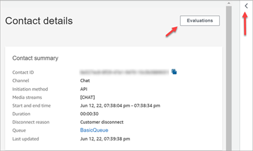
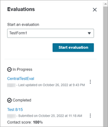
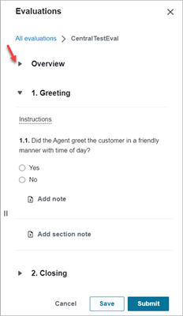
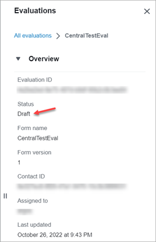
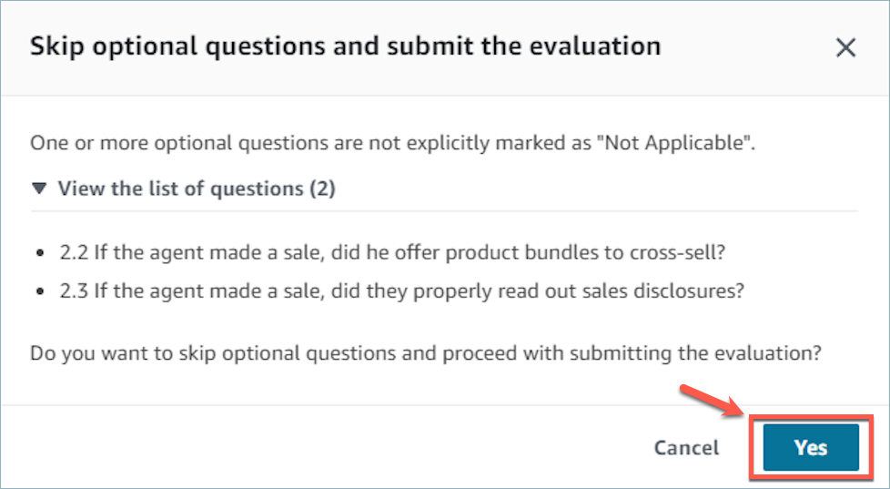

# Evaluate agent and self-service interaction performance in Connect Customer

###### Tip

**New user?** Check out the [Connect Customer
Contact Lens Workshop](https://catalog.workshops.aws/amazon-connect-contact-lens/en-US "https://catalog.workshops.aws/amazon-connect-contact-lens/en-US"). This online course includes guidance on
creating evaluation forms.

**IT administrators**: To enable Connect Customer evaluation
capabilities, go to the Connect Customer console, choose your instance alias, choose
**Data storage**, **Content evaluations**,
**Edit**. You'll be prompted to create or choose an S3 bucket.
After the bucket is created, you can store evaluations and export them.

Connect Customer performance evaluations enables you to define custom performance evaluation criteria
to assess, monitor and improve how agents and automated systems (bots, AI agents)
interact with customers and resolve issues. You can then monitor performance by reviewing
aggregated insights in dashboards, and drill-down into individual contacts where you can see
evaluations alongside recordings, transcript, conversation summaries and analytics in a single
view. With integrated coaching, you can provide feedback to agents highlighting their strengths
and opportunities to improve.

You can perform manual evaluations for all contact types (voice, chat, email, and task). You can perform automated interactions for voice and chat contacts analyzed by Connect Customer conversational analytics. You can perform automated evaluations of both agent interactions and automated interactions (handled by bots or AI agents). For more details on automated evaluations, see [Step 6: Enable automated evaluations](create-evaluation-forms.md#step-automate "create-evaluation-forms.md#step-automate").

To perform manual evaluations, you can search for a contact, choose the appropriate evaluation form, review the contact audio, screen recording or transcript, and then evaluate how the human, AI agent, or bot interacted with the customer. You can then use those insights to improve the customer experience by providing agent coaching feedback and optimizing bots, AI agents and self-service workflows.

###### To evaluate performance

1. Log in to Connect Customer with a user account that has [permissions to perform
   evaluations](evaluation-and-coaching-permissions.md "evaluation-and-coaching-permissions.md").
2. Access the contact that you want to evaluate. There are a few ways you can do
   this. For example, someone might have shared the contact URL with you, or assigned you
   a task that has the URL. Or, you might have the contact ID, which lets you search for
   the contact record by doing the following: on the navigation pane, choose
   **Analytics and optimization**, **Contact
   search**, and then search for the contact that you want to
   evaluate.
3. On the **Contact details** page, choose
   **Evaluations** or the **<** icon.

 4. The **Evaluations** panel lists any evaluations that are in
progress or completed for the contact.

 5. To start an evaluation, choose an evaluation form from the dropdown menu, and then
choose **Start evaluation**. If you have not set up an
evaluation form yet, then you will need to do so beforehand. For more information, see [Create an evaluation
form](create-evaluation-forms.md "create-evaluation-forms.md"). 6. To navigate an especially long evaluation form, use the arrows next to each
section to collapse or expand it.

 7. Choose **Save** to save a form in progress. The status of the
form becomes **Draft**. You can return to it any time to continue,
or you can delete it and start over.

 8. When you're done, choose **Submit**. If you have skipped optional
questions in the form, you will see a warning asking you to confirm that you want to
submit the evaluation. Choose **Yes**. The evaluation is now
**Completed**.

