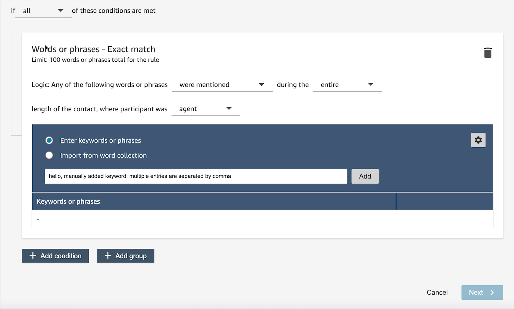
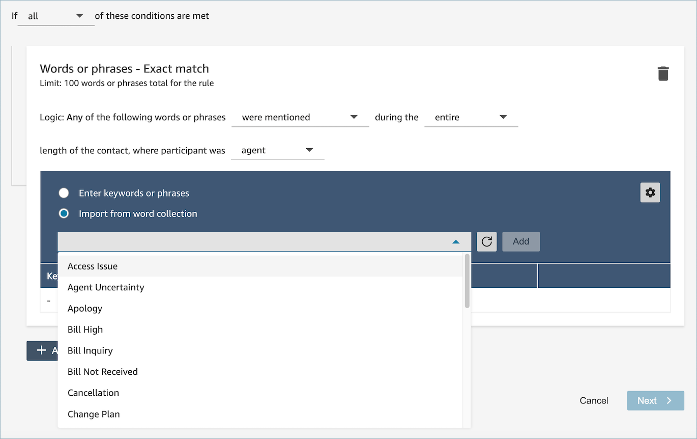

# Use a Word or phrase

condition in a Contact Lens rule

Within Contact Lens
**conversational analytics** rule, you have the option to
specify a Words or phrases condition. You can choose Exact Match, Semantic
Match, or Pattern Match for the words or phrases. This topic explains each type
of match.

###### Note

All three match types are not case sensitive, for example, if you have
specified the word as "billing", it will also match with the transcript
containing the word "Billing".

## How to use exact match

**Exact Match** is an exact word match, which can be
either singular or plural.

You can add the keywords or phrases by using either of the following
methods:

- Selecting **Enter keywords or phrases** and
  entering values manually in the text box. Multiple values can be
  separated by a comma.

- Selecting **Import from word collection** to
  import pre-defined words and phrases from word collections.

Word collections can be categorized into two types: user word collections
and system word collections. System word collections are pre-defined by
Amazon Connect, which are non-editable to users. A user word collection can be
created, read, updated, and deleted (CRUD) by users. For more information,
see [Manage word collections when you
create conversational analytics rules in Contact Lens](manage-word-collections.md "manage-word-collections.md").

## How to use pattern match

If you want to match related words, append an asterisk (\*) to the
criteria. For example, if you want to match on all variations of "neighbor"
(neighbors, neighborhood) you would type
**neighbo\***.

With **Pattern Match** you can specify the
following:

- **List of values**: This is useful when you want
  to build expressions with interchangeable values. For example, the
  expression might be:

_I'm calling about a power outage in ["Beijing" or
"London" or "New York" or "Paris" or "Tokyo"]_

Then in your list of values you would add the cities: Beijing,
London, New York, Paris, Tokyo.

The advantage of using values is that you can create one
expression, instead of multiple. This reduces the number of cards
that you need to create.

- **Number**: This option is used most frequently
  in compliance scripts, or if you're looking for a context when you
  know somewhere in between there's a number (in digits [0-9]). This
  way you can put all of your criteria into one expression instead of
  two. For example, an agent compliance script might say:

_I have been in this industry for [num] years and would
like to discuss this topic with you._

Or a customer might say:

_I have been a member for [num] years._

###### Note

    + When extracting numbers from chat or audio
     transcripts, only numerical digits (0-9) are
     recognized.
    + For voice contacts, certain languages may not convert
     spoken numbers into digital format during [number
     transcription](../../../transcribe/latest/dg/how-numbers.md "../../../transcribe/latest/dg/how-numbers.md"). This means number pattern
     matching might not work in these cases. For a list of
     which languages support number transcription, see [Supported languages and language-specific
     features](../../../transcribe/latest/dg/supported-languages.md "../../../transcribe/latest/dg/supported-languages.md") in the *Amazon Transcribe Developer
     Guide*.

- **Proximity definition**: Finds matches that may
  be less than 100 percent exact. You can also specify the distance
  between words. For example, if you are looking for contacts where
  the word "credit" was mentioned but you do not want to see any
  mention of the words "credit card," you can define a pattern
  matching category to look for the word "credit" that is not within a
  one-word distance of "card."

For example, a proximity definition might be:

_credit [is not within 1 word from]
card_

###### Tip

For a list of languages supported by pattern match, see [AI features](supported-languages.md#supported-languages-contact-lens "supported-languages.md#supported-languages-contact-lens").

## How to use semantic match

Semantic matching is supported only for post-call/chat analysis.

- An "intent" is an example of utterance. It can be a phrase or a
  sentence.
- You can enter up to four intents in one card (group).
- We recommend using semantically similar intents within one card to
  get the best results. For example, there's category for
  "politeness." It includes two intents: "greetings" and "goodbye". We
  recommend separating these intents into two cards:

      + Card 1: "How are you today" and "How’s everything going".
       They are semantically similar greetings.
      + Card 2: "Thanks for contacting us" and "Thank you for
       being our customer." They are semantically similar
       goodbyes.

  Separating the intents into two cards provides more accuracy than
  putting them all into one card.
