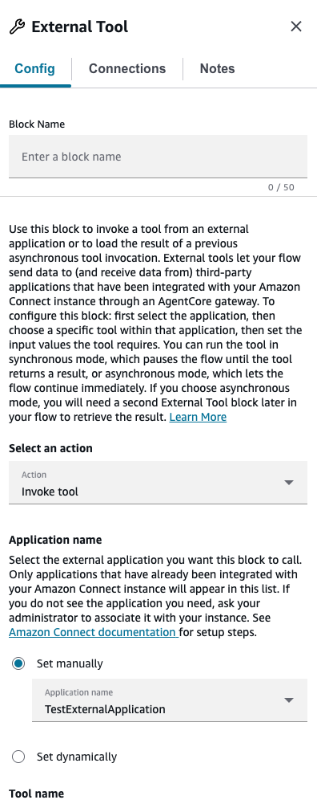
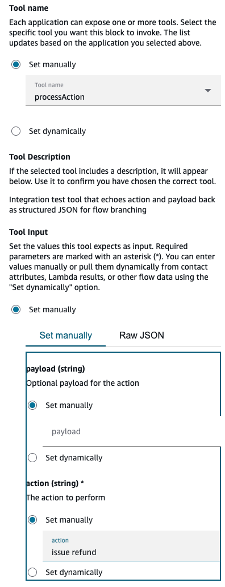
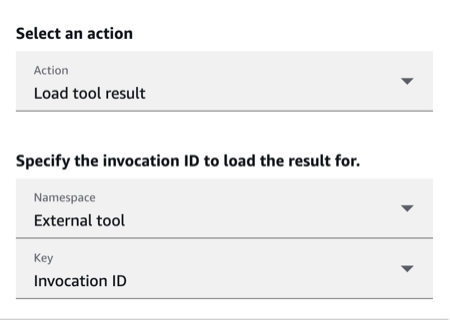
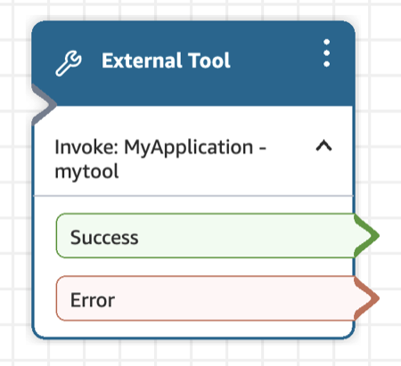

# Flow block in Connect Customer: External Tool

This topic defines the flow block for invoking a tool from an external application
directly from a flow.

###### Note

The **External Tool** block is only available in [Amazon
Connect Customer](enable-nextgeneration-amazonconnect.md "enable-nextgeneration-amazonconnect.md") instances, and only in certain Regions. For the list of
Regions, see [External Tool](regions.md#externaltool_region "regions.md#externaltool_region").

## Description

- Invokes a tool from an external application, such as Salesforce or
  ServiceNow, that is integrated with your Connect Customer instance through an Amazon
  Bedrock AgentCore gateway. Your flow can send data to and read data from
  third-party applications without maintaining custom Lambda functions.
- Runs a tool synchronously, where the flow pauses until the tool returns,
  or asynchronously, where the flow continues. For an asynchronous invocation,
  add a second **External Tool** block set to **Load
  tool result** to retrieve the result.
- Stores the result in the `$.ExternalTool` namespace.

## Supported channels

The following table lists how this block routes a contact who is using the
specified channel.

| Channel | Supported? |
| ------- | ---------- |
| Voice   | Yes        |
| Chat    | Yes        |
| Task    | Yes        |
| Email   | Yes        |

## Flow types

You can use this block in the following [flow
types](create-contact-flow.md#contact-flow-types "create-contact-flow.md#contact-flow-types"):

- All flows

## Prerequisites and dependencies

Before you can use this block, you must [integrate an external application with your Connect Customer instance as an MCP
server](3p-apps-mcp-server.md#3p-apps-mcp-server-how-to-integrate "3p-apps-mcp-server.md#3p-apps-mcp-server-how-to-integrate"). To set up the integration:

1. Open the Connect Customer console.
2. Add a new integration and select **MCP server** as the
   integration type.
3. Select a Bedrock AgentCore gateway to connect with your instance. If no
   gateway exists, [create one in Bedrock AgentCore](3p-apps-mcp-server.md#3p-apps-mcp-server-how-to-integrate "3p-apps-mcp-server.md#3p-apps-mcp-server-how-to-integrate") first.
4. In the gateway's inbound identity configuration, add the gateway ID to the
   **Allowed audiences** field. The gateway ID is required
   for tool invocations to succeed.
5. Associate your Connect Customer instance with the integration by selecting the
   instance that is configured with the gateway's Discovery URL.

After the integration is complete, the application appears in the
**External Tool** block and can be selected by name.

## Properties

The block supports the following actions. Select an action using **Select
an action**. The default is **Invoke tool**.

### Invoke tool

The following images show the Invoke tool action configuration in the External Tool block properties.

- **Application name** (required): The external application
  to call. You can set this manually or dynamically. Only applications
  associated with your instance appear.
- **Tool name** (required): The tool to invoke within the
  application. You can set this manually or dynamically; the manual list
  updates by application. Input fields are generated from the tool schema, and
  tool inputs can be provided manually, dynamically, or as raw JSON.
- **Execution mode**:

  - **Synchronous**: The contact is routed to the
    next block only after the External Tool invocation completes.
  - **Asynchronous**: The contact is routed to the
    next block without waiting for the External Tool invocation to
    complete. You can configure a [Wait](wait.md "wait.md") block to wait for an External Tool
    that is invoked in asynchronous execution mode.

- **Timeout**: How long to wait before the External Tool
  invocation times out. The maximum is 8 seconds for **Synchronous**
  mode and 60 seconds for **Asynchronous** mode.

  - If an External Tool invocation is throttled, or a general service
    failure (500 error) occurs, the request is retried.
  - When an External Tool invocation returns an error, Connect Customer retries
    up to three times, up to the specified timeout. At that point, the
    contact is routed down the **Error** branch.

- Branches: **Success** and
  **Error**.

### Load tool result

The following image shows the Load tool result action configuration in the External Tool block properties.

- **External tool invocation ID**: The invocation ID of the
  External Tool that was run in **Asynchronous** mode.
  `$.ExternalTool.InvocationId` contains the invocation ID of
  the most recent asynchronously run External Tool.
- For the **Load tool result** action, set
  **Namespace** = `ExternalTool` and
  **Key** = **Invocation ID**.
- Branches: **Success**, **In
  progress**, and **Error**.

## Namespace

The **External Tool** block writes results to the following namespace paths:

- `$.ExternalTool.InvocationId` – the current invocation
  ID.
- `$.ExternalTool.ResultData` – the tool result (up to 32
  KB).

Each new invocation overwrites the previous `$.ExternalTool` result. To
keep a result, copy it to a contact attribute (`$.Attributes.*`) or flow
attribute (`$.FlowAttribute.*`) before invoking another tool.

## Configuration tips

- **Application name** and **Tool name**
  can be set dynamically as well as manually.
- Synchronous results are capped at 32 KB. Larger responses take the
  **Error** branch.

## Example

An outbound campaign tailors its message to each customer's spend tier. After
integrating Amazon Bedrock AgentCore and a third-party integration that exposes each
account's spend tier, the flow uses an **External Tool** block to
read the tier from the third-party application, and then branches to the matching
message.

## Configured

After you configure the block, it shows the **Success** and
**Error** branches. For a **Load tool result**
action, it also shows the **In progress** branch.

