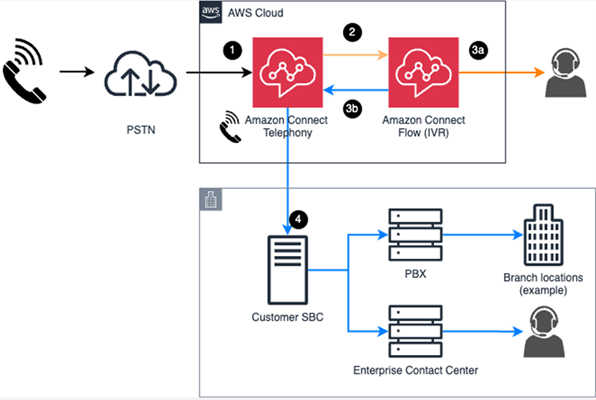

# Set up Amazon Connect external voice transfer to an

on-premise voice system

Migrating a contact center from on-premise to the cloud can be complicated. It requires
moving many different components such as telephony, IVR, ACD, call recording, call
analytics, and more. To accelerate your migration to Amazon Connect you can use Amazon Connect external voice
transfer. It enables you to take an IVR first Amazon Connect migration approach.

You can integrate Amazon Connect with other voice systems to directly transfer voice calls and call
metadata without using the PSTN. The call metadata includes rich context—such as
callers phone number and their authentication status—that is captured by using the
IVR. You can use the metadata to intelligently route the call to the right place in your
external voice system. This enables you to easily migrate your contact center to
Amazon Connect:

- You start with using Amazon Connect telephony and IVR with your existing voice systems for
  immediate modernization, to help improve your customers' experience and reduce
  costs. For example:
  - You can create a generative AI powered voice bot, analyze the performance,
    and quickly innovate to improve your customer's experience.

- At a later date, you can move your agents to Amazon Connect.
  The following diagram shows the flow of voice call audio when it is received and serviced
  by Amazon Connect telephony and IVR.

- If the call is not contained within the IVR, it can go to an agent hosted by
  Amazon Connect or transferred from Amazon Connect to your on-premise voice system. This requires voice
  to be transferred by using the external voice transfer connector.
- After the call is transferred, the on-premise call flow continues to operate the
  way it is configured with your existing agents.

1. A call through PSTN lands on Amazon Connect telephony
2. The call is sent to the Amazon Connect IVR for call orchestration and IVR.
3. The call can be routed using one of the following options:
   1. Routed to an agent hosted in Amazon Connect.
   2. Routed off platform. The Amazon Connect IVR is no longer used.

4. The call is delivered to your SBC. The Amazon Connect telephony service still in the path
   of the call.

## Why not use transfer to phone number

over PSTN?

You can choose to transfer the voice calls to phone numbers over PSTN. However,
contextual information about the caller, such as their phone number, the queue they are
in, if they have been authenticated, etc., is not preserved as these calls traverse
across PSTN.

Following table lists the differences between using transfer to phone number or
external voice transfer.

|              | Transfer to phone number                 | Transfer to external voice systems                                                                                                                                                                                                                            |
| ------------ | ---------------------------------------- | ------------------------------------------------------------------------------------------------------------------------------------------------------------------------------------------------------------------------------------------------------------- | ------------------------------------------------------------------------------------------------------------------------------------------------------------------------------------------------------------------------------------------------------------------------------------------------------------------------------------------------------------------------------------------------------------------------------------------------------------------------------------------------------------------------------------------------------------------------------------------------------------------------------------------------------------------------------------------------------------------------------------------------------------------------------------------------------------------------------------------------------------------------------------------------------------------------------------------------------------------------------------------------------------------------------------------------------------------------------------------------------------------------------------------------------------------------------------------------------------------------------------------------------------------------------------------------------------------------------------------------------------------------------------------------------------------------------------------------------------------------------------------------------------------------------------------------------------------------------------------------------------------------------------------------------------------------------------------------------------------------------------------------------------------------------------------------------------------------------------------------------------------------------------------------- |
| Destination  | A phone number                           | A pre-configured connector                                                                                                                                                                                                                                    |
| Metadata     | Cannot be transferred                    | Can be transferred                                                                                                                                                                                                                                            |
| Connectivity | Uses the public telephone network (PSTN) | Does not use the public telephone network (PSTN)                                                                                                                                                                                                              |
| Billing      | Voice usage costs apply during transfer  | Voice usage costs do not apply after the call is transferred if: 1. The call is not being recorded. 2. The [Transfer to phone number](transfer-to-phone-number.md "transfer-to-phone-number.md") block is NOT configured to **Resume flow after disconnect**. | ## Requirements Before you start setting up external voice transfer, check that your Amazon Connect and on-premise systems meet the following requirements:  • Verify your Amazon Connect instance is created in a [supported AWS Region](regions.md#external-voice-transfer-region "regions.md#external-voice-transfer-region") for external voice integration.  • Make sure your on-premise voice system can connect to the Region. ## Set up steps Following is a summary of the steps you'll take to set up external voice transfer for Amazon Connect The linked topics provide more detail. 1. [Create an Amazon Connect instance](amazon-connect-instances.md "amazon-connect-instances.md") if you don't already have one.  • Claim a phone number from Amazon Connect or port an existing number. 2. [Request service quota increases](../../../servicequotas/latest/userguide/request-quota-increase.md "../../../servicequotas/latest/userguide/request-quota-increase.md") for **External voice transfer connectors per account**. ###### Important After your service quotas are requested and approved, **External voice connectors** is displayed in the Amazon Connect console and the Amazon Connect admin website. 3. [Create external voice transfer connectors](setup-external-voice-transfer.md "setup-external-voice-transfer.md") in the Amazon Connect console. 4. [Configure your external on-premise voice system](configure-external-voice-system1.md "configure-external-voice-system1.md"). 5. [Configure a Transfer flow block to route calls from Amazon Connect to your external enterprise voice system](configure-external-voice-system-flow1.md "configure-external-voice-system-flow1.md"). 6. Optionally, [Set up Amazon Connect Global Resiliency for external voice transfer](acgr-external-voice-transfer.md "acgr-external-voice-transfer.md"). |
