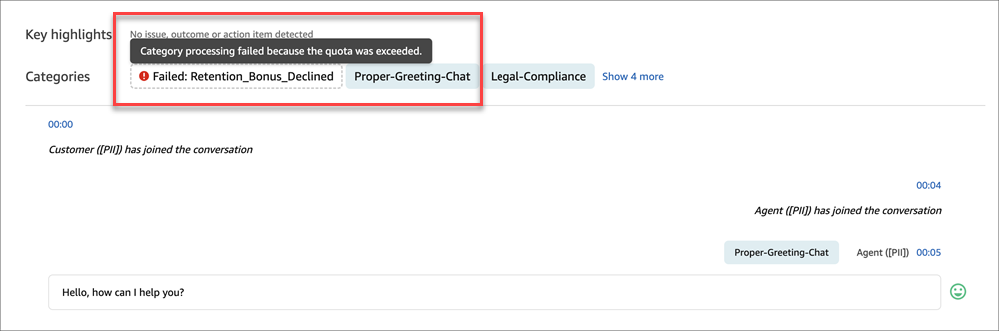

# When a rule or category fails to be

evaluated by Amazon Connect Contact Lens

When Amazon Connect Contact Lens evaluates a rule or category during a
post-contact analysis for a voice or chat contact, it is possible that the rule
or category fails to evaluate.

Following are the possible category outcomes when a rule or category is
evaluated during contact analysis:

1. **Successfully matched and applied to the
   contact**. When categories are displayed on the
   **Contact details** page, it indicates they were
   successfully matched and applied to the contact.
2. **Successfully evaluated and but they don't apply
   to the contact**. When categories are absent from the
   **Contact details** page, it indicates they don't
   apply to the contact but were successfully evaluated by
   Contact Lens rules.
3. **The contact analysis was completed but a
   specific category was not evaluated**. When a category
   fails to be evaluated, it doesn't mean the category doesn't apply to the
   contact (based on its criteria), but rather that Contact Lens
   completed the contact analysis without evaluating this specific
   category.
   The following image shows that failed categories are denoted with their dashed
   borders, transparent backgrounds, error icons, and failed prefixes. When you
   hover over a failed category, details about why the category failed to evaluate
   are displayed.


These failed categories only exist from rules with the semantic match
condition. The two possible reasons are:

1. **Quota exceeded**: Your Gen AI actions
   limit was exceeded for that time span. You can request a quota increase
   through AWS Support.
2. **Failed safety guidelines**: Category
   processing failed because it did not satisfy security and quality
   guardrails.
   We recommend adding more conditions to your semantic match rules to narrow
   down the number of contacts it may apply to. This will help avoid quota exceeded
   failures.

## Contact Lens

post-contact analysis output customer S3 file

Failed categories appear in the analysis file under JobDetails > Skipped
Analysis.

The `SkippedAnalysis` section shows contact analysis that was
marked as 'Skipped', even though the analysis was completed for that
contact. It contains the properties "Feature" and "ReasonCode".
`POST_CONTACT_SUMMARY` is one of the existing
features.

`CATEGORIZATION` is added as a new feature to skipped analysis.
There is one unique categorization element in the
`SkippedAnalysis` array for each unique
`ReasonCode` that resulted in failed categorization. A new
`SkippedEntities` property is introduced for each unique
element, containing a list of all category names (and their associated rule
IDs) that failed due to the associated reason code.

Following is an example of failed categories within
`JobDetails`:

```
"JobDetails": {
    "SkippedAnalysis": [
        {
            "Feature": "CATEGORIZATION",
            "ReasonCode": "QUOTA_EXCEEDED",
            "SkippedEntities": [
                {
                    "CategoryName": "PotentialFraud"
                    "RuleId": "a1130485-9529-4249-a1d4-5738b4883748"
                },
                {
                    "CategoryName": "Refund"
                    "RuleId": "bbbbbbb-9529-4249-a1d4-5738b4883748"
                }
            ]
        },
        {
            "Feature": "CATEGORIZATION",
            "ReasonCode": "FAILED_SAFETY_GUIDELINES",
            "SkippedEntities": [
                {
                    "CategoryName": "ManagerEscalation"
                    "RuleId": "cccccccc-9529-4249-a1d4-5738b4883748"
                },
            ]
        },
        {
            "Feature": "POST_CONTACT_SUMMARY",
            "ReasonCode": "INSUFFICIENT_CONVERSATION_CONTENT"
        }
    ]
},
```

For more information, see [Example Contact Lens
conversational analytics output files for a call](contact-lens-example-output-files.md "contact-lens-example-output-files.md").
