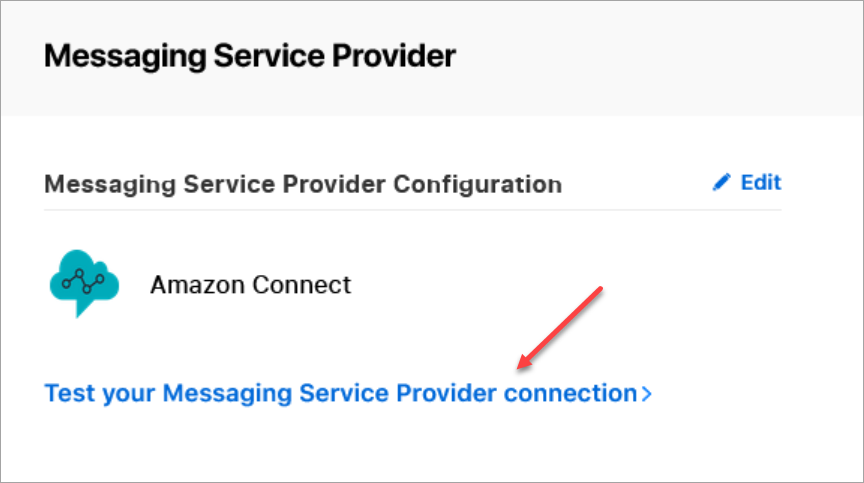
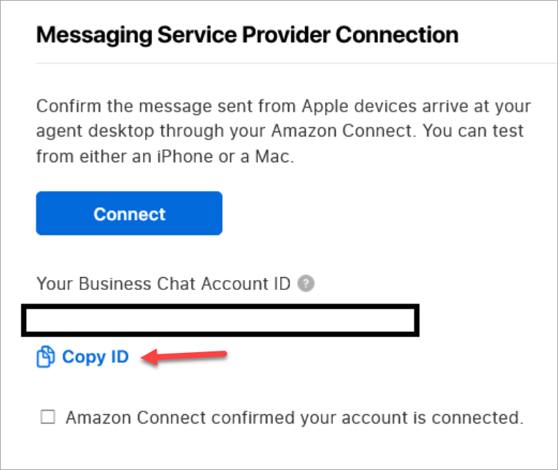

# Find your Apple Messages for Business Account ID for your integration with Connect Customer

1. In [Apple Business Register](https://register.apple.com/ "https://register.apple.com/"),
   navigate to **Message Service Provider** and choose or tap
   **Test your Messaging Service Provider connection**.

 2. Choose or tap **Copy ID**.

