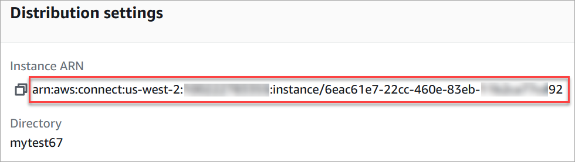
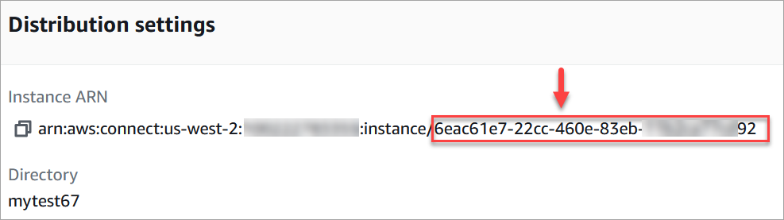
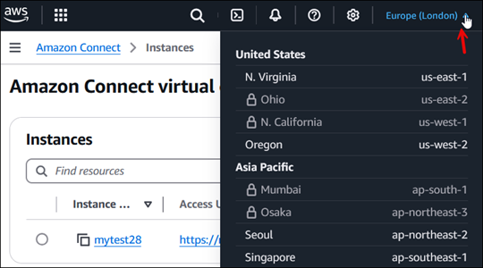

# Find your Amazon Connect instance ID or ARN

When you open a support ticket, you may be asked to provide your Amazon Connect instance ID
(also called the ARN). Use the following steps to find it.

1. Open the Amazon Connect console at
   [https://console.aws.amazon.com/connect/](https://console.aws.amazon.com/connect/ "https://console.aws.amazon.com/connect/").
2. On the instances page, choose the instance alias. The instance alias is also
   your **instance name**, which appears in your Amazon Connect
   URL. The following image shows the **Amazon Connect virtual contact center instances** page, with a box
   around the instance alias.

On the **Account overview** page, in the
**Distribution settings** section, you can see the full
instance ARN.

The information after **instance/** is the instance ID.

If you don't see your instance listed, double-check that you're looking in the correct
Region, as shown in the following image. For a list of supported Regions, see [Amazon Connect availability by Region](regions.md#amazonconnect_region "regions.md#amazonconnect_region").

