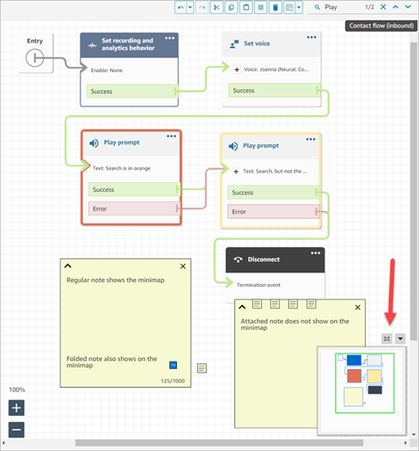

# Use the mini-map in Amazon Connect to navigate a flow

In the lower left corner of the flow designer, there's a miniaturize view of the
entire flow. Use this view to help you easily navigate the flow. The drag-to-move
mini-map has visual highlights that enable you to quickly move to any point in the
flow.

The following image shows the location of the mini-map in the flow designer. The arrow
points to the toggle that you use to hide or show the mini-map.

The following GIF shows an example of how you can use the mini-map to navigate a large
flow. Click or tap the mini-map to move the view to the desired location on the flow
designer.

Note the following functionality:

- It shows your current view in green outline.
- It highlights selected blocks in blue, notes in yellow, search results in
  orange, and termination blocks in black.
- It allows continuous movement of the view when you drag on the
  mini-map.
- It returns the view to the **Entry** block and trims unused
  space when you choose **Reset**.
