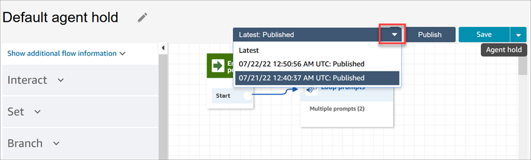
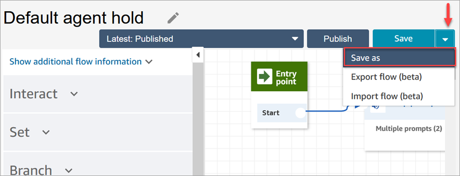

# Flow version control: Roll back a flow

## View a previous version of a

flow

This procedure is especially useful if you want to research how a flow has been
changed over time.

1. In the flow designer, open the flow you want to view.
2. Choose the **Latest: Published** dropdown to view a list
   of previously published versions of the flow.

For default flows that are provided with your Amazon Connect instance, the oldest
flow in the list is the original version. The date matches when your Amazon Connect
instance was created. For example, in the following image, the original
default flow is dated 07/21/22.

###### Note

For users with tag-based access controls configured on their security
profile, the dropdown will be restricted to **Latest:
Published** and **Latest: Saved**
versions. To learn more about tag-based access controls in Amazon Connect, see
[Apply tag-based access control in
Amazon Connect](tag-based-access-control.md "tag-based-access-control.md"). 3. Choose the version of the flow to open and view it. You can view all the
blocks and how they are configured. 4. Next, you can do one of the following:

    * To return to the most recently published version, choose it from
     the **Latest: Published** dropdown list.
    * Make changes to the previous version and choose **Save
     as** from the dropdown to save it with a new name. Or
     choose **Save** from the dropdown to assign the
     same name.

    
    * Or, choose **Publish** to return the previous
     version to production.

## Roll back a flow

1. In the flow designer, open the flow you want to roll back.
2. Use the drop-down to choose the version of the flow you want to roll back
   to. If you choose **Latest**, it reverts the flow to the
   most recent published version. If there isn't a published version, it
   reverts to the most recent saved version.

###### Note

To see a consolidated view of all changes across all flows, click the
**View historical changes** link at the bottom of
the **Flows** page. You can filter to a specific flow
by date or user name. 3. Choose **Publish** to push that version into production.
