# Flows and conversational bot performance

dashboard

The flows and conversational bot performance dashboard helps you understand the
performance of your automated experiences including flows, flow modules, and
conversational bots. You can compare key metrics such as flows started, average flow
duration, or bot intent outcome over time. You can filter for specific bots or flows,
and save reports to share across your organization.

###### Contents

- [Enable
  access to the dashboard](#how-to-enable-access-to-the-flows-performance-dashboard "#how-to-enable-access-to-the-flows-performance-dashboard")
- [What do "dropped" and "prior dropped" mean?](#dropped-prior "#dropped-prior")
- [Examples of "Time range" and "Compare
  to" configurations](#config-timerange-compareto "#config-timerange-compareto")
- [Performance overview
  chart](#flows-dashboard-performance-overview-chart "#flows-dashboard-performance-overview-chart")
- [Comparison to
  prior period charts](#flows-dashboard-comparison-to-prior-period-charts "#flows-dashboard-comparison-to-prior-period-charts")
- [Failed bot intents movers and
  shakers](#failed-bot-intents-movers "#failed-bot-intents-movers")
- [Bot conversations and success rate over
  time](#bot-success-rate "#bot-success-rate")
- [Bot conversations overview
  table](#bot-conversations-overview-table "#bot-conversations-overview-table")
- [Bot intent overview table](#bot-intent-overview-table "#bot-intent-overview-table")
- [Flow outcomes over time
  comparison chart](#flow-outcomes-over-time-comparison-chart "#flow-outcomes-over-time-comparison-chart")
- [Flow durations over time
  comparison chart](#flow-duration-over-time-comparison-chart "#flow-duration-over-time-comparison-chart")
- [Flows and Flow modules
  overview tables](#flow-and-flow-module-overview-tables "#flow-and-flow-module-overview-tables")
- [Dashboard functionality
  limitations](#dashboard-functionality-limitations "#dashboard-functionality-limitations")

## Enable

access to the dashboard

Ensure users are assigned the appropriate security profile permissions:

- **Access metrics - Access** permission or the
  **Dashboard - Access** permission. For information
  about the difference in behavior, see [Assign permissions to view dashboards
  and reports in Amazon Connect](dashboard-required-permissions.md "dashboard-required-permissions.md").
- **Flows - View**, **Flow modules -
  View**, and **Bot - View** permissions: These
  permissions are required to see data in your dashboard.

###### Note

You must have the **Flows - View** permission to see
the dashboard.

## What do "dropped" and "prior dropped" mean?

The following terms are used in this topic:

- **Dropped**: The count of flows that started
  running within the specified start and end time, and then ended with a
  contact dropping from the flow before the flow reached a terminal block. For
  example, a block that is intended to end the contact.
- **Prior dropped**: The count of flows in the
  time range being "compared to" that started running, and then ended with a
  contact dropping from the flow before the flow reached a terminal block. The
  time range selected from the **Compare to** dropdown must
  be a date in the past compared to your time range.

## Examples of "Time range" and "Compare

to" configurations

Following are a few use cases that help explain how to configure the
**Time range** and **Compare to**
settings.

- **Use case 1**: I want to get all the flows
  dropped in the last 2 hours and compare that to the flows dropped in the
  last 2 hours prior to the 2 hours selected time range.

Configure the dashboard as follows:

    + Time range = Trailing
    + Time = 2h
    + Compare to = Prior 2h

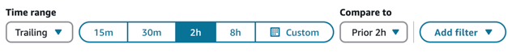

- **Use case 2**: I want to get all the flows
  dropped in the last 2 hours and compare that to the flows dropped yesterday
  from 00:00:00 to 23:59:59.

Configure the dashboard as follows:

    + Time range = Trailing
    + Time = 2h
    + Compare to = Prior day

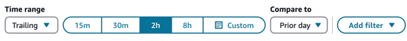

- **Use case 3**: I want to get all the flows
  dropped in the last 24 hours and compare that to the flows dropped on the
  same day last week.

Configure the dashboard as follows:

    + Time range = Trailing
    + Time = Custom 24h
    + Compare to = Prior week same day

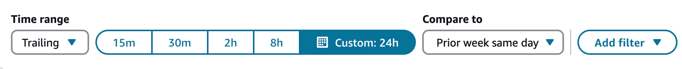

- **Use case 4**: I want to get all the flows
  dropped since 12 am today and compare that to all the flows dropped last
  week.

Configure the dashboard as follows:

    + Time range = Trailing
    + Time = Custom: Today (since 12am)
    + Compare to = Prior week

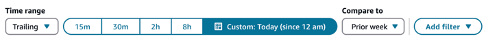

## Performance overview

chart

The **Performance overview** chart provides aggregated metrics
based on your filters. Each metric within the charts is compared to your "compare
to" benchmark time range filter. For example, flows started during your time range
selection was 200,000 which is down 15% compared to your benchmark number of flows
started, 235,000. The percentages are rounded up or down. The colors that appear for
the dropped in flow metric indicate negative (red) compared to your benchmark.

The following image shows an example of this chart.

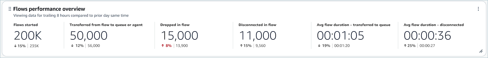

The following metrics are displayed on this chart:

- **Flows started:** The count of flows that
  started running within the specified start time and end time.
- **Transferred from flow to queue or agent:**
  The count of flows that started running within the specified start time and
  end time and ended with a contact transferring from the flow to a queue or
  agent.
- **Dropped in flow:** The count of flows that
  started running within the specified start time and end time and ended with
  a contact dropping from the flow before the flow reached a terminal block.
- **Disconnected in flow:** The count of flows
  that started running within the specified start time and end time and ended
  with a contact reaching a disconnect terminal block
- **Avg duration – transferred to queue:** The
  average flow duration for the specified start time and end time of selected
  flows where the flow outcome is transferred to queue.
- **Avg duration – disconnected:** The average
  flow duration for the specified start time and end time of selected flows
  where the flow outcome is disconnected participant.

## Comparison to

prior period charts

The **Top flows by dropped in flow rate** and **Top
flows transferred to queue or agent rate** charts display the current
period metric and the "Compare to" period metric for the top ten flows sorted (from
highest to lowest) by the current period metric. These charts allow you to identify
the flows contributing most to overall dropped or transferred contacts.

To see all data, choose the More icon in the top right of the chart, and then
choose **Expand**. The following image shows the **Top
flows by dropped in flow rate**. An arrow points to the location of the
More icon.

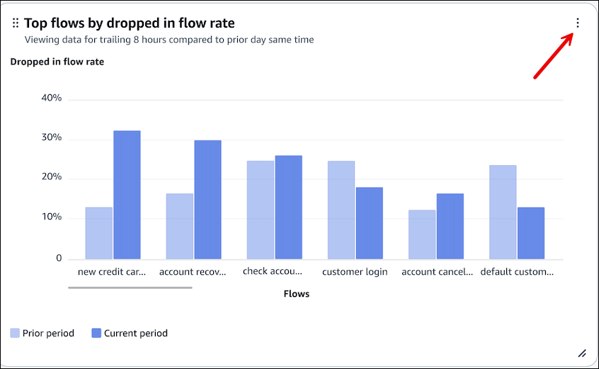

## Failed bot intents movers and

shakers

The **Failed bot intents movers and shakers** chart shows you the
bot intents with the highest percent change in failed rate compared to your
benchmark time range. For example, if an intent has a failed rate of 10% in the
current period and 5% in the previous period, the intent will have a percent change
of 100%.

The following image shows an example of this chart.

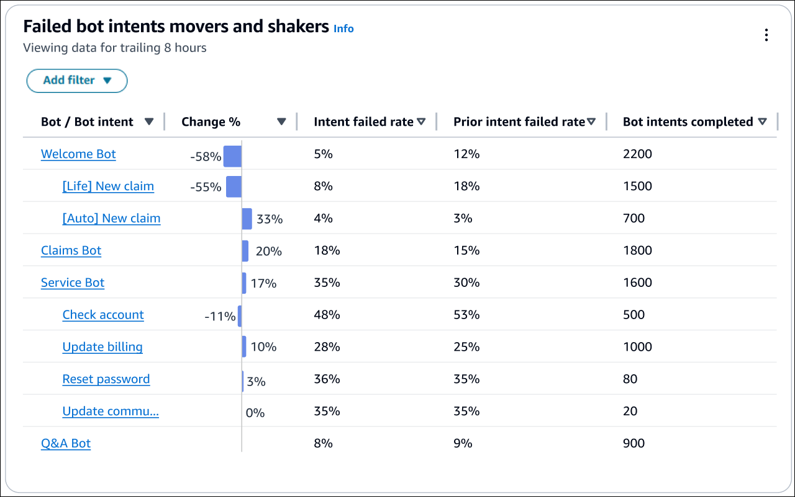

The following metrics are displayed on this chart:

- **Change %**: (Bot intent failed rate % – Prior bot
  intent failed rate %) / (Prior bot intent failed rate %). This number is
  rounded. The chart is sorted by highest absolute Change %.
- **Bot intent failed rate**: Bot intent failed rate during
  the specified current time range.
- **Prior bot intent failed rate**: Bot intent failed rate
  during the specified benchmark time range.
- **Bot intents completed**: Count of bot intent triggers
  completed in the specified current time range.

## Bot conversations and success rate over

time

The **Bot conversations and success rate** over time trend is a
time-series chart that displays the count of bot conversations (blue bars) and the
bot conversation success rate (red line) over a given time period broken down by
intervals (15min, daily, weekly, monthly).

To configure different time range intervals, choose **Interval**,
as shown in the following image.

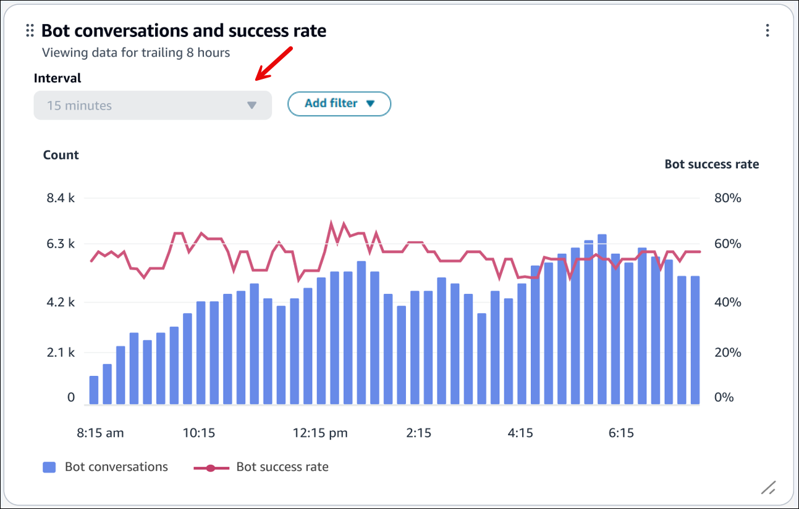

## Bot conversations overview

table

The **Bot conversations** overview table displays a snapshot of
bot conversation metrics aggregated over the selected time range. The following
image shows an example of this table.

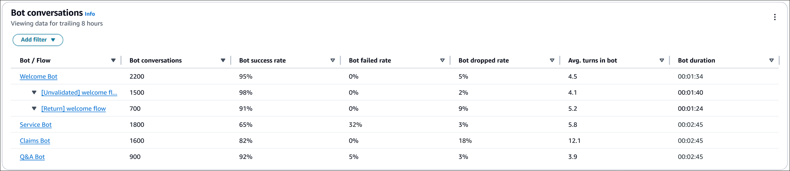

The following metrics are displayed on this table:

- **Bot conversation**: The count of bot conversations that
  started within the specified time range.
- **Bot success rate**: The percentage of successful
  conversations / total bot conversations. The completion of the final intent
  in the conversation is categorized as a success.
- **Bot failed rate**: The percentage of failed
  conversations / total bot conversations. The failure to fulfill final intent
  is categorized as failed.
- **Bot dropped rate**: The percentage of dropped
  conversations / total bot conversations. Drops are categorized when the
  customer doesn't respond before the conversation is categorized as a success
  or failed (for example, they are disconnected unexpectedly from the
  interaction).
- **Avg turns in bot**: The average number of turns (that
  is, a single request from the contact to the bot) for bot conversations that
  started within the specified time range.
- **Avg bot conversation duration**: The average duration
  for bot conversations that started within the specified time range.

## Bot intent overview table

The **Bot intent** overview table displays a snapshot of bot
intent metrics table aggregated over the selected time range. The following image
shows an example of this table.

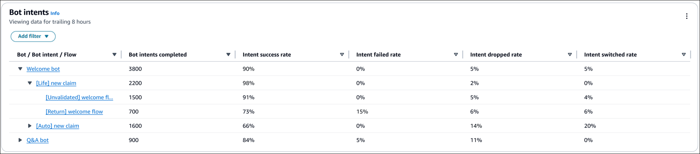

The following metrics are displayed on this table:

- **Bot intents completed**: The count of intent triggers
  that ended within the specified time range.
- **Bot conversation outcome rate**: The percentage of bot
  intent triggers that ended within the specified time range broken down by
  mutually exclusive and exhaustive list of bot intent outcomes.
- **Intent success rate**: The number of times the intent
  was successful / the number of times the intent was invoked. Success is
  defined as the bot successfully fulfilling and completing the intent.
- **Intent failed rate**: The number of times the intent
  was failed / the number of times the intent was invoked. Failed is defined
  as either the user declined the confirmation prompt or the bot switches to
  the Fallback Intent before completion.
- **Intent dropped rate**: The number of times the intent
  was dropped / the number of times the intent was invoked. Dropped is defined
  as the user respond before the intent is categorized as a success or failed
  (for example, they are disconnected unexpectedly from the
  interaction).
- **Intent switched rate**: The number of times the intent
  was switched / the number of times the intent was invoked. Switched intents
  occur when the bot recognizes a different intent and switches to that intent
  instead, before the original intent is categorized as a success or
  failed.

## Flow outcomes over time

comparison chart

The **Flow outcomes over time comparison** chart is a
time-series chart that displays the breakdown of Flow outcome rate metrics for a
single flow or multiple flows over a given time period and broken down by intervals
(15min, daily, weekly, monthly). 

You can configure different time range intervals by using the "Interval" button
directly in the widget. The intervals that you can select depend on the page-level
time range filter. For example:

- If you have a "Today" time range filter at the top of your dashboard, you
  can only see an interval of 15min for the last 24 hours.
- If you have a "Day" time range filter at the top of your dashboard, you
  can see a trailing 8 day interval trend, or a 15min interval trend for the
  trailing 24 hours.

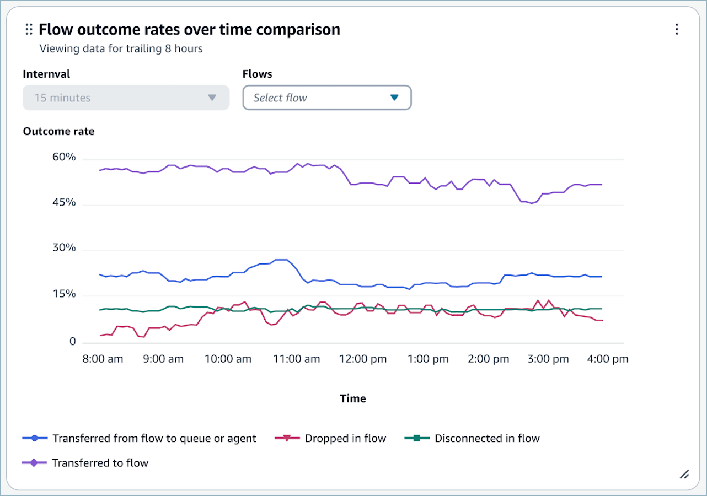

## Flow durations over time

comparison chart

The **Flow durations over time comparison** chart is a
time-series chart that displays the breakdown of Flow duration metrics for a single
flow or multiple flows over a given time period and broken down by intervals (15min,
daily, weekly, monthly). 

You can configure different time range intervals by using the "Interval" button
directly in the widget. The intervals that you select depend on the page-level time
range filter.

For example:

- If you have a "Today" time range filter at the top of your dashboard, you
  can only see an interval of 15min for the last 24 hours.
- If you have a "Day" time range filter at the top of your dashboard, you
  can see a trailing 8 day interval trend, or a 15min interval trend for the
  trailing 24 hours.

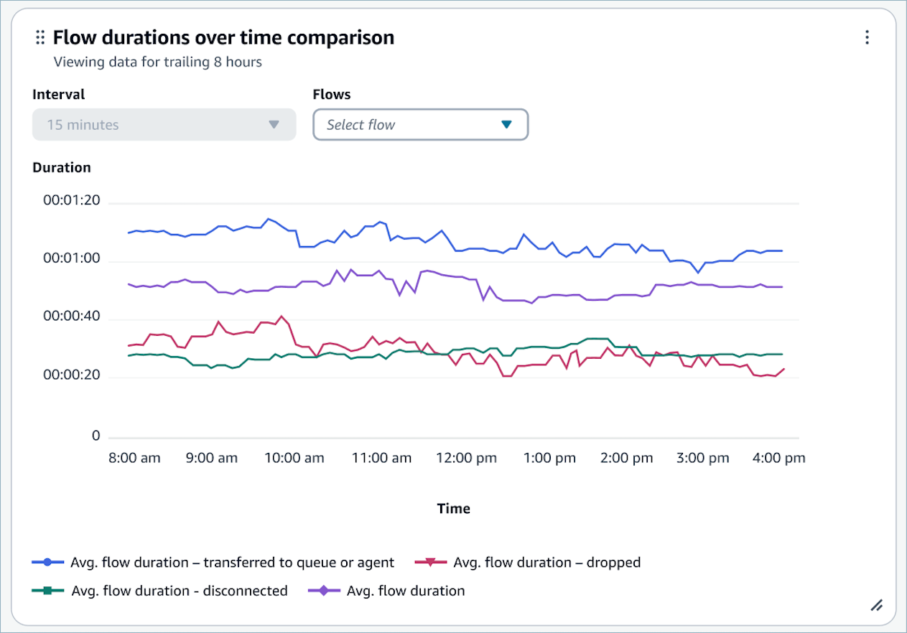

## Flows and Flow modules

overview tables

The **Flows** and **Flow modules** overview
tables display a snapshot of metrics aggregated over the selected time range. The
following image shows an example of the **Flows** overview
table.

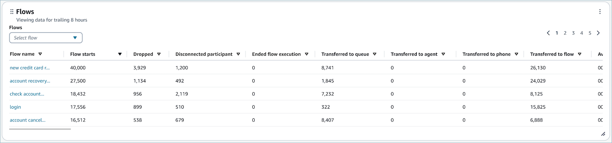

The following image shows an example of the **Flow modules**
overview table.

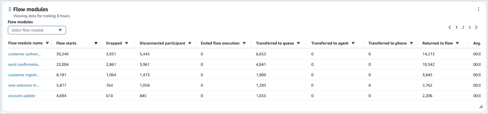

The following metrics are displayed on these tables:

- **Flow / flow module starts:**The count of
  flows that started execution within the specified start time and end time.
  For a given start and end time it will show the count of those flows whose
  start time is between the start and end interval specified.
- **Flow outcomes:** The count of flows that
  started execution within the specified start time and end time and ended
  with a specified mutually exclusive and exhaustive flow outcome.
- **Avg Flow Durations by outcome:** The
  average flow duration for the specified start time and end time with a
  specified mutually exclusive and exhaustive flow outcome.

## Dashboard functionality

limitations

The following limitations apply to the Flows performance dashboard:

- Tag-based access controls are not currently supported by the dashboard.
  You can restrict access through the Dashboard permissions pertaining to a
  security profile.
- No support for metrics on flows that are type Customer hold and Agent
  hold. For customer hold metrics, see [Metric definitions in Amazon Connect](metrics-definitions.md "metrics-definitions.md").
