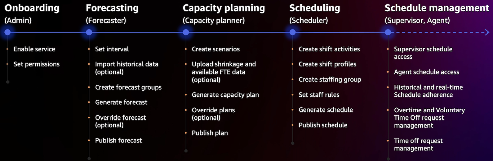

# Forecasting, capacity planning, and scheduling in Amazon Connect

###### Tip

**New user?** Check out the [Amazon Connect
forecasting, capacity planning, and scheduling workshop](https://catalog.workshops.aws/amazon-connect-optimization/en-US "https://catalog.workshops.aws/amazon-connect-optimization/en-US"). This online course
is for Contact Center Administrators, Workforce Managers, Forecasters and Schedulers who
are responsible for the forecasting and scheduling of agents.

To run a contact center, you need the right number of agents working at the right times to
achieve your operational goals. It's critical to not overspend or overrun your
workforce.

Amazon Connect provides a set of services powered by machine learning that help you optimize your
contact center by offering the following:

- [Forecasting](forecasting.md "forecasting.md"). Analyze and
  predict contact volume based on historical data. What will future demand—the
  contact volume and handle time—look like? Amazon Connect forecasting provides accurate
  and auto-generated forecasts that are automatically updated daily.
- [Scheduling](scheduling.md "scheduling.md"). Generate agent
  schedules for day-to-day workloads that are flexible, and meet business and
  compliance requirements. Offer agents flexible schedules and work-life balance. How
  many agents are needed in each shift? Which agent works in which slot?
  - [Schedule Adherence](schedule-adherence.md "schedule-adherence.md"). Enable contact center
    supervisors to monitor schedule adherence and improve agent productivity.
    Schedule adherence metrics are available after the agent schedules are
    published.

- [Capacity planning](capacity-planning.md "capacity-planning.md").
  Predict how many agents your contact center will require. Optimize plans by
  scenarios, service level goals, and metrics, such as shrinkage.
  For information about where Amazon Connect forecasting, capacity planning, and scheduling is available, see [Availability of Amazon Connect features by Region](regions.md "regions.md").

The following diagram shows a typical end-to-end optimization workflow by persona: Amazon Connect
administrator, forecaster, scheduler, capacity planner, and agent. It lists the tasks
performed by each persona.

