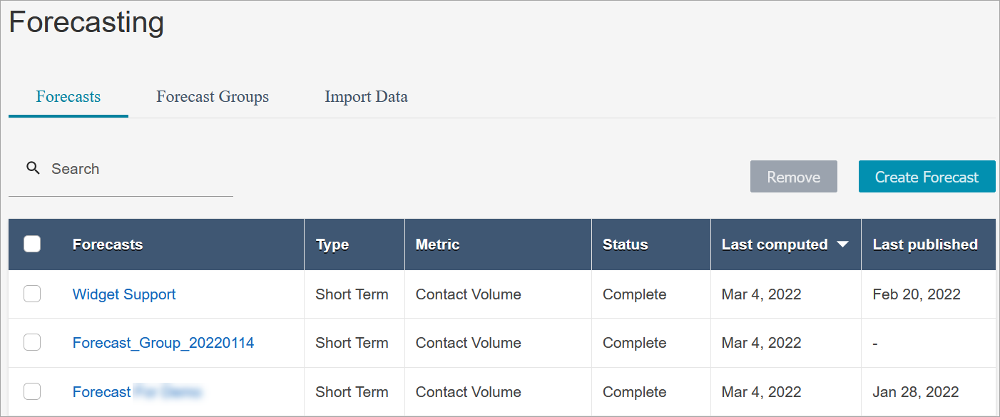

# Forecasting in Amazon Connect

Forecasting is the starting point for any scheduling and capacity planning activities.
Before you can generate a schedule or capacity plan, you must create a corresponding
forecast.

A _forecast_ attempts to predict future contact volume and average
handle time. Amazon Connect uses historical metrics to create the forecast.

- **Short-term forecasts are automatically updated
  daily**. When you come into work, you can review the forecast that
  was updated overnight with the most current data. You can publish the forecast
  to make it available to schedulers whenever you want. The
  **Forecasting** page displays when a forecast was last
  updated and published. Use short-term forecasts for scheduling up to 18 weeks
  ahead.
- **Long-term forecasts are automatically updated every
  week, based on the day you created the forecast**. For example, if
  you created the forecast on a Monday, it is updated every Monday. Use long-term
  forecasts for capacity planning up to 64 weeks ahead.
- **Intraday forecasts are updated every 15
  minutes**. Intraday forecasts are generated for queues that have a
  minimum of 5000 unique contacts per week, per queue-channel for last 4 weeks. If
  less data than that is available, intraday forecasts are not available for those
  queues. For more information about intraday forecasts, see [Intraday forecast performance
  dashboard](intraday-forecast-performance-dashboard.md "intraday-forecast-performance-dashboard.md").

###### Note

When a short-term or long-term forecast is created for the first time, it is
typically computed and made available within 4 hours. In many cases, the forecast is
ready in approximately 1 hour. Any changes to the forecast group
configuration—such as importing historical data, adding queues, or removing
queues— also automatically triggers a forecast recomputation within the same
timeframe.

The following image shows three short-term forecasts on the
**Forecasting** page.

###### Important

Only the most current forecast is available. Because the forecast is updated every
day, if you want to keep the current day's forecast, you must download it before
Amazon Connect overwrites it.

## Getting started with

forecasting

Use the following steps to create a forecast and then share it with other people
in your organization.

1. [Set the forecast and
   scheduling interval](set-forecast-scheduling-interval.md "set-forecast-scheduling-interval.md"): This is a
   one-time activity typically set up by forecasters. It cannot be
   undone.
2. [Create forecast
   groups](create-forecast-groups.md "create-forecast-groups.md")
3. [Import historical
   data](import-data-for-forecasting.md "import-data-for-forecasting.md")
4. [Create forecasts](create-forecasts.md "create-forecasts.md")
5. [Inspect a forecast](inspect-forecast.md "inspect-forecast.md")
6. [Publish a forecast](publish-forecast.md "publish-forecast.md")

You can take other actions on a forecast, such as [downloading it to a .csv file for offline
analysis](download-forecasts.md "download-forecasts.md") or [overriding](edit-forecast.md "edit-forecast.md") it. Use the
following steps to get started.
