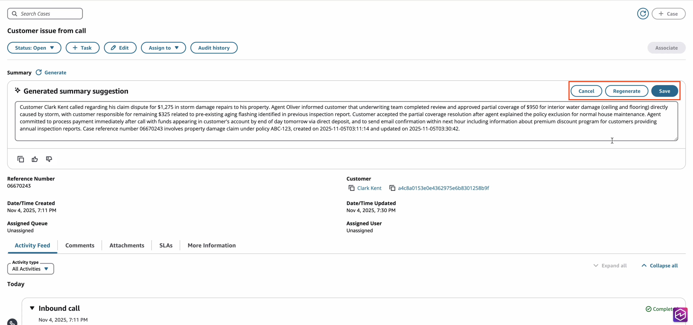

# Generate AI-powered Case summary

Agents have the ability to generate an AI-powered Case summary by clicking Generate.

This displays a **Generated summary suggestion** which the agent can optionally edit and regenerate before saving the summary on the Case.

