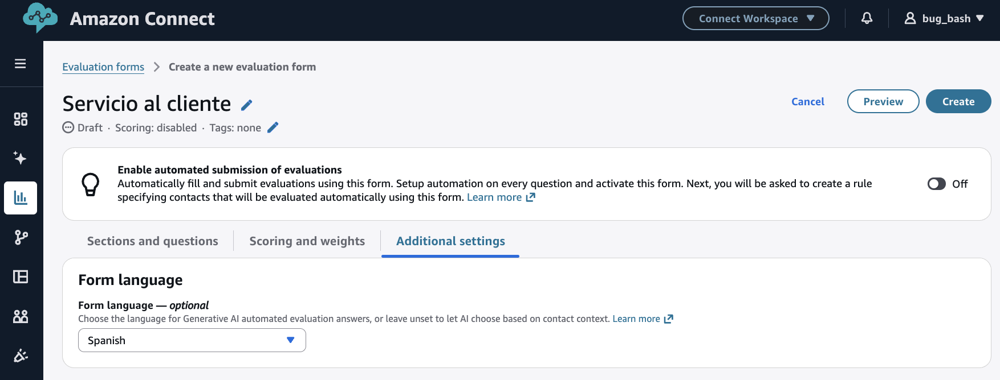
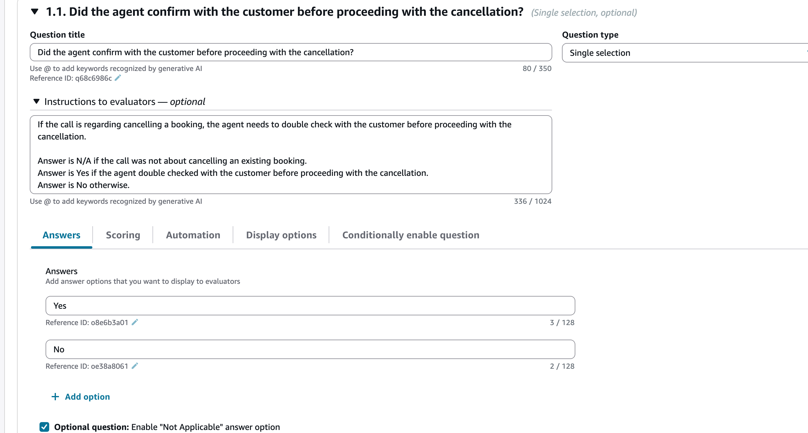

# Evaluate agent performance in Connect Customer using generative AI

###### Note

**Powered by Amazon Bedrock**: AWS implements automated abuse
detections. Because generative AI features in conversational analytics are built on Amazon Bedrock,
users can take full advantage of the controls implemented in Amazon Bedrock to enforce safety,
security, and the responsible use of artificial intelligence (AI).

Managers can specify their evaluation criteria in natural language, and use
generative AI for automating evaluations of up to 100% of customer interactions.
Generative AI can enable you to automate evaluations of additional agent behaviors (for
example, was the agent able to resolve the customer's issue?), enabling managers to
comprehensively monitor and improve regulatory compliance, agent adherence to quality
standards and sensitive data collection, while reducing the time spent on evaluating
agent performance. Along with answers, you are also provided with context and
justification, and references to specific points in the transcript that you can use to
provide agent coaching.

You can use generative AI to assist managers with filling evaluations or use it to
automatically fill and submitting evaluations. For more information about setting up
automated evaluations, see [Step 6: Enable automated evaluations](create-evaluation-forms.md#step-automate "create-evaluation-forms.md#step-automate").

Evaluations questions are answered using generative AI by interpreting the question
title and evaluation criteria specified within the instructions to evaluators associated
with each question, and using these to analyze the conversation transcript. For more
information, see [Step 2: Add sections and questions](create-evaluation-forms.md#step-sections "create-evaluation-forms.md#step-sections").

## Process to automate evaluations using generative AI

The following is the overview of the automation process:

1. Get a high-level understanding of which of the evaluation questions should
   be answered with generative AI by reading [Guidelines to improve generative AI accuracy](#guidelines-to-improve-generative-ai-accuracy "#guidelines-to-improve-generative-ai-accuracy").
2. Assign permissions to select users within your quality management team to
   use Ask AI assistant. These users will start seeing the Ask AI button next
   to each question, while performing evaluations and can use that to get
   answer recommendations. These users can provide feedback on which questions
   are receiving accurate answers using generative AI. For more information,
   see [Assign security profile permissions for performance evaluations and coaching](evaluation-and-coaching-permissions.md "evaluation-and-coaching-permissions.md").
3. To improve accuracy, you can provide additional evaluation criteria within
   [instructions to evaluators](create-evaluation-forms.md#step-sections "create-evaluation-forms.md#step-sections"). For
   more information, see [Guidelines to improve generative AI accuracy](#guidelines-to-improve-generative-ai-accuracy "#guidelines-to-improve-generative-ai-accuracy").
4. Once you have a good understanding of which questions can be accurately
   answered with generative AI, you can do a broader rollout by pre-configuring
   on the evaluation form, whether a question will receive an automated answer
   using generative AI.
5. Once you have setup automation, any user performing evaluations using the
   evaluation form will get automated generative AI answers to the
   pre-configured questions (without requiring additional permissions). For
   more information, see [Step 6: Enable automated evaluations](create-evaluation-forms.md#step-automate "create-evaluation-forms.md#step-automate").
6. You can setup automation such that an evaluator first reviews the
   generative AI answers before submission or you can automatically fill and
   submit evaluations.

###### Note

AI-generated evaluations are not 100% accurate. Before acting on AI outputs
(such as providing rewards, agent coaching, and so on), we recommend that you review a
sample of evaluations. This helps confirm the performance trends that AI
provides. You can override AI-filled evaluations and make any corrections before
sharing them with the agent or using them for performance reviews. We also
recommend keeping a manual evaluation process in place. This helps you catch any
drift between AI-filled evaluations and manager-filled evaluations over
time.

###### Limitations of generative AI-powered performance evaluations

Transcription accuracy affects the accuracy of generative AI-powered
evaluations. Conversational analytics cannot accurately transcribe conversations that
include more than one language. It also cannot accurately transcribe
conversations in which multiple parties speak at the same time. Examples include
conference calls, warm transfers, and calls where an agent adds a third party.
Both scenarios lower the accuracy of generative AI-powered performance
evaluations.

You can use rules to filter out conversations where you expect these scenarios
to occur, such as conversations in specific queues. For more information, see
[Create a rule in conversational analytics that submits an automated evaluation](contact-lens-rules-submit-automated-evaluation.md "contact-lens-rules-submit-automated-evaluation.md").

## Use Ask AI to get generative AI answer recommendations

1. Log into Connect Customer with a user account that has [permissions to perform
   evaluations](evaluation-and-coaching-permissions.md "evaluation-and-coaching-permissions.md") and [ask
   AI assistant](evaluation-and-coaching-permissions.md "evaluation-and-coaching-permissions.md").
2. Choose the **Ask AI** button below a question to receive
   a generative AI-powered recommendation for the answer, along with context
   and justification (reference points from the transcript that were used to
   provide answers).

   1. The answer is automatically selected based on the
      generative AI recommendation, but you can change it.
   2. You can get generative AI-powered recommendations by choosing
      **Ask AI** for up to 10 questions per contact.
      For more information, see [Conversational analytics service quotas](amazon-connect-service-limits.md#contactlens-quotas "amazon-connect-service-limits.md#contactlens-quotas").

3. You can choose the time associated with a transcript reference to be
   directed to the point in the conversation

## Provide additional criteria for answering evaluation form questions using generative AI

While configuring an evaluation form, you can provide criteria for answering
questions within the **instructions to evaluators**
associated with each evaluation form question. Apart from driving consistency in
evaluations by evaluators, these instructions are also used to provide generative
AI-powered evaluations.

###### AI answer mapping and scoring

If AI is not able to identify which of the provided answer options is
appropriate, then it selects **Not Applicable**, even if the
question is not optional. When this happens, the question is excluded from
scoring and the weights are redistributed to the other questions. To avoid this,
clearly explain each answer option in the **Instructions to
evaluators** for the question. For more information, see [Guidelines to improve generative AI accuracy](#guidelines-to-improve-generative-ai-accuracy "#guidelines-to-improve-generative-ai-accuracy").

## Set up automated evaluations using generative AI on the evaluation form

You can pre-configure on an evaluation form whether a question will be
automatically answered using generative AI. Then, if you start an evaluation using
the evaluation form on the Connect Customer UI, answers to these questions will get
automatically filled using generative AI (without requiring you to choose Ask AI).
You can also use generative AI to automatically fill and submit evaluations. For
automatically submitted evaluations, you can use generative AI to answer up to 10
questions per contact (see [Conversational analytics service quotas](amazon-connect-service-limits.md#contactlens-quotas "amazon-connect-service-limits.md#contactlens-quotas")). Note that this limit does not apply to
automation using contact categories or metrics (for example, longest
hold duration, etc.).

To learn more about setting up automated evaluations using generative AI, see
[Guidelines to improve generative AI accuracy](#guidelines-to-improve-generative-ai-accuracy "#guidelines-to-improve-generative-ai-accuracy").

## Set up generative AI-powered evaluations in non-English languages

By default, if you do not set the language of an evaluation form, the generative
AI model automatically detects the language of your evaluation form questions and
tries to provide answers in the same language, if the AI model understands that
language. By default, generative AI answer justifications are typically provided
in English.

To consistently receive both AI-generated answers and answer justifications in
your preferred language, you can set the language of an evaluation form, choosing from
**English**, **Spanish**,
**Portuguese**, **French**,
**German**, **Italian**,
**Chinese**, **Japanese**,
**Korean**, and **Malay**.
By explicitly setting the language of an evaluation, you can also perform cross-language
evaluations, where generative AI fills a evaluation form in English, even when the
conversation transcript is in another language, say Spanish. This enables multilingual
contact centers to use a standardized evaluation framework across languages.

To set the language of the evaluation form:

1. Select the **Additional settings**
   tab while creating or updating an evaluation form.
2. Choose **Form language** from the dropdown.
3. Ensure your form's questions, instructions and answer choices are in the same
   language as the selected **Form language**, for optimal
   AI performance.

## Guidelines to improve generative AI accuracy

### Selecting questions to be answered by generative AI

###### Dos

- Use generative AI to answer questions that only require the conversation
  transcript. Examples are questions on soft skills, questions that check
  for call flow, or compliance statements, among others.
- Split complex questions into multiple simpler ones. For example, instead
  of "Did the agent exhibit active listening?", ask two questions: "Did the
  agent understand the customer's problem the first time, without the
  customer needing to repeat themselves?" and "Did the agent summarize the
  issue after the customer explained it?".
- Use conditionally enabled questions to enable or disable questions that
  are only applicable in certain situations. For example, you may have one
  question, "Did the customer buy a product during the conversation?", and a
  subsequent conditionally enabled question, "Did the agent provide mandatory
  fee disclosures before completing the sale?". For more details, see [Step 4: Conditionally enable questions](create-evaluation-forms.md#step-conditionally-enable-questions "create-evaluation-forms.md#step-conditionally-enable-questions").

###### Don'ts

- Don't use generative AI to answer questions that need information outside
  the conversation transcript. Generative AI cannot analyze screen
  recordings, access your internal or third-party systems such as CRM
  applications, or evaluate conversations across multiple contacts.
- Don't use generative AI to evaluate quantifiable activities such as "Was
  the customer put on excessive hold?" or "Was the customer frequently
  interrupted?". Instead, set the question type to **Number**
  and use metrics such as the longest hold duration or the number of
  interruptions. For more details, see [Step 6: Enable automated evaluations](create-evaluation-forms.md#step-automate "create-evaluation-forms.md#step-automate").
- Don't automate questions that assess interactions between multiple parties
  (another agent, a partner institution, or a second customer). conversational analytics
  is aware of only two participants at a given time. For example, avoid a
  question like "If another person other than the primary account holder
  joined the conversation, did the agent first confirm with the primary
  account holder before proceeding?".
- Don't ask questions that depend on tone of voice. Generative AI cannot
  determine the agent's or customer's tone.
- Don't use generative AI for highly subjective questions, such as "Was the
  agent attentive during the call?".

### Improving phrasing of questions and associated instructions

###### Dos

- Word questions as complete sentences. Instead of "ID validation", ask
  "Did the agent attempt to validate the customer's identity?".
- Add detailed evaluation criteria in the **Instructions to
  evaluators** for the question. For "Did the agent try to
  validate the customer's identity?", add the instruction:
  _Answer is Yes if the agent asked for the customer's membership
  number and postal code before addressing their questions. Answer is No
  otherwise._
- Define business-specific terms the question depends on. If the agent must
  name a department in the greeting, list example department names in the
  instructions.
- Use "agent" and "customer" consistently. Avoid variations like
  "colleague", "representative", or "associate", and "member", "caller", or
  "subscriber".
- Make it clear who is being evaluated. "Did the agent avoid the usage of
  profanity?" can be read as asking whether profanity occurred anywhere,
  returning "No" even when only the customer used it. Ask "Did the agent use
  profanity?" instead.
- Phrase questions positively. Use "Did the agent greet the customer?"
  rather than "Did the agent skip the greeting?". Phrasing questions
  positively provides better AI-evaluation reasoning and references.
- Specify when the answer is **Not Applicable** (N/A). For
  example: _The answer is N/A if the call resulted in a
  transfer._
- In the **Instructions to evaluators**, explain when AI
  should select each answer option. For "Did the agent give a resolution
  timeframe?", add the instruction: _Answer is Yes if the agent gave
  a resolution timeframe, No otherwise._ Not explaining each option
  may result in AI selecting **Not Applicable**, even if the
  question is not optional.
- Clarify whether all or any of the specified agent behaviors is required.
  "The agent must ask the customer's name and phone number" fails if the
  agent asked for the name but not the phone number.
- Include examples for non-standard scenarios, not just the standard call
  flow. If you expect the agent to say "It typically takes 3 to 5 business
  days" on a standard call, you should also include callback phrasing like
  "I'll call you back within 30 minutes with an update". Standard-flow-only
  examples lead to inconsistent answers on callbacks, escalations, and
  transfers.
- Give auto-fail questions the most attention, since one failing answer
  affects the whole form's evaluation score. Cover edge cases and
  non-standard scenarios. For more on scoring, see [Step 5: Assign scores and ranges to answers](create-evaluation-forms.md#step-assignscores "create-evaluation-forms.md#step-assignscores").

###### Don'ts

- Don't use double quotes unless you need exact wording. If the instruction
  checks for `"Have a nice day"`, the AI won't match _Have
  a nice afternoon_. Write instead: `The agent wished the
 customer a nice day`.
- Don't use acronyms. Spell out the full term, for example "CFPB", so the AI
  can interpret it correctly.
- Don't use proper nouns likely to be misspelled in the transcript. A
  product name like _Klarity Pay_ may be transcribed
  differently, preventing a match.
- Don't use vague questions. Instead of "Did the agent use appropriate
  language?", ask "Did the agent use profanity?".
- Don't use long verbatim scripts. Checking for `"Thank you for calling
 ABC Bank. How may I assist you?"` rarely matches, since minor
  transcription differences break the full script.

### Improving answer options

###### Dos

- Use simple, short answer options, such as **Yes**, **No**, and
  **Partial**.
- Enable the **Optional question** setting when a question
  may not apply. This lets evaluators skip the question or mark it
  **Not Applicable**.

###### Don'ts

- Don't use spelling errors or special characters in answer options, as
  they can reduce the accuracy of generative AI answers.
- Don't use too many answer options. For "How was the customer experience?",
  a long list like Great, Good, OK, Poor, Very Poor, and Horrible reduces
  accuracy. Use a smaller set of distinct options instead.
- Don't use long text in answer options, since the generative AI model might
  reproduce it incorrectly.

### Example implementation following guidelines

The following example shows a generative AI-answered question that follows these
guidelines. The question title is a complete sentence, the instructions to
evaluators define each answer option and explain the Not Applicable scenario, and
the answer options are short.

