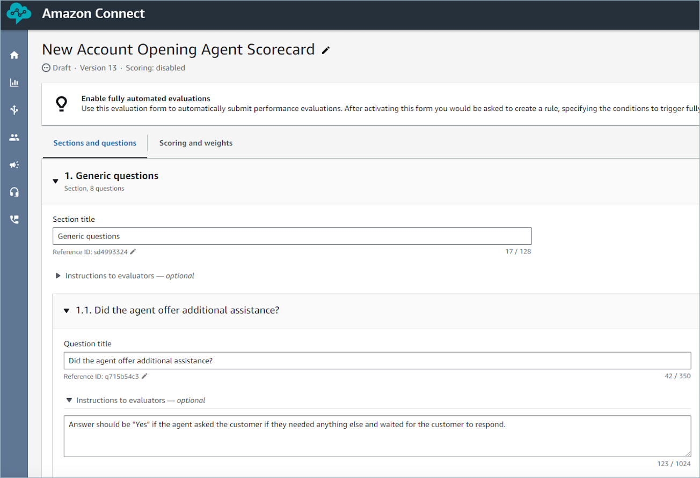

# Evaluate agent performance in

Amazon Connect using generative AI

###### Note

**Powered by Amazon Bedrock**: AWS implements automated abuse
detections. Because generative AI features in Contact Lens are built on Amazon Bedrock,
users can take full advantage of the controls implemented in Amazon Bedrock to enforce safety,
security, and the responsible use of artificial intelligence (AI).

Managers can specify their evaluation criteria in natural language, and use
generative AI for automating evaluations of up to 100% of customer interactions.
Generative AI can enable you to automate evaluations of additional agent behaviors (for
example, was the agent able to resolve the customer’s issue?), enabling managers to
comprehensively monitor and improve regulatory compliance, agent adherence to quality
standards and sensitive data collection, while reducing the time spent on evaluating
agent performance. Along with answers, you are also provided with context and
justification, and references to specific points in the transcript that you can use to
provide agent coaching.

You can use generative AI to assist managers with filling evaluations or use it to
automatically fill and submitting evaluations. For more information about setting up
automated evaluations, see [Step 6: Enable automated evaluations](create-evaluation-forms.md#step-automate "create-evaluation-forms.md#step-automate").

Evaluations questions are answered using generative AI by interpreting the question
title and evaluation criteria specified within the instructions to evaluators associated
with each question, and using these to analyze the conversation transcript. For more
information, see [Step 2: Add sections and questions](create-evaluation-forms.md#step-sections "create-evaluation-forms.md#step-sections").

## Process to automate evaluations using

generative AI

The following is the overview of the automation process:

1. Get a high-level understanding of which of the evaluation questions should
   be answered with generative AI by reading [Guidelines to improve
   generative AI accuracy](#guidelines-to-improve-generative-ai-accuracy "#guidelines-to-improve-generative-ai-accuracy").
2. Assign permissions to select users within your quality management team to
   use Ask AI assistant. These users will start seeing the Ask AI button next
   to each question, while performing evaluations and can use that to get
   answer recommendations. These users can provide feedback on which questions
   are receiving accurate answers using generative AI. For more information,
   see [Assign security profile permissions for
   users to create and access evaluation forms](evaluation-forms-permissions.md "evaluation-forms-permissions.md").
3. To improve accuracy, you can provide additional evaluation criteria within
   [instructions to evaluators](create-evaluation-forms.md#step-sections "create-evaluation-forms.md#step-sections"). For
   more information, see [Guidelines to improve
   generative AI accuracy](#guidelines-to-improve-generative-ai-accuracy "#guidelines-to-improve-generative-ai-accuracy").
4. Once you have a good understanding of which questions can be accurately
   answered with generative AI, you can do a broader rollout by pre-configuring
   on the evaluation form, whether a question will receive an automated answer
   using generative AI.
5. Once you have setup automation, any user performing evaluations using the
   evaluation form will get automated generative AI answers to the
   pre-configured questions (without requiring additional permissions). For
   more information, see [Step 6: Enable automated evaluations](create-evaluation-forms.md#step-automate "create-evaluation-forms.md#step-automate").
6. You can setup automation such that an evaluator first reviews the
   generative AI answers before submission or you can automatically fill and
   submit evaluations.

## Use Ask AI to get

generative AI answer recommendations

1. Log into Amazon Connect with a user account that has [permissions to perform
   evaluations](evaluation-forms-permissions.md "evaluation-forms-permissions.md") and [ask
   AI assistant](evaluation-forms-permissions.md "evaluation-forms-permissions.md").
2. Choose the **Ask AI** button below a question to receive
   a generative AI-powered recommendation for the answer, along with context
   and justification (reference points from the transcript that were used to
   provide answers).
   1. The answer will get automatically selected based on the
      generative AI recommendation, but can be changed by the user.
   2. You can get generative AI-powered recommendations by choosing
      **Ask AI** for up to 10 questions per contact.
      For more information, see [Contact Lens service quotas](amazon-connect-service-limits.md#contactlens-quotas "amazon-connect-service-limits.md#contactlens-quotas").

3. You can choose the time associated with a transcript reference to be
   directed to the point in the conversation

## Provide

additional criteria for answering evaluation form questions using generative
AI

While configuring an evaluation form, you can provide criteria for answering
questions within the **instructions to evaluators**
associated with each evaluation form question. Apart from driving consistency in
evaluations by evaluators, these instructions are also used to provide generative
AI-powered evaluations.

## Set up

automated evaluations using generative AI on the evaluation form

You can pre-configure on an evaluation form whether a question will be
automatically answered using generative AI. Then, if you start an evaluation using
the evaluation form on the Amazon Connect UI, answers to these questions will get
automatically filled using generative AI (without requiring you to click Ask AI).
You can also use generative AI to automatically fill and submit evaluations. For
automatically submitted evaluations, you can use generative AI to answer up to 10
questions per contact (see [Contact Lens service quotas](amazon-connect-service-limits.md#contactlens-quotas "amazon-connect-service-limits.md#contactlens-quotas")). Note that this limit does not apply to
automation using Contact Lens categories or metrics (for example, longest
hold duration, etc.).

To learn more about setting up automated evaluations using generative AI, see
[Guidelines to improve
generative AI accuracy](#guidelines-to-improve-generative-ai-accuracy "#guidelines-to-improve-generative-ai-accuracy").

## Guidelines to improve

generative AI accuracy

###### Selecting questions for getting generative AI recommendations

1. Use generative AI to respond to questions that can be answered using
   information from the conversation transcript, without the need to validate
   information through third-party applications such as CRM systems.
2. Using generative AI to answer questions requiring numeric responses, such
   as "How long did the agent interact with the customer?" is not recommended.
   Instead, consider [setting up automation](create-evaluation-forms.md#step-automate "create-evaluation-forms.md#step-automate")
   for such evaluation form questions using Contact Lens or contact
   metrics.
3. Avoid using generative AI to answer highly subjective questions, for
   example, "Was the agent attentive during the call?"

###### Improving phrasing of questions and associated instructions

1. Use complete sentences to word questions, for example, replacing
   _ID validation_ with "Did the agent attempt to
   validate the customer’s identity?" enables the generative AI to better
   understand the question.
2. It is recommended that you provide detailed criteria for answering the
   question within the **instructions to
   evaluators,** especially if its not possible to answer the
   question based on the question text alone. For example, for the question
   "Did the agent try to validate the customer identity?" you may want to
   provide additional instructions such as, _The agent is required to
   always ask a customer their membership ID and postal code before
   addressing the customer’s questions_.
3. If answering a question requires knowledge of some business specific
   terms, then specify those terms in the instruction. For example, if the
   agent needs to specify the name of the department in the greeting, then list
   the required department name(s) that the agent needs to state as part of the
   **instructions to evaluators** associated
   with the question.
4. If possible, use the term 'agent' instead of terms like 'colleague',
   'employee', 'representative', 'advocate', or 'associate'. Similarly use the
   term 'customer', instead of terms like 'member', 'caller', 'guest', or
   'subscriber'.
5. Only use double quotes in your instruction if you want to check for exact
   words being spoken by the agent or the customer. For example, If the
   instruction is to check for the agent saying `"Have a nice day"`,
   then the generative AI will not detect _Have a nice
   afternoon_. Instead the instruction should say: `The
agent wished the customer a nice day`.
