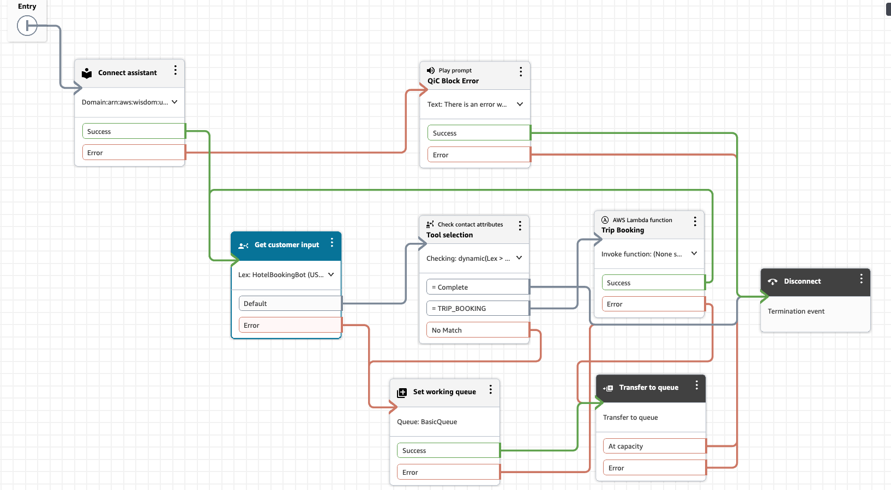
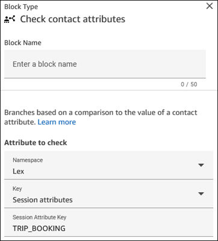

# Use generative AI-powered

self-service with Connect AI agents

###### Tip

Check out this course from AWS Workshop: [Customizing Connect AI agents Self-Service](https://catalog.workshops.aws/amazon-q-in-connect/en-US/customizing-amazon-q-in-connect-self-service "https://catalog.workshops.aws/amazon-q-in-connect/en-US/customizing-amazon-q-in-connect-self-service").

Connect AI agents supports customer self-service use cases in chat and voice (IVR) channels. It
can:

- Answer customer questions.
- Provide step-by-step guidance.
- Complete actions like rescheduling appointments and booking trips.
  When customers need additional help, Connect AI agents seamlessly transfers them to agents while
  preserving the context of the full conversation.

###### Contents

- [Default system tools](#default-system-actions-for-ai-agents-self-service "#default-system-actions-for-ai-agents-self-service")
- [Set up
  self-service](#enable-self-service-ai-agents "#enable-self-service-ai-agents")
- [Custom actions for self-service](#custom-actions-for-connect-ai-agents-self-service "#custom-actions-for-connect-ai-agents-self-service")
- [FOLLOW_UP_QUESTION
  tool](#follow-up-question-tool "#follow-up-question-tool")

## Default system tools

Connect AI agents comes with the following built-in tools that work out-of-the-box:

1. **QUESTION**: Provides answers and gathers
   relevant information when no other tool can directly address the
   query.
2. **ESCALATION**: Automatically transfers to an
   agent when customers request human assistance.

###### Note

When ESCALATION is selected, it takes the **Error**
branch of the **Get customer input** block. 3. **CONVERSATION**: Engages in basic dialogue
when there's no specific customer intent. 4. **COMPLETE**: Concludes the interaction when
customer needs are met. 5. **FOLLOW_UP_QUESTION**: Enables more
interactive and information-gathering conversations with customers. For more
information about using this tool, see [FOLLOW_UP_QUESTION tool](#follow-up-question-tool "#follow-up-question-tool").

You can customize these default tools to meet your specific requirements.

## Set up self-service

Follow these steps to enable Connect AI agents for self-service:

1.  Enable Connect AI agents in your Amazon Lex bot by activating the [AMAZON.QinConnectIntent](../../../lexv2/latest/dg/built-in-intent-qinconnect.md "../../../lexv2/latest/dg/built-in-intent-qinconnect.md"). For instructions, see [Create an Connect AI agents intent](create-qic-intent-connect.md "create-qic-intent-connect.md").
2.  Add an [Connect assistant](connect-assistant-block.md "connect-assistant-block.md") block to
    your flow.
3.  Add a [Get customer input](get-customer-input.md "get-customer-input.md") block to your flow to
    specify:

        * When Connect AI agents should begin handling customer interactions.
        * Which types of interactions it should handle.

    For instructions, see [Create a flow and add your conversational AI bot](create-bot-flow.md "create-bot-flow.md").

4.  (Optional) Add a [Check contact
    attributes](check-contact-attributes.md "check-contact-attributes.md") block to your flow and
    configure it to determine what should happen after Connect AI agents has completed its
    turn of the conversation: In the **Attribute to check**
    section, set the properties as follows:

        * Set **Namespace** =
         **Lex**
        * Set **Key** = **Session
         attributes**
        * Set **Session Attribute Key** = Tool

    Connect AI agents saves the selected tool name as a Lex session attribute. This
    session attribute can then be accessed by using the **Check contact
    attributes** block.

5.  (Optional) Define routing logic based on the tool selected by
    Connect AI agents:

        * Route COMPLETE responses to end the interaction.
        * Route custom tool responses (like TRIP\_BOOKING) to specific
         workflows.

    The following image shows an example of how you can make a routing
    decision based on what Connect AI agents decides.



## Custom actions

for self-service

You can extend Connect AI agents's capabilities by adding custom tools. These tools
can:

- Surface next best actions for customers.
- Delegate tasks to existing Amazon Lex bots.
- Handle specialized use cases.

When adding a custom tool to your AI prompt:

- Include relevant examples to help Connect AI agents select appropriate actions.
- Use the [Check contact
  attributes](check-contact-attributes.md "check-contact-attributes.md") block to create
  branching logic.

      + When you configure **Check contact attributes**,
       in the **Attribute to check** section, enter the
       name of your custom tool.

  The following image shows a custom tool named TRIP_BOOKING is
  specified.



### Example: Disambiguate the

customer intent

You can create a generative AI assistant that gathers information before
routing to an agent. This requires:

- No knowledge base configuration.
- Simple instructions to collect information.
- Step-by-step guides to present the information to the agents. For more
  information, see [Display contact context in the agent
  workspace when a contact begins in Amazon Connect](display-contact-attributes-sg.md "display-contact-attributes-sg.md").

Following is an example tool definition for disambiguation. You can remove all
default tools except CONVERSATION and add one new custom tool called
HANDOFF:

```
tools:
- name: CONVERSATION
  description: Continue holding a casual conversation with the customer.
  input_schema:
    type: object
    properties:
      message:
        type: string
        description: The message you want to send next to hold a conversation and get an understanding of why the customer is calling.
    required:
    - message
- name: HANDOFF
  description: Used to hand off the customer engagement to a human agent with a summary of what the customer is calling about.
  input_schema:
    type: object
    properties:
      message:
        type: string
        description: Restatement to the customer of what you believe they are calling about and any pertinent information. MUST end with a statement that you are handing them off to an agent. Be as concise as possible.
      summary:
        type: string
        description: A list of reasons the customer has reached out in the format <SummaryItems><Item>Item one</Item><Item>Item two</Item></SummaryItems>. Each item in the Summary should be as discrete as possible.
    required:
    - message
    - summary
```

### Example:

Recommend an action for a customer

You can configure next best actions in Amazon Connect by using flows. You
can also configure automated actions and create step-by-step guides to provide
UI-based actions to customers. For more information, see [Step-by-step Guides to set up your
Amazon Connect agent workspace](step-by-step-guided-experiences.md "step-by-step-guided-experiences.md").  Connect AI agents saves the selected
tool name as a Lex session attribute. The attribute can then be accessed by
using the **Check contact attributes** flow block.  

Here's an example tool definition for booking a trip:

```
-name: TRIP_BOOKING
  description: Tool to transfer to another bot who can do trip bookings. Use this tool only when the last message from the customer indicates they want to book a trip or hotel.
  input_schema:
    type: object
    properties:
      message:
        type: string
        description: The polite message you want to send while transferring to the agent who can help with booking.
    required:
    - message
```

When using the **Check contact attributes** flow block to
determine which tool Connect AI agents has selected, you can make branching decisions to
select the relevant step-by-step guide for that user. For example, if a customer
wants to book a trip during a self-service chat interaction, you can:

- Match the TRIP_BOOKING tool response in your flow.
- Route to the appropriate step-by-step guide.
- Display the step-by-step interface directly in the customer's chat
  window.

For more information about implementing step-by-step guides in chat, see
[Deploy step-by-step guides in Amazon Connect
chats](step-by-step-guides-chat.md "step-by-step-guides-chat.md").

## FOLLOW_UP_QUESTION tool

The FOLLOW_UP_QUESTION tool enhances Connect AI agents self-service capabilities by enabling
more interactive and information-gathering conversations with customers. This tool
works alongside the default and custom tools. It helps collect necessary information
before determining which action to take.

The following code shows the configuration of the FOLLOW_UP_QUESTION tool.

```
- name: FOLLOW_UP_QUESTION
  description: Ask follow-up questions to understand customer needs, clarify intent,
    and collect additional information throughout the conversation. Use this to gather
    required details before selecting appropriate actions.
  input_schema:
    type: object
    properties:
      message:
        type: string
        description: The message you want to send next in the conversation with the
          customer. This message should be grounded in the conversation, polite, and
          focused on gathering specific information.
    required:
      - message
```

The FOLLOW_UP_QUESTION tool complements your defined tools by enabling Connect AI agents to
gather necessary information before deciding which action to take. It's particularly
useful for:

- **Intent disambiguation**

When the customer's intent is unclear, use this tool to ask clarifying
questions before selecting the appropriate action.

- **Information gathering**

Collect required details for completing a task or answering a
question.

### Example FOLLOW_UP_QUESTION

use case

For a self-service bot designed to report fraud, you might define a tool named
CONFIRM_SUBMISSION to collect specific information from the customer:

```
- name: CONFIRM_SUBMISSION
  description: Confirm all collected information and finalize the report submission.
  input_schema:
    type: object
    properties:
      message:
        type: string
        description: A message reviewing all of the collected information and asking
          for final confirmation before submission.
      report_details:
        type: string
        description: The user's report or complaint details
      reporter_info:
        type: string
        description: Reporter's contact information (if provided) or "Anonymous"
      subject_info:
        type: string
        description: Information about the individual or business being reported
    required:
      - message
      - report_details
      - reporter_info
      - subject_info

```

However, you can use the FOLLOW_UP_QUESTION tool instead to collect this
information step-by-step, as shown in the following sample:

```
- name: FOLLOW_UP_QUESTION
  description: Ask follow-up questions to understand customer needs and collect additional
    information throughout the complaint process. Use this for all information gathering
    steps including confidentiality preferences, contact info, subject details etc.
  input_schema:
    type: object
    properties:
      message:
        type: string
        description: The message you want to send next in the conversation with the
          customer. This message should be grounded in the conversation and polite.
          Use this for asking clarification questions, collecting contact information,
          gathering subject details, and all other follow-up steps in the complaint
          process.
    required:
      - message
```

### Prompt

instructions

Add instructions to your prompt to guide your self-service bot on when to use
the FOLLOW_UP_QUESTION tool. For example:

```
CRITICAL: Use FOLLOW_UP_QUESTION for all information gathering steps after the initial analysis.
Do NOT proceed to other tools until you have collected all required information. Use this tool
to disambiguate customer intent when unclear.

When using FOLLOW_UP_QUESTION:
1. Ask one specific question at a time
2. Focus on collecting required information for the most likely intent
3. Be conversational but direct
4. Acknowledge information the customer has already provided
5. Only move to other tools (like CONFIRM_SUBMISSION or TRIP_BOOKING) when you have all required
   information
```

### Example

conversations

Following are three example conversations that show the FOLLOW_UP_QUESTION
tool in use.

- Example 1: When a customer asks about reporting fraud, the model needs
  to collect information (such as `report_details`,
  `reporter_info`, `subject_info`) from the
  customer to create a report. Instead of using a custom tool named
  CONFIRM_SUBMISSION tool to collect the information, this example shows
  how it can start collecting required information using the
  FOLLOW_UP_QUESTION tool.
- Example 2: This example continues the same theme, showcasing the
  alternate information that can be retrieved for reporter's contact
  information by using the FOLLOW_UP_QUESTION tool.
- Example 3: This example indicates how the model should respond to
  vague requests from customer and clarify things by using the
  FOLLOW_UP_QUESTION tool.

```
<examples>
    <example>
        <conversation>
            [CUSTOMER] I want to report someone who I think is committing fraud
        </conversation>
        <thinking>
            The customer wants to report fraud. I need to collect specific information
            including details about the suspected fraud, reporter information, and
            subject information. I'll start by asking about the suspected fraudulent activity.
        </thinking>
        <tool>
            [FOLLOW_UP_QUESTION(message="I'd be happy to help you report suspected fraud.
            Could you please describe the fraudulent activity you've observed?")]
        </tool>
    </example>

    <example>
        <conversation>
            [AGENT] Can you provide me your full address?
            [CUSTOMER] I don't feel comfortable sharing my address
        </conversation>
        <thinking>
            The caller declined to share their address. I should respect their privacy
            concerns while still trying to collect alternative contact information.
        </thinking>
        <tool>
            [FOLLOW_UP_QUESTION(message="I understand your privacy concerns. That's
            completely fine. Would you be comfortable providing a phone number or email
            address instead? Or you can choose to remain anonymous.")]
        </tool>
    </example>

    <example>
        <conversation>
            [CUSTOMER] I'm not getting my benefit payments anymore
        </conversation>
        <thinking>
            The customer is reporting a payment issue. This sounds like a general service
            issue rather than fraud. I should clarify if they need assistance with their benefits.
        </thinking>
        <tool>
            [FOLLOW_UP_QUESTION(message="I'm sorry to hear about the issue with your payments.
            To help me understand better, could you tell me when you last received a payment
            and if you've received any notification about why they stopped?")]
        </tool>
    </example>
</examples>

```
