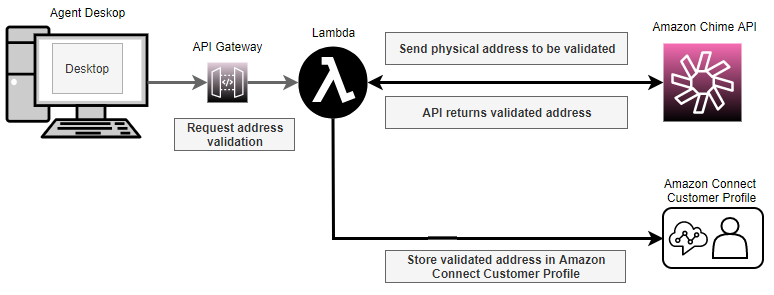

# Get and store an agent's

validated physical address in your Amazon Connect instance

The first step in setting up E911 for your Amazon Connect instance is to get and store the
agent's validated physical address. The following illustration shows the process for
storing addresses.

1. Since agents may be working from different locations (for example, office
   building, home, or coffee shop), it's critical that the most recently
   validated address is passed along with the emergency outbound call.
   1. Store a validated address when you first set up an agent on Amazon Connect,
      based on the agent's usual location.
   2. Prompt the agent to update their address at the start of their
      shift to help ensure that the emergency outbound call has their
      latest address.
   3. Check addresses against a database of valid street addresses
      (Master Street Address Guide).

2. Use the Amazon Chime API [ValidateE911Address](../../../chime-sdk/latest/APIReference/API_voice-chime_ValidateE911Address.md "../../../chime-sdk/latest/APIReference/API_voice-chime_ValidateE911Address.md"). This API validates and returns the
   validated physical address.
3. Use the [CreateProfile](../../../customerprofiles/latest/APIReference/API_CreateProfile.md "../../../customerprofiles/latest/APIReference/API_CreateProfile.md") or [UpdateProfile](../../../customerprofiles/latest/APIReference/API_UpdateProfile.md "../../../customerprofiles/latest/APIReference/API_UpdateProfile.md") APIs to store the validated address in Amazon Connect Customer Profiles.

###### Note

We recommend using `CreateProfile` when it is required to
add a validated address the first time. After that, use
`UpdateProfile`.
