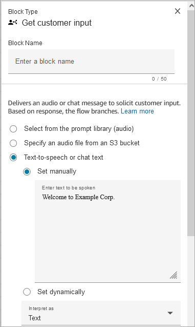
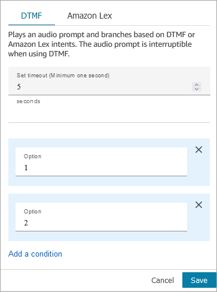
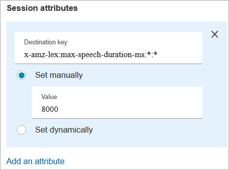
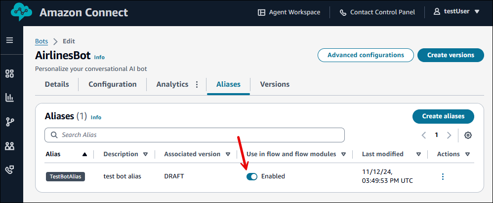
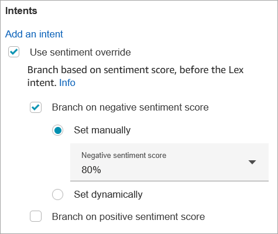
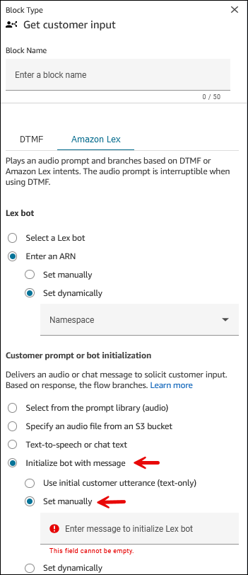
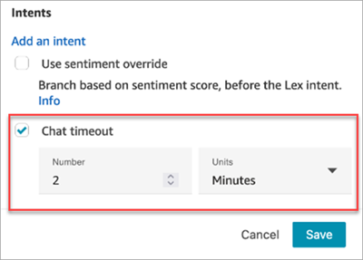
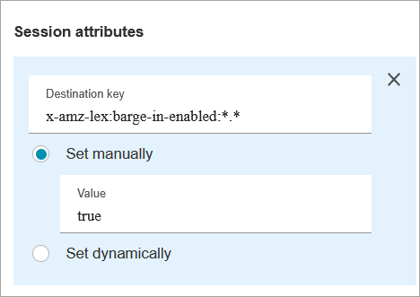
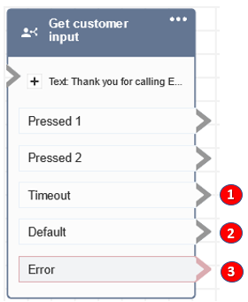

# Flow block in Amazon Connect: Get customer input

This topic defines the flow block for such tasks as capturing customer information,
creating interactive phone menus for customer responses, and routing customers to
specific paths within a flow.

## Description

Captures interactive and dynamic input from customers. It supports interruptible
prompts with DTMF input (input from a phone) and Amazon Lex bot.

This block accepts only individual digits (1-9) and the special characters # and
\*. Multi-digit entries are not supported. For multiple entries, such as gathering a
customer's credit card number, use the [Store customer input](store-customer-input.md "store-customer-input.md") block.

## Use cases for this block

This block is designed to be used in the following scenarios:

- Create interactive phone menus where customers can respond using
  touch-tone keypads. For example, "Press 1 for Sales, press 2 for
  Support."
- Enable voice-activated prompts by using this block with Amazon Lex bots.
  Customers can interrupt the prompts by speaking. This provides them with a
  more natural and responsive interaction.
- Route the customer to specific paths within the flow based on their input.
  This helps direct the customer to the appropriate department or service
  based on their needs.
- Gather feedback from customers by presenting options that allow them to
  express their satisfaction or concerns.
- Conduct surveys and poll customers to collect valuable feedback and
  insights.
- Guide customers through troubleshooting processes by asking specific
  questions related to their issues. You can provide tailored solutions based
  on their responses.

## Contact types

The following table shows how this block routes a contact for each channel.

| Channel | Supported?                                                                    |
| ------- | ----------------------------------------------------------------------------- |
| Voice   | Yes                                                                           |
| Chat    | Yes, when Amazon Lex is used, otherwise it takes the<br>\*_Error_<br>• branch |
| Task    | No                                                                            |
| Email   | No                                                                            |

## Flow types

You can use this block in the following [flow
types](create-contact-flow.md#contact-flow-types "create-contact-flow.md#contact-flow-types"):

| Flow type              | Supported? |
| ---------------------- | ---------- |
| Inbound flow           | Yes        |
| Customer queue flow    | Yes        |
| Customer hold flow     | No         |
| Customer whisper flow  | No         |
| Outbound whisper flow  | Yes        |
| Agent hold flow        | No         |
| Agent whisper flow     | No         |
| Transfer to agent flow | Yes        |
| Transfer to queue flow | Yes        |

## How to configure this block

You can configure the Get customer input block by using the Amazon Connect admin website, or by using the
[GetParticipantInput](../APIReference/participant-actions-getparticipantinput.md "../APIReference/participant-actions-getparticipantinput.md") action in the Amazon Connect Flow language, or the [ConnectParticipantWithLexBot](../APIReference/participant-actions-connectparticipantwithlexbot.md "../APIReference/participant-actions-connectparticipantwithlexbot.md") and [Compare](../APIReference/flow-control-actions-compare.md "../APIReference/flow-control-actions-compare.md") actions.

###### Configuration sections

- [Select a prompt](#get-customer-input-prompt "#get-customer-input-prompt")
- [Configure for DTMF input](#get-customer-input-dtmf "#get-customer-input-dtmf")
- [Configure for Amazon Lex input](#get-customer-input-lex-tab-properties "#get-customer-input-lex-tab-properties")
- [Flow block branches](#gci-branches "#gci-branches")
- [Additional configuration tips](#get-customer-input-tips "#get-customer-input-tips")
- [Data generated by this block](#gci-data "#gci-data")

### Select a prompt

The following image shows the **Properties** page of the
**Get customer input** block. It is manually configured to
play an audio prompt that says "Welcome to Example Corp."



Choose from the following options to select a prompt to be played to the
customer:

- **Select from the prompt library (audio)**: You can
  choose from one of the pre-recorded prompts included with Amazon Connect, or use
  the Amazon Connect admin website to record and upload your own prompt.
- **Specify an audio file from an S3 bucket**: You can
  manually or dynamically specify an audio file from an S3 bucket.
- **Text-to-speech or chat text**: You can enter prompt
  to be played in plain text or SSML. These text-based prompts are played
  as audio prompts to customers using Amazon Polly. SSML-enhanced input text
  gives you more control over how Amazon Connect generates speech from the text
  that you provide. You can customize and control aspects of speech, such
  as pronunciation, volume, and speed.

### Configure for DTMF input

The following image shows the DTMF section of the
**Properties** page. Two conditions have been added to
determine the appropriate branching, depending whether the customer presses 1 or 2. It times out after 5 seconds if the customer doesn't enter anything.



Choose the following options:

- **Set timeout**: Specify how long to wait while the
  user decides how they want to respond to the prompt.

      + Minimum value: 1 second
      + Maximum value: 180 seconds

  After this time elapses, a timeout error occurs. For the Voice
  channel, this is the timeout until the first DTMF digit is entered. Must
  be defined statically, and must be a valid integer larger than zero.

- **Add condition**: The number against which the
  customer input is compared.

#### Flow language representation when DTMF

is used

The following code example shows how a DTMF configuration would be
represented by the [GetParticipantInput](../APIReference/participant-actions-getparticipantinput.md "../APIReference/participant-actions-getparticipantinput.md") action in the Flow language.

```
{
      "Parameters": {
        "StoreInput": "False",
        "InputTimeLimitSeconds": "5",
        "Text": "Welcome to Example Corp. Please press 1 for sales, press 2 for support"
      },
      "Identifier": "Get Customer Input",
      "Type": "GetParticipantInput",
      "Transitions": {
        "NextAction": "d8701db7-3d31-4581-bd4c-cb49c38c6f43",
        "Conditions": [
          {
            "NextAction": "d8701db7-3d31-4581-bd4c-cb49c38c6f43",
            "Condition": {
              "Operator": "Equals",
              "Operands": [
                "1"
              ]
            }
          },
          {
            "NextAction": "d8701db7-3d31-4581-bd4c-cb49c38c6f43",
            "Condition": {
              "Operator": "Equals",
              "Operands": [
                "2"
              ]
            }
          }
        ],
        "Errors": [
          {
            "NextAction": "d8701db7-3d31-4581-bd4c-cb49c38c6f43",
            "ErrorType": "InputTimeLimitExceeded"
          },
          {
            "NextAction": "d8701db7-3d31-4581-bd4c-cb49c38c6f43",
            "ErrorType": "NoMatchingCondition"
          },
          {
            "NextAction": "d8701db7-3d31-4581-bd4c-cb49c38c6f43",
            "ErrorType": "NoMatchingError"
          }
        ]
      }
    }
```

### Configure for Amazon Lex input

- **Select a Lex bot**: After you create your Amazon Lex bot, choose the name of the bot from the drop-down list.
  Only built bots appear in the drop-down list.
- Enter an ARN: Specify the Amazon Resource Name of the Amazon Lex bot.
- **Session attributes**: Specify [Amazon Lex session attributes](connect-attrib-list.md#attribs-lex-table "connect-attrib-list.md#attribs-lex-table") that
  apply to the current contact's session only. The following image shows
  the session attributes configured for a max speech duration of 8000
  milliseconds (8 seconds).



- **Intents**
  - **Add intent**: Choose to enter the name of
    the Amazon Lex bot intent to compare against.

  There are a few ways you can add intents:

      - Enter them manually in the text box.
      - Search for intents.
      - Select intents from a dropdown list.
      - Filter the dropdown list of intents by locale. Based
       on the locale selected, intents for the bot are listed
       in the dropdown list.

  When you select a Lex bot ARN and alias from a dropdown lists,
  you can add intents for that bot by searching using locale. In
  order for intents to be listed, the bot must have an Amazon Connect tag
  and the bot alias must have a version associated with it.

  The **Intents** dropdown box does not list
  intents for Amazon Lex V1 bots, cross region bots, or if the bot ARN
  is dynamically set. For these intents, try the following options
  to find them.

      - Check whether the
       **AmazonConnectEnabled** tag is set
       to true:


      	1. Open the Amazon Lex console, choose
      	 **Bots**, select the bot, then
      	 choose **Tags**.
      	2. If the
      	 **AmazonConnectEnabled** tag is
      	 not present, add **AmazonConnectEnabled =
      	 true**.
      	3. Return to the Amazon Connect admin website. Refresh the flow
      	 designer to see the selections in **Get
      	 customer input** block.
      - Check if the version is associated with the alias:


      	1. In Amazon Connect admin website, choose **Routing**,
      	 **Flows**, the bot,
      	 **Aliases**. Verify that
      	 **Use in flow and flow modules**
      	 is enabled, as shown in the following
      	 image.


      	
      	2. Refresh the flow designer to see the
      	 selections in **Get customer
      	 input** block.

  - **Use sentiment override**: Branch based on
    sentiment score, before the Amazon Lex intent.

  The sentiment score is based on the last utterance of the
  customer. It is not based on the entire conversation.

  For example, a customer calls and they have a negative
  sentiment because their preferred appointment time isn't
  available. You can branch the flow based on their negative
  sentiment score, for example, if their negative sentiment is
  more than 80%. Or, a customer calls and has a positive sentiment
  of more than 80%, you can branch to upsell them on
  services.

  The following image shows the Intents section of the Amazon Lex
  tab. It is configured to route the contact when their negative
  sentiment score is 80%.

  

  If you add both negative and positive sentiment scores, the
  negative score is always evaluated first.

  For information about how to use sentiment score, alternative
  intents, and sentiment label with contact attributes, see [Check contact
  attributes](check-contact-attributes.md "check-contact-attributes.md").

- **Initialize bot with message**
  - **Purpose**: Select this option to pass the
    customer's initial message. Or, enter a custom message manually
    or dynamically to be the initial message used to initialize the
    Lex bot for an enhanced customer chat experience. Both options
    support text only.

  The initial message is sent to the newly created chat while
  invoking the [StartChatContact](../APIReference/API_StartChatContact.md "../APIReference/API_StartChatContact.md") API.

  A custom message is set by typing in a manual initial message
  or dynamically passing an attribute.

      - **User initial customer utterance
       (text-only)**: Always serializes the block
       with bot initialization message as
       ``$.Media.InitialMessage``.
      - **Set manually**: Accepts any plain
       text message or [attribute references](connect-attrib-list.md "connect-attrib-list.md"). Supports a maximum of
       1024 characters.
      - **Set dynamically**: Accepts any
       selected attribute that has a text value. Supports a
       maximum of 1024 characters.

  - **Required**: No. This is not a
    required parameter.
  - **Use cases**:
    - Use **User initial customer utterance
      (text-only)** with web chat, SMS, WhatsApp,
      or Apple Messages for Business channels to have Lex
      respond with an intent to the customer's first chat
      message.
    - Use **Set manually** to statically
      jump to a Lex intent based on your use case in the
      flow.

    You can use this option to proactively display
    interactive messages when customers open the chat
    widget.
    - Use **Set dynamically** to
      dynamically jump to a Lex intent based on an attribute
      (for example, customer profile, contact details, case
      information) or additional information passed from the
      chat widget (for example, product page, customer's
      shopping cart details, or customer preferences assigned
      to [user-defined
      attributes](connect-attrib-list.md#user-defined-attributes "connect-attrib-list.md#user-defined-attributes")).

    You can use this option to proactively display
    interactive messages when customers open the chat
    widget.

###### Note

If the initial message attribute is not included as part of the contact,
the contact is routed down the **Error** branch.

To have separate flow configurations for different messaging types, such
as web chat, SMS, or Apple Messages for Business, before the **Get
customer input** block use the [Check contact attributes](check-contact-attributes.md "check-contact-attributes.md") block
to verify the initial message is available.

The following image shows a **Get customer input** block.
**Initialize bot with message** and **Set
manually** are selected.



#### Configurable

time-outs for voice input

To configure time-out values for voice contacts, use the following session
attributes in the **Get customer input** block that calls
your Lex bot. These attributes allow you to specify how long to wait for the
customer to finish speaking before Amazon Lex collects speech input from callers,
such as answering a yes/no question, or providing a date or credit card
number.

Amazon Lex

- **Max Speech Duration**

`x-amz-lex:audio:max-length-ms:[intentName]:[slotToElicit]`

How long the customer speaks before the input is
truncated and returned to Amazon Connect. You can increase the
time when a lot of input is expected or you want to give
customers more time to provide information.

Default = 12000 milliseconds (12 seconds). The maximum
allowed value is 15000 milliseconds.

###### Important

If you set **Max Speech
Duration** to more than 15000
milliseconds, the contact is routed down the
**Error** branch.

- **Start Silence Threshold**

`x-amz-lex:audio:start-timeout-ms:[intentName]:[slotToElicit]`

How long to wait before assuming that the customer
isn't going to speak. You can increase the allotted time
in situations where you'd like to allow the customer
more time to find or recall information before speaking.
For example, you might want to give customers more time
to get out their credit card so they can enter the
number.

Default = 3000 milliseconds (3 seconds).

- **End Silence Threshold**

`x-amz-lex:audio:end-timeout-ms:[intentName]:[slotToElicit]`

How long to wait after the customer stops speaking
before assuming the utterance has concluded. You can
increase the allotted time in situations where periods
of silence are expected while providing input.

Default = 600 milliseconds (0.6 seconds)

Amazon Lex (Classic)

- **Max Speech Duration**

`x-amz-lex:max-speech-duration-ms:[intentName]:[slotToElicit]`

How long the customer speaks before the input is
truncated and returned to Amazon Connect. You can increase the
time when a lot of input is expected or you want to give
customers more time to provide information.

Default = 12000 milliseconds (12 seconds). The maximum
allowed value is 15000 milliseconds.

###### Important

If you set **Max Speech
Duration** to more than 15000
milliseconds, the contact is routed down the
**Error** branch.

- **Start Silence Threshold**

`x-amz-lex:start-silence-threshold-ms:[intentName]:[slotToElicit]`

How long to wait before assuming that the customer
isn't going to speak. You can increase the allotted time
in situations where you'd like to allow the customer
more time to find or recall information before speaking.
For example, you might want to give customers more time
to get out their credit card so they can enter the
number.

Default = 3000 milliseconds (3 seconds).

- **End Silence Threshold**

`x-amz-lex:end-silence-threshold-ms:[intentName]:[slotToElicit]`

How long to wait after the customer stops speaking
before assuming the utterance has concluded. You can
increase the allotted time in situations where periods
of silence are expected while providing input.

Default = 600 milliseconds (0.6 seconds)

#### Configurable

time-outs for chat input during a Lex interaction

Use the **Chat timeout** field under
**Intents** to configure timeouts for chat input. Enter
how long until inactive customers timeout in a Lex interaction.

- Minimum: 1 minute
- Maximum: 7 days

The following image shows the **Get customer input**
block configured to timeout chats when the customer is inactive for 2
minutes.



For information about setting up chat timeouts when all participants are
human, see [Set up chat timeouts for chat participants](setup-chat-timeouts.md "setup-chat-timeouts.md").

#### Barge-in configuration and

usage for Amazon Lex

You can allow customers to interrupt the Amazon Lex bot mid-sentence using
their voice, without waiting for it to finishing speaking. Customers
familiar with choosing from a menu of options, for example, can now do so
without having to listen to the entire prompt.

Amazon Lex

- **Barge-in**

Barge-in is enabled globally by default. You can
disable it in the Amazon Lex console. For more information,
see [Enabling
your bot to be interrupted by your user](../../../lexv2/latest/dg/interrupt-bot.md "../../../lexv2/latest/dg/interrupt-bot.md").
Additionally, you can modify barge-in behavior, by using
the `allow-interrupt` session attribute. For
example, `x-amz-lex:allow-interrupt:*:*`
allows interrupt for all intents and all slots. For more
information, see [Configuring timeouts for capturing user
input](../../../lexv2/latest/dg/session-attribs-speech.md "../../../lexv2/latest/dg/session-attribs-speech.md") in the _Amazon Lex V2 Developer
Guide_.

Amazon Lex (Classic)

- **Barge-in**

`x-amz-lex:barge-in-enabled:[intentName]:[slotToElicit]`

Barge-in is disabled globally by default. You must set
the session attribute in the **Get customer
input** block that calls your Lex bot to
enable it at the global, bot, or slot levels. This
attribute only controls Amazon Lex barge-in; it doesn't
control DTMF barge-in. For more information, see [How flow blocks use Amazon Lex session
attributes](how-to-use-session-attributes.md "how-to-use-session-attributes.md").

The following image shows the **Session
attributes** section with barge-in
enabled.



#### Configurable fields

for DTMF input

Use the following session attributes to specify how your Lex bot responds
to DTMF input.

- **End character**

`x-amz-lex:dtmf:end-character:[IntentName]:[SlotName]`

The DTMF end character that ends the utterance.

Default = #

- **Deletion character**

`x-amz-lex:dtmf:deletion-character:[IntentName]:[SlotName]`

The DTMF character that clears the accumulated DTMF digits and
ends the utterance.

Default = \*

- **End timeout**

`x-amz-lex:dtmf:end-timeout-ms:[IntentName]:[SlotName]`

The idle time (in milliseconds) between DTMF digits to consider
the utterance as concluded.

Default = 5000 milliseconds (5 seconds)

- **Max number of allow DTMF digits per
  utterance**

`x-amz-lex:dtmf:max-length:[IntentName]:[SlotName]`

The maximum number of DTMF digits allowed in a given utterance.
This cannot be increased.

Default = 1024 characters

For more information, see [How flow blocks use Amazon Lex session
attributes](how-to-use-session-attributes.md "how-to-use-session-attributes.md").

#### Flow Language representation when Amazon Lex

is used

The following code sample shows how an Amazon Lex configuration would be
represented by the [ConnectParticipantWithLexBot](../APIReference/participant-actions-connectparticipantwithlexbot.md "../APIReference/participant-actions-connectparticipantwithlexbot.md") action in the Flow
language:

```
{
    "Parameters": {
      "Text": "Welcome to Example Corp. Please press 1 for sales, press 2 for support",
      "LexV2Bot": {
        "AliasArn": "arn:aws:lex:us-west-2:23XXXXXXXXXX:bot-alias/3HL7SXXXXX/TSTALXXXXX"
      },
      "LexTimeoutSeconds": {
        "Text": "300"
      }
    },
    "Identifier": "Get Customer Input",
    "Type": "ConnectParticipantWithLexBot",
    "Transitions": {
      "NextAction": "d8701db7-3d31-4581-bd4c-cb49c38c6f43",
      "Errors": [
        {
          "NextAction": "d8701db7-3d31-4581-bd4c-cb49c38c6f43",
          "ErrorType": "InputTimeLimitExceeded"
        },
        {
          "NextAction": "d8701db7-3d31-4581-bd4c-cb49c38c6f43",
          "ErrorType": "NoMatchingError"
        },
        {
          "NextAction": "Get Customer Input-ygqIfPM1n2",
          "ErrorType": "NoMatchingCondition"
        }
      ]
    }
  }
```

#### Fragmented action

representation

The following code sample represents a fragmented [Compare](../APIReference/flow-control-actions-compare.md "../APIReference/flow-control-actions-compare.md") action for a Amazon Lex sentiment score returned from a Lex
bot after the conversation.

```
{
      "Parameters": {
        "ComparisonValue": "$.Lex.SentimentResponse.Scores.Negative"
      },
      "Identifier": "Get Customer Input-ygqIfPM1n2",
      "Type": "Compare",
      "Transitions": {
        "NextAction": "Get Customer Input-xDRo1hbBRB",
        "Conditions": [
          {
            "NextAction": "d8701db7-3d31-4581-bd4c-cb49c38c6f43",
            "Condition": {
              "Operator": "NumberGreaterOrEqualTo",
              "Operands": [
                "0.08"
              ]
            }
          }
        ],
        "Errors": [
          {
            "NextAction": "Get Customer Input-xDRo1hbBRB",
            "ErrorType": "NoMatchingCondition"
          }
        ]
      }
    }
```

### Flow block branches

The following image shows an example of what this block looks like when it is
configured for DTMF input. It shows two branches for input: **Pressed
1** and **Pressed 2**. It also shows branches for
**Timeout**, **Default**, and
**Error**.



1. **Timeout**: What to do when no input is provided by
   the customer for the specified chat timeout in Amazon Lex or the
   **Set timeout** value specified for DTMF.
2. **Default**: If the customer enters input that
   doesn't match any condition in DTMF, or an intent executed in Amazon Lex bot.
   This the preceding image, the contact is routed down the
   **Default** branch if they enter a value other than
   1 or 2.
3. **Error**: If the block is run but results in an
   error for DTMF, or an intent is not fulfilled in Amazon Lex bot.

### Additional configuration tips

- For information about choosing a prompt from the Amazon Connect library or an
  S3 bucket, see the [Play prompt](play.md "play.md")
  block.
- You can configure this block to accept DTMF input or a chat response.
  You can also configure it work with Amazon Lex for example, a contact can be
  routed based on their utterance.
  - Session attributes available for the integration with Amazon Lex.
    This topic explains some of the session attributes available for
    the integration with Amazon Lex. For a list of all the available
    Amazon Lex session attributes, see [Configuring
    timeouts for capturing user
    input](../../../lexv2/latest/dg/session-attribs-speech.md "../../../lexv2/latest/dg/session-attribs-speech.md"). When you use text, either for
    text-to-speech or chat, you can use a maximum of 3,000 billed
    characters (6,000 total characters).
  - Amazon Lex bots support both spoken utterances and keypad input
    when used in a flow.
  - For both voice and DTMF, there can be only one set of session
    attributes per conversation. Following is the order of
    precedence:
    1. Lambda provided session attributes: Overrides to
       session attributes during customer Lambda
       invocation.
    2. Amazon Connect console provided session attributes: Defined in
       the **Get customer input**
       block.
    3. Service defaults: These are used only if no attributes
       are defined.

- You can prompt contacts to end their input with a pound key # and to
  cancel it using the star key \*. When you use a Lex bot, if you don't
  prompt customers to end their input with #, they will end up waiting
  five seconds for Lex to stop waiting for additional key presses.
- To control time-out functionality, you can
  use Lex session attributes in this block, or in set them in your Lex
  Lambda function. If you choose to set the attributes in a Lex Lambda
  function, the default values are used until the Lex bot is invoked. For
  more information, see [Using
  Lambda Functions](../../../lex/latest/dg/using-lambda.md "../../../lex/latest/dg/using-lambda.md") in the _Amazon Lex Developer Guide_.
- When you specify one of the session attributes described in this
  article, you can use wildcards. They let you set multiple slots for an
  intent or bots.

Following are some examples of how you can use wildcards:

    + To set all slots for a specific intent, such as PasswordReset,
     to 2000 milliseconds:


    Name =
     `x-amz-lex:max-speech-duration-ms:PasswordReset:*`


    Value = 2000
    + To set all slots for all bots to 4000 milliseconds:


    Name =
     `x-amz-lex:max-speech-duration-ms:*:*`


    Value = 4000

Wildcards apply across bots but not across blocks in a flow.

For example, you have a Get_Account_Number bot. In the flow, you have
two **Get customer input** blocks. The first block sets
the session attribute with a wildcard. The second one doesn't set the
attribute. In this scenario, the change in behavior for the bot applies
only to the first **Get customer input** block, where
the session attribute is set.

- Because you can specify that session attributes apply to the intent
  and slot level, you can specify that the attribute is set only when
  you're collecting a certain type of input. For example, you can specify
  a longer **Start Silence Threshold** when you're
  collecting an account number than when you're collecting a date.
- If DTMF input is provided to a Lex bot using Amazon Connect, the customer input
  is made available as a [Lex request
  attribute](../../../lex/latest/dg/context-mgmt-request-attribs.md "../../../lex/latest/dg/context-mgmt-request-attribs.md"). The attribute name is
  `x-amz-lex:dtmf-transcript` and the value can be a
  maximum of 1024 characters.

Following are different DTMF input scenarios:

| Customer input | DTMF transcript |
| -------------- | --------------- |
| [DEL]          | [DEL]           |
| [END]          | [END]           |
| 123[DEL]       | [DEL]           |
| 123[END]       | 123             |

Where:

    + [DEL] = Deletion character (Default is **\***
     )
    + [END] = End character (Default is **#**
     )

### Data generated by this block

This block does not generate any data.

## Error scenarios

Let's say you have the following scenario with two flows, each one capturing DTMF
input from customers:

1. One flow uses the **Get customer input** block to request
   DTMF input from customers.
2. After the DTMF input is entered, it uses the **Transfer to
   flow** block to move the contact to the next flow.
3. In the next flow, there's a **Store customer input**
   block to get more DTMF input from the customer.

There's setup time between the first and second flows. This means if the customer
enters DTMF input very quickly for the second flow, some of the DTMF digits might be
dropped.

For example, the customer needs to press 5, then wait for a prompt from the second
flow, then type 123. In this case, 123 is captured without problem. However, if they
don't wait for the prompt and enter 5123 very quickly, the Store customer input
block may capture only 23 or 3.

To guarantee the **Store customer input** block in second flow
captures all of the digits, the customer needs to wait for the prompt to be played,
and then enter their type DTMF input.

## Sample flows

Amazon Connect includes a set of sample flows. For instructions that explain how to access the sample flows in the flow designer, see
[Sample flows in Amazon Connect](contact-flow-samples.md "contact-flow-samples.md"). Following are topics
that describe the sample flows which include this block.

- [Sample inbound flow in Amazon Connect for the first contact
  experience](sample-inbound-flow.md "sample-inbound-flow.md")
- [Sample interruptible queue flow with
  callback in Amazon Connect](sample-interruptible-queue.md "sample-interruptible-queue.md")
- [Sample queue configurations flow in
  Amazon Connect](sample-queue-configurations.md "sample-queue-configurations.md")
- [Sample recording behavior in Amazon Connect](sample-recording-behavior.md "sample-recording-behavior.md")

## More resources

See the following topics to learn more about Amazon Lex and adding prompts.

- [Create conversational AI bots in Amazon Connect](connect-conversational-ai-bots.md "connect-conversational-ai-bots.md")
- [How to use the same Amazon Lex bot for voice and
  chat](one-bot-voice-chat.md "one-bot-voice-chat.md")
- [Add text-to-speech to prompts in flow blocks in
  Amazon Polly](text-to-speech.md "text-to-speech.md")
