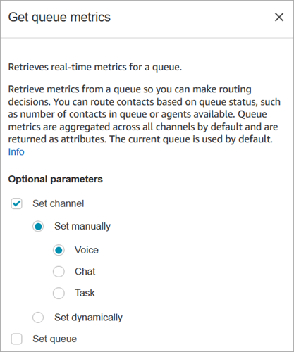
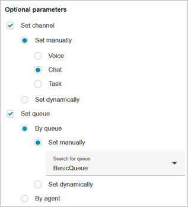
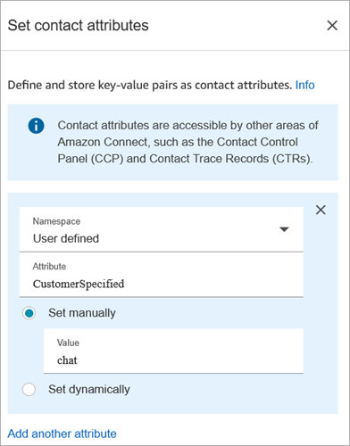
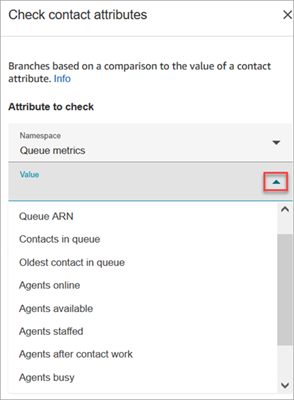
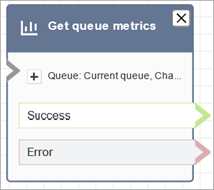

# Flow block in Amazon Connect: Get metrics

By default, this block returns queue metrics for the current queue. You can optionally choose to return metrics for a different queue/channel combination, or contact-level metrics such as the contact's position in queue. Metrics are returned as attributes that can be referenced via JSONPath or the Check contact attributes block.

## Description

- Retrieves near real-time queue metrics with a 5-10 second delay for more
  granular routing decisions.
- You can route contacts based on queue or agent status, such as the number
  of contacts in queue or agents available.
- Queue metrics are aggregated across all channels by default and are
  returned as attributes.
- The current queue is used by default.
- For agent-based metrics (such as agents online, agents available, or
  agents staffed), if there are no agents, no metrics are returned.
- For queue estimated wait time, the metric would only return when there's one single channel provided.
- Following are the metrics that can be retrieved:
  - Queue name
  - Queue ARN
  - [Contacts in queue](metrics-definitions.md#contacts-in-queue "metrics-definitions.md#contacts-in-queue")
  - [Oldest contact in
    queue](metrics-definitions.md#oldest-real-time "metrics-definitions.md#oldest-real-time")
  - [Agents online](metrics-definitions.md#online-agents "metrics-definitions.md#online-agents")
  - [Agents available](metrics-definitions.md#available-real-time "metrics-definitions.md#available-real-time")
  - [Agents staffed](metrics-definitions.md#staffed-agents "metrics-definitions.md#staffed-agents")
  - [Agent after contact
    work](metrics-definitions.md#agent-after-contact-work "metrics-definitions.md#agent-after-contact-work")
  - [Agents busy](metrics-definitions.md#agents-on-contact "metrics-definitions.md#agents-on-contact")
  - [Agents missed](metrics-definitions.md#agent-non-response "metrics-definitions.md#agent-non-response") (Agent
    non-response)
  - [Agents
    non-productive](metrics-definitions.md#agent-non-productive "metrics-definitions.md#agent-non-productive")
  - [Queue estimated wait time](metrics-definitions.md#estimated-wait-time "metrics-definitions.md#estimated-wait-time")
  - [Contact estimated wait time](metrics-definitions.md#estimated-wait-time "metrics-definitions.md#estimated-wait-time")
  - [Contact position in queue](metrics-definitions.md#position-in-queue "metrics-definitions.md#position-in-queue")

- You can choose to return metrics by channel, for example, voice or chat.
  You can also filter by queue or agent. These options enable you to know how
  many chat and voice contacts are in a queue and if you have agents available
  to handle those contacts.
- You can route contacts based on queue status, such as number of contacts
  in queue or agents available. Queue metrics are aggregated across all
  channels and are returned as attributes. The current queue is used by
  default.
- After a **Get metrics** block, use a [Check contact
  attributes](check-contact-attributes.md "check-contact-attributes.md") to check metric values
  and define routing logic based on them, such as number of contacts in a
  queue, number of available agents, and oldest contact in a queue.

## Supported channels

The following table lists how this block routes a contact who is using the
specified channel.

| Channel | Supported? |
| ------- | ---------- |
| Voice   | Yes        |
| Chat    | Yes        |
| Task    | Yes        |
| Email   | Yes        |

## Flow types

You can use this block in the following [flow
types](create-contact-flow.md#contact-flow-types "create-contact-flow.md#contact-flow-types"):

- All flows

## Properties

The following image shows the **Properties** page of the
**Get metrics** block. It is configured to retrieve
metrics for the **Voice** channel.

You can retrieve metrics by channel, and/or by queue or agent.

- If you don't specify a channel, it returns metrics for all channels.
- If you don't specify a queue, it returns metrics for the current
  queue.
- Dynamic attributes can only return metrics for one channel.

For example, the following image shows the **Properties** page
configured for the **Chat** channel and
**BasicQueue**. If you choose these settings **Get
queue metrics** would return metrics for only the BasicQueue, filtered
to include only chat contacts.

## Configuration tips

### Specifying a channel in the Set

contact attributes block

Dynamic attributes can only return metrics for one channel.

Before you use dynamic attributes in the **Get
metrics** block, you need to set the attributes in the [Set contact
attributes](set-contact-attributes.md "set-contact-attributes.md") block, and specify which
channel.

When you set a channel dynamically using text, as shown in the following
image, for the attribute value enter **Voice** or
**Chat**. This value is not case-sensitive.

### Using the Check contact attributes

block after the Get metrics block

After a **Get metrics** block, add a [Check contact
attributes](check-contact-attributes.md "check-contact-attributes.md") block to branch based on
the returned metrics. Use the following steps:

1. After **Get metrics**, add a **Check
   contact attributes** block.
2. In the **Check contact attributes** block, set
   **Attribute to check** to **Queue
   metrics**.
3. In the **Value** dropdown box, you'll see a list of
   metrics that can be checked by the **Get
   metrics** block. Choose the metric that you want to use for
   the routing decision.

### Why Get metrics block throws an

error

The **Get metrics** block throws an error in the
following scenario:

1. You add this block to your flow.
2. The Real-time metrics report returns empty metrics because no activity
   is taking place.
3. The **Get metrics** block throws an error
   because there are no metrics to display.

## Configured block

The following image shows an example of what this block looks like when it is
configured. It has two branches: **Success** and
**Error**.

## Scenarios

See these topics for scenarios that use this block:

- [How to reference contact attributes in
  Amazon Connect](how-to-reference-attributes.md "how-to-reference-attributes.md")
