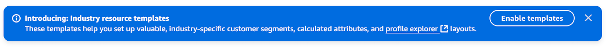
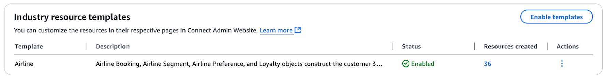
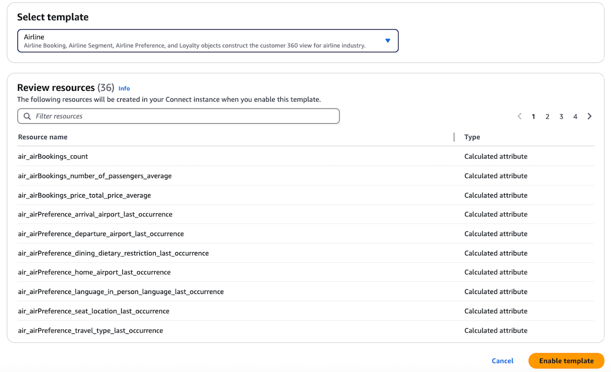
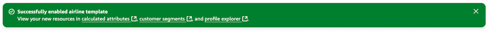

# Getting started with industry

resource templates

Amazon Connect Customer Profiles provides industry resource templates to help you quickly set up your domain with
calculated attributes, segments, and Profile Explorer layouts tailored to specific
industries.

## Before you begin

Before you enable industry resource templates, ensure you have:

- An Amazon Connect instance with Customer Profiles enabled
- Appropriate permissions to create resources in your Customer Profiles
  domain

## About industry resource

templates

When you enable an industry template, Customer Profiles automatically creates the
following resources in your domain:

- Calculated attribute definitions - Pre-defined attributes derived from your
  customer data
- Segment definitions - Customer groupings based on common
  characteristics
- Profile Explorer layouts - Customized dashboard views for visualizing customer
  information

These resources are designed to help you quickly derive value from your customer data
without having to manually create each resource.

## Enable industry resource

templates

1. On the Customer Profiles homepage, locate the Industry templates
   section.
   - If this is your first time setting up Customer Profiles, an
     announcement appears at the top of the page.

   
   - If you already have resources in your domain, the list of enabled
     templates appears in the Industry templates section.

   

2. To enable a template, choose **Enable a template**.
3. In the **Select template** dropdown, choose the industry that
   best matches your business:
   - **Airline** - For air travel businesses
   - **Hotel** - For hospitality businesses

4. Review the resources that will be created in the **Review
   resources** section.

 5. Choose **Enable template**. 6. Wait for the resources to be created. Make sure to keep the browser tab open
while the resource creation is in progress. 7. Once complete, you'll see a confirmation message and the template will appear
in the Industry templates section with the number of resources created.

## Resources created by industry

templates

### Airline Industry Template

#### Calculated Attributes

The airline template creates calculated attributes across several
categories:

| Airline Calculated Attributes                                 | Calculated Attribute Name           | Display Name                                                                          | Description        | Object type |
| ------------------------------------------------------------- | ----------------------------------- | ------------------------------------------------------------------------------------- | ------------------ | ----------- |
| air_airPreference_departure_airport_last_occurrence           | Preferred departure airport         | Returns customer's most recently configured preferred departure airport.           | \_airPreference    |
| air_airPreference_arrival_airport_last_occurrence             | Preferred arrival airport           | Returns customer's most recently configured preferred arrival airport.             | \_airPreference    |
| air_airPreference_travel_type_last_occurrence                 | Preferred travel type               | Returns customer's most recently configured preferred type of travel.              | \_airPreference    |
| air_airPreference_marketing_opt_in_last_occurrence            | Marketing opt-in preference         | Returns customer's most recently configured marketing opt-in setting.              | \_airPreference    |
| air_airPreference_language_in_person_language_last_occurrence | Preferred in-person language        | Returns customer's most recently preferred language for in-person interactions.    | \_airPreference    |
| air_airPreference_seat_location_last_occurrence               | Preferred seat location             | Returns customer's most recently selected seat location preference.                | \_airPreference    |
| air_airPreference_home_airport_last_occurrence                | Preferred home airport              | Returns customer's most recently specified home airport.                           | \_airPreference    |
| air_airPreference_dining_dietary_restriction_last_occurrence  | Preferred dietary restriction       | Returns customer's most recently specified dietary restriction.                    | \_airPreference    |
| air_airBookings_number_of_passengers_average                  | Average passengers per booking      | Returns average number of passengers across customer's bookings.                   | \_airBooking       |
| air_airBookings_price_total_price_average                     | Average booking price               | Returns average cost across all customer's bookings.                                  | \_airBooking       |
| air_airBookings_count                                         | Count of bookings                   | Returns the count of bookings made by a customer.                                     | \_airBooking       |
| air_airSegments_flight_delay_time_sum                         | Total flight delay duration         | Returns total length of flight delays experienced by customer.                     | \_airSegment       |
| air_airSegments_cancelled_flights_count_30_days               | Cancelled flights in past 30 days   | Returns count of customer flights cancelled within the last 30 days.               | \_airSegment       |
| air_airSegments_delayed_flights_count_30_days                 | Delayed flights in past 30 days     | Returns count of customer flights delayed within the last 30 days.                 | \_airSegment       |
| air_airSegments_completed_flights_count_30_days               | Completed flights in past 30 days   | Returns count of customer flights completed within the last 30 days.               | \_airSegment       |
| air_airSegments_completed_flights_count_1_year                | Completed flights in past year      | Returns count of customer flights completed within the last year.                  | \_airSegment       |
| air_airSegment_departure_date_last_occurrence                 | Last flight departure date          | Returns departure date of customer's most recent flight.                           | \_airSegment       |
| air_airSegments_miles_to_earn_sum                             | Total miles flown                   | Returns sum of all flight distances in miles for a customer.                       | \_airSegment       |
| air_airSegments_miles_to_earn_sum_1_year                      | Miles flown in past year            | Returns sum of flight miles flown by customer in the past year.                    | \_airSegment       |
| air_airSegments_business_first_class_count                    | Count of premium class flights      | Returns count of customer air segments booked as business-class or first-class.    | \_airSegment       |
| air_loyalties_points_redeemed_sum                             | Total loyalty points redeemed       | Returns total sum of points redeemed across all customer loyalty programs.         | \_loyalty          |
| air_loyalties_count                                           | Count of loyalty memberships        | Returns number of loyalty program memberships held by the customer.                | \_loyalty          |
| air_loyalty_tier_points_to_next_tier_last_occurrence          | Points to next tier                 | Returns customer's most recent record of points needed to reach next loyalty tier. | \_loyalty          |
| air_loyalty_points_balance_last_occurrence                    | Current loyalty points balance      | Returns customer's most recent loyalty points balance.                             | \_loyalty          |
| air_loyalty_membership_id_last_occurrence                     | Current loyalty membership ID       | Returns customer's most recent loyalty membership identifier.                      | \_loyalty          |
| air_loyalty_program_name_last_occurrence                      | Current loyalty program name        | Returns customer's most recent loyalty program name.                                  | \_loyalty          |
| air_loyalty_enrollment_date_last_occurrence                   | Most recent loyalty enrollment date | Returns customer's most recent loyalty program enrollment date.                    | \_loyalty          |
| air_loyalty_tier_current_tier_last_occurrence                 | Current loyalty tier                | Returns customer's most recent loyalty program tier status.                        | \_loyalty          |
| air_loyalties_silver_gold_platinum_tier_count                 | Count of premium tier memberships   | Returns count of customer loyalty programs with Silver                             | \_loyalty          |
| air_loyaltyPromotions_count                                   | Count of loyalty promotions         | Returns total number of loyalty promotions received by the customer.               | \_loyaltyPromotion |

#### Segments

The airline template creates the following segments:

- [Airline] Marketing subscribers
- [Airline] Customers with cancelled flights in the past 30 days
- [Airline] Customers with delayed flights in the past 30 days
- [Airline] Customers with completed flights in the past 30 days
- [Airline] Dormant members

#### Profile Explorer

Layout

A demo profile explorer layout is created with layout name:
`DEMO-Airline-Layout` that consists of the following
widgets:

- Customer details and contact information
- Loyalty program status and points
- Recent bookings and flights
- Customer preferences
- Customer value metrics
- Customer satisfaction indicators

### Hotel Industry Template

#### Calculated Attributes

The hotel template creates calculated attributes across several
categories:

| Hotel Calculated Attributes                                    | Calculated Attribute Name           | Display Name                                                                          | Description        | Object type |
| -------------------------------------------------------------- | ----------------------------------- | ------------------------------------------------------------------------------------- | ------------------ | ----------- |
| hotel_hotelPreference_location_room_type_last_occurrence       | Preferred room type                 | Returns customer's most recently configured preferred room type.                   | \_hotelPreference  |
| hotel_hotelPreference_cleaning_time_last_occurrence            | Preferred cleaning time             | Returns customer's most recently configured room cleaning time preference.         | \_hotelPreference  |
| hotel_hotelPreference_location_view_last_occurrence            | Preferred room view                 | Returns customer's most recently configured room view preference.                  | \_hotelPreference  |
| hotel_hotelPreference_check_in_type_last_occurrence            | Preferred check-in method           | Returns customer's most recently configured check-in method preference.            | \_hotelPreference  |
| hotel_hotelPreference_check_out_type_last_occurrence           | Preferred check-out method          | Returns customer's most recently configured check-out method preference.           | \_hotelPreference  |
| hotel_hotelPreference_special_request_last_occurrence          | Last special request type           | Returns customer's most recently requested special accommodation type.             | \_hotelPreference  |
| hotel_hotelPreference_interest_name_of_interest_max_occurrence | Most frequent interest              | Returns customer's most frequently expressed interest or amenity preference.       | \_hotelPreference  |
| hotel_hotelPreference_marketing_opt_in_last_occurrence         | Marketing opt-in preference         | Returns customer's most recently configured marketing opt-in setting.              | \_hotelPreference  |
| hotel_hotelReservations_number_of_nights_average               | Average length of stay              | Returns average duration of stay across all customer hotel reservations.           | \_hotelReservation |
| hotel_hotelReservations_number_of_nights_completed_sum_1_year  | Total nights in past year           | Returns total nights stayed in the past year across all customer reservations.     | \_hotelReservation |
| hotel_hotelReservations_number_of_nights_completed_sum         | Total nights stayed                 | Returns total number of nights stayed across all customer hotel reservations.      | \_hotelReservation |
| hotel_hotelReservation_room_type_name_last_occurrence          | Last room type booked               | Returns customer's most recently booked room type.                                    | \_hotelReservation |
| hotel_hotelReservation_channel_method_last_occurrence          | Last booking channel used           | Returns customer's most recent channel used for hotel reservation.                 | \_hotelReservation |
| hotel_hotelReservations_count                                  | Count of reservations               | Returns the count of hotel reservations made by a customer.                        | \_hotelReservation |
| hotel_hotelReservations_total_amount_after_tax_average         | Average reservation spend           | Returns average amount spent per hotel reservation after taxes.                    | \_hotelReservation |
| hotel_hotelReservations_total_amount_after_tax_sum             | Total hotel spend                   | Returns total amount spent across all customer hotel reservations after taxes.     | \_hotelReservation |
| hotel_hotelReservation_number_of_guests_max_occurrence         | Most common group size              | Returns customer's most frequently booked number of guests across all stays.       | \_hotelReservation |
| hotel_hotelReservations_business_travel_count                  | Count of business trips             | Returns count of customer reservations marked as business travel.                  | \_hotelReservation |
| hotel_hotelReservations_missed_checkin_count                   | Count of missed check-ins           | Returns count of reservations where customer missed check-in.                      | \_hotelReservation |
| hotel_hotelReservation_cancelled_count                         | Count of cancelled reservations     | Returns count of hotel reservations that were cancelled by the customer.           | \_hotelReservation |
| hotel_hotelStayRevenues_amount_sum                             | Total revenue generated             | Returns total revenue generated from all customer hotel stays.                     | \_hotelStayRevenue |
| hotel_hotelStayRevenues_amount_average                         | Average revenue per stay            | Returns mean revenue amount calculated across all customer stays.                  | \_hotelStayRevenue |
| hotel_hotelStayRevenues_amount_maximum                         | Highest revenue amount              | Returns largest single revenue amount generated from any customer stay.            | \_hotelStayRevenue |
| hotel_hotelStayRevenue_revenue_type_max_occurrence             | Most common revenue source          | Returns most frequent type of revenue generated across customer hotel stays.       | \_hotelStayRevenue |
| hotel_loyalties_points_redeemed_sum                            | Total loyalty points redeemed       | Returns total sum of points redeemed across all customer loyalty programs.         | \_loyalty          |
| hotel_loyalties_count                                          | Count of loyalty memberships        | Returns number of loyalty program memberships held by the customer.                | \_loyalty          |
| hotel_loyalty_tier_points_to_next_tier_last_occurrence         | Points to next tier                 | Returns customer's most recent record of points needed to reach next loyalty tier. | \_loyalty          |
| hotel_loyalty_points_balance_last_occurrence                   | Current loyalty points balance      | Returns customer's most recent loyalty points balance.                             | \_loyalty          |
| hotel_loyalty_membership_id_last_occurrence                    | Current loyalty membership ID       | Returns customer's most recent loyalty membership identifier.                      | \_loyalty          |
| hotel_loyalty_program_name_last_occurrence                     | Current loyalty program name        | Returns customer's most recent loyalty program name.                                  | \_loyalty          |
| hotel_loyalty_enrollment_date_last_occurrence                  | Most recent loyalty enrollment date | Returns customer's most recent loyalty program enrollment date.                    | \_loyalty          |
| hotel_loyalty_tier_current_tier_last_occurrence                | Current loyalty tier                | Returns customer's most recent loyalty program tier status.                        | \_loyalty          |
| hotel_loyalties_silver_gold_platinum_tier_count                | Count of premium tier memberships   | Returns count of customer loyalty programs with Silver                             | \_loyalty          |
| hotel_loyaltyPromotions_count                                  | Count of loyalty promotions         | Returns total number of loyalty promotions received by the customer.               | \_loyaltyPromotion |

#### Segments

The hotel template creates segments such as:

- [Hotel] Preference Marketing Subscribers
- [Hotel] Solo travelers
- [Hotel] Couple or pair travelers
- [Hotel] Family or group travelers
- [Hotel] Customers with upcoming reservation in 30 days

#### Profile Explorer Layout

A customized layout that displays:

- Customer details and contact information
- Room preferences
- Stay history
- Revenue information
- Loyalty status

## Disable industry templates

You can disable an industry template to remove the resources it created from your
domain. To disable a template:

1. On the Customer Profiles homepage, locate the Industry templates
   section.
2. Find the template you want to disable and choose **Disable**
   action.
3. Review the confirmation message and choose **Confirm** to
   disable the template.

###### Important

When you disable a template, all resources created by that template will be
deleted from your domain. If any of these resources are used in Customer Segments,
Outbound Campaigns, or Contact Flows, disabling the template may impact them.

Before disabling a template, review the resources in use to understand the
potential impact.

## Troubleshooting

| Troubleshooting Industry Templates                 | Error                                                                                                                                                                                                                                                                                                         | Recommendation |
| -------------------------------------------------- | ------------------------------------------------------------------------------------------------------------------------------------------------------------------------------------------------------------------------------------------------------------------------------------------------------------- | -------------- |
| Template resources failed to create                | 1. Check that you have the necessary permissions to create resources in your domain. 2. Verify that you haven't reached the limit for calculated attributes or segments in your domain. 3. Try enabling the template again. It will only attempt to create resources that don't already exist. |
| Created resources don't appear in Profile Explorer | 1. Refresh your browser. 2. Verify that you have the necessary Security Profiles permissions to view the resources. 3. Check that the resources were successfully created in the Industry templates section.                                                                                      |
| Unable to enable multiple templates                | Each domain can have multiple industry templates enabled. If you're experiencing issues, check that you haven't reached the resource limits for your domain.                                                                                                                                            |
| Need to delete template resources                  | Currently, the Getting Started feature does not provide a way to automatically delete all resources created by a template. You can manually delete individual resources through their respective management pages.                                                                                   |

## Next steps

After enabling an industry template, you can:

- Navigate to the Profile Explorer to see your new layout in action
- View and Edit calculated attributes to better fit your specific needs
- Manage customer segments in Amazon Connect
- Edit Profile Explorer Layout based on your business requirements
- Integrate external applications with Amazon Connect Customer Profiles to start
  populating profiles
