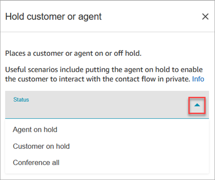
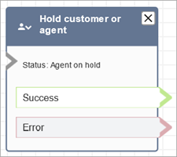

# Flow block in Amazon Connect: Hold customer or

agent

This topic defines the flow block for placing a customer or agent on hold, and
resuming the call afterward.

###### Important

During a video call or screen sharing session, agents are able to see the
customer's video or screen share even when the customer is on hold. It is the customer's
responsibility to handle PII accordingly. If you want to change this behavior, you can build a
custom CCP and communication widget. For more information, see [Integrate in-app, web, video calling, and screen
sharing natively into your application](config-com-widget2.md "config-com-widget2.md").

## Description

- Places a customer or agent on or off hold. This is useful when, for
  example, you want to put the agent on hold while the customer enters their
  credit card information.
- If this block is triggered during a chat conversation, the contact is
  routed down the **Error** branch.

## Supported channels

The following table lists how this block routes a contact who is using the
specified channel.

| Channel | Supported?           |
| ------- | -------------------- |
| Voice   | Yes                  |
| Chat    | No • Error branch |
| Task    | No • Error branch |
| Email   | No • Error branch |

## Flow types

You can use this block in the following [flow
types](create-contact-flow.md#contact-flow-types "create-contact-flow.md#contact-flow-types"):

- Inbound flow
- Outbound Whisper flow
- Transfer to Agent flow
- Transfer to Queue flow

## Properties

The following image shows the **Properties** page of the
**Hold customer or agent** block. It shows that the dropdown
list has three options: **Agent on hold**, **Customer on
hold**, and **Conference all**.

These options are defined as follows:

- **Agent on hold** = customer is on the call
- **Conference all** = agent and customer are on the
  call
- **Customer on hold** = agent is on the call

## Configured block

The following image shows an example of what this block looks like when it is
configured. It configured for **Agent on hold**, and it
has two branches: **Success** and
**Error**.

## Samples flows

[Sample secure customer data entry input
in a call with a contact center agent](sample-secure-input-with-agent.md "sample-secure-input-with-agent.md")
