# Identify dates where you need to override standard operating hours

You can override the standard operating hours for future dates where operations will be closed, have reduced hours, or will be open longer than normal.

###### Note

Up to 50 overrides can be created for each hours of operation resource. This quota is not adjustable.

###### Create an override

1. Navigate to the **Routing** menu and open **Hours of operation**.
2. Open a record by selecting its name.
3. In the **Overrides** section, select **Create**.

###### Note

If you have view-only permissions, you will not see this action. 4. Build your list of overrides by choosing between:

    1. **Add recurring event** — Use for holidays and other dates that follow a repeating pattern (e.g. early closure the last Friday of every month).
    2. **Create temporary hours** — Use for dates with non-standard hours that are not recurring and where the configured hours must supersede all other settings for that date/range.
    3. **Copy from another Hours of Operation** - Use when it is helpful to pull together overrides already configured on other records, but you want the option to make changes (for example, to remove certain dates).

    ###### Note

    Rather than setting up a list of dates and times directly, you can link to the overrides set up on a different Hours of operation resource. Use this approach if you wish to share a master list that is maintained in one place.

5. Follow the instructions on the window that opens.
6. Select **Apply** to commit your selected date(s) and hours.
7. Select **Save** at the top right of the hours of operation resource page.

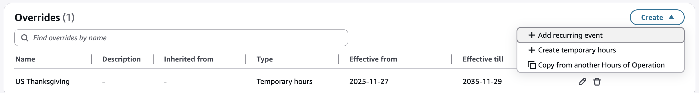

###### Recurring events

If you choose recurring event:

1. Provide a meaningful **Name** for this override.
2. Select the **Effective dates** for this override.

###### Note

These dates are used by Flows to determine if this override should be considered. If today's date falls before or after this range, the override will be ignored. 3. Indicate if operations are **Closed** or **Open**. 4. Choose the **Recurrence pattern**. Based on your selections, you will be able to provide additional details.
In this example, operations are closed on a specific date each year, no matter what day of the week it falls on:

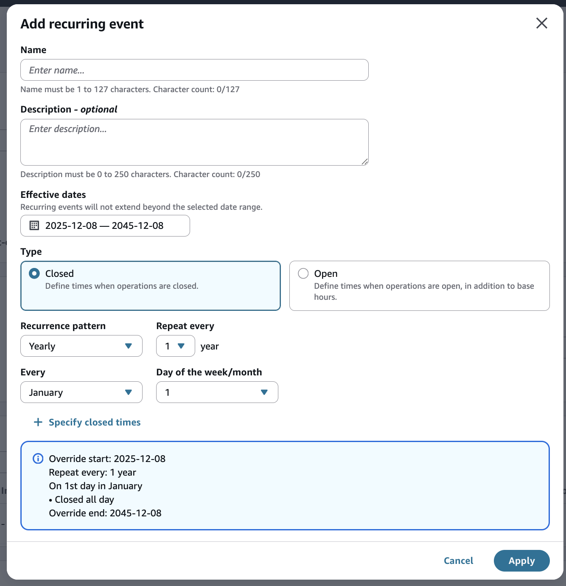
In this example, extended hours have been set up for every other week:

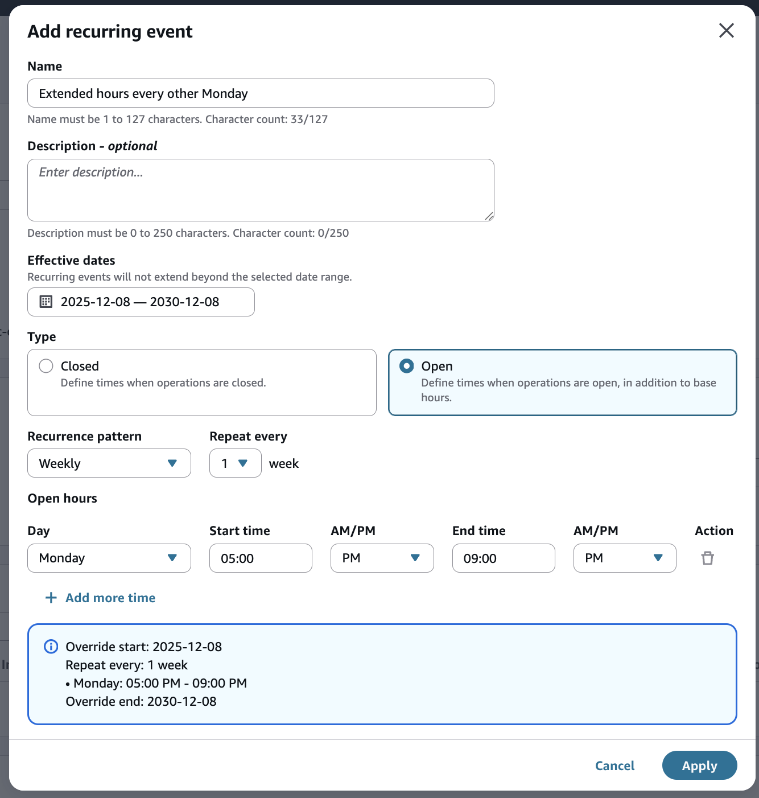

###### Temporary hours

If you choose temporary hours:

1. Provide a meaningful **Name** for this override.
2. Select the **Effective dates** for this override.

###### Note

These dates are used by Flows to determine if this override should be considered. If today's date falls before or after this range, the override will be ignored. 3. Select the **Hours** for the specified date(s), that will replace the standard day of the week schedule.

###### Note

Recurring open/closed overrides take precedence over temporary hours.
In this example, operations are only open every other day and for partial hours:

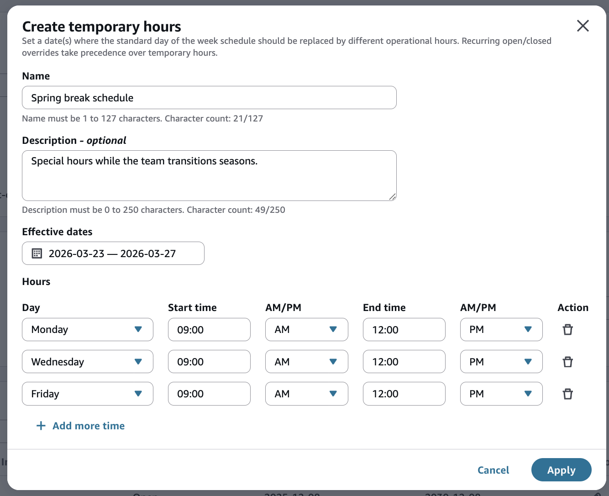

###### Copy overrides

If you choose **Copy from another Hours of Operations**:

1. Find the parent resource and select it.
2. Next, click to **Save link**.

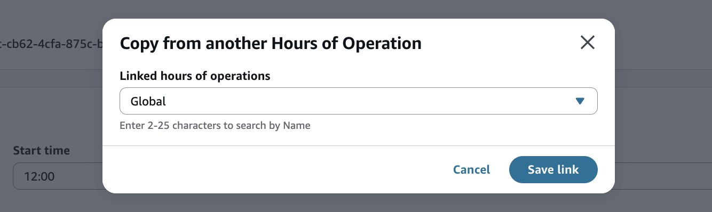
After copying a list, the override records are _distinct from their source_. They are unaffected by changes made to that original list (for example, if Labor Day changes from closed to a half day).

###### Note

Copied overrides count towards the 50 override service quota.

###### Note

If you want to instead rely on a global list and ensure your override dates and times are automatically kept in sync, then follow instructions for _linking_ rather than copying.

###### Link overrides

An alternative to setting up a list of overrides within an hours of operation record is to link to another resource that contains a master list. For example, you can set up a “parent” hours of operations to house a list of global corporate holidays, and another for regional blocked dates, and so on. Each “child” that is linked to a parent record inherits its overrides. As changes are made to the parent, the child automatically benefits without additional effort.

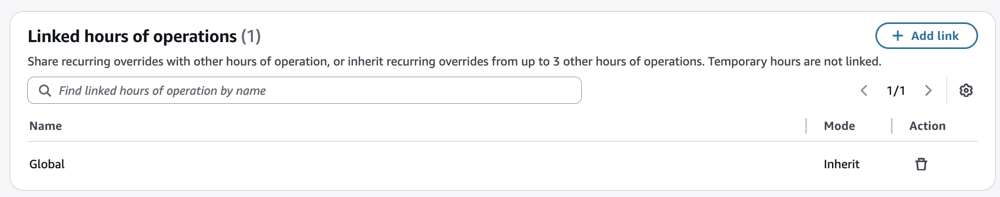
To create a link so overrides are inherited from another hours of operations:

1. Open a record and navigating to the **Linked hours of operations** section.
2. Select the button to **Add link**.

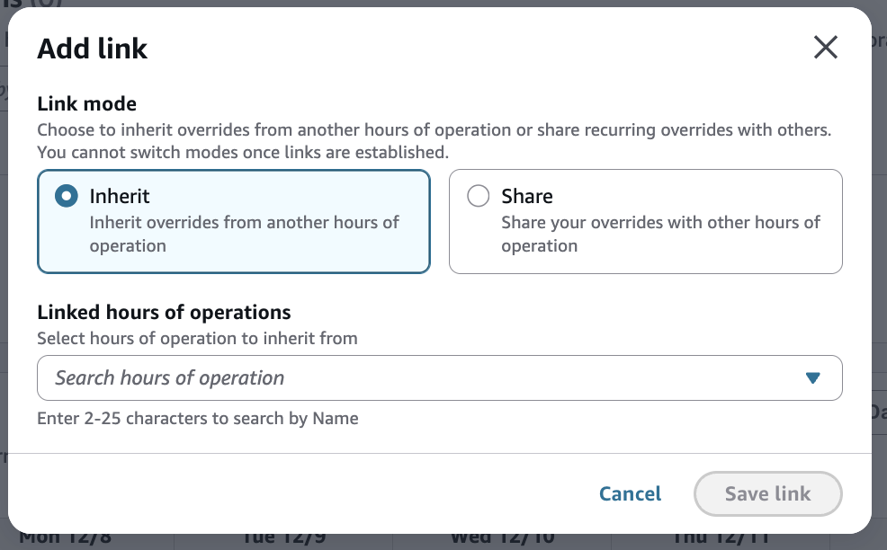 3. Choose the link mode titled **Inherit**. 4. Search for the hours of operation that will provide the source override list. 5. Select the **Save link** button. 6. Repeat as needed.

###### Note

Parent overrides do not count towards the 50 override service quota.

###### Note

A child can link to up to 3 parents. This quota is not adjustable.

###### Note

After an hours of operation record becomes a child, it cannot have children itself.
To create a link that shares overrides:

1. Open a record and navigating to the **Linked hours of operations** section.
2. Select the button to **Add link**.
3. Choose the link mode titled **Share**.
4. Search an hours of operation that you wish to provide overrides to.
5. Select the **Save link** button.
6. Repeat as needed.

###### Note

The number of children that can reference the same parent is not limited. All of the hours of operations in the instance can share the same parent override list.

###### Note

After an hours of operation record becomes a parent, it cannot have a parent itself.
The list of overrides in a linked list cannot be modified in any way from a child record. Changes can only be made from the parent record. If linkage is made in error, it can be removed.

If only a subset of users with permission to edit hours of operations should have access to a parent record, you can set up granular access control. For more information, see [Apply tag-based access control in
Amazon Connect](tag-based-access-control.md "tag-based-access-control.md").

###### Dates with competing overrides

There may be times where the overrides on a given hours of operation resource conflict with each other. Connect prioritizes the various types as follows:

1. Closed recurring overrides are considered first.
2. Open recurring overrides are considered next.
3. Temporary hours are considered next.
4. Standard day-of-the-week hours are considered last.
   In the following example, there are numerous competing configurations, but because the recurring closed hours cover the entire day, the other overrides and operating hours are ignored. The contact center is closed for the full day.

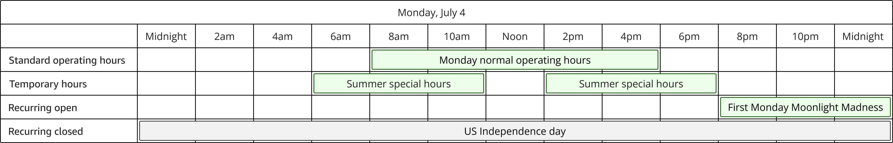
In a different example, the standard operating hours would normally not be open on a Sunday. However, this is a special exception, as the company prides itself on supporting its customers on one of the busiest shopping days of the year. In this case, the contact center is open from 10am - 10pm.

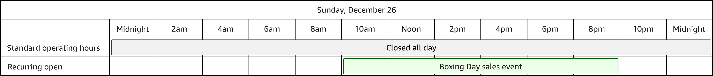
In a final example, the contact center opens at 8am, then closes from noon to 4pm, then reopens for two hours before closing at 8pm.

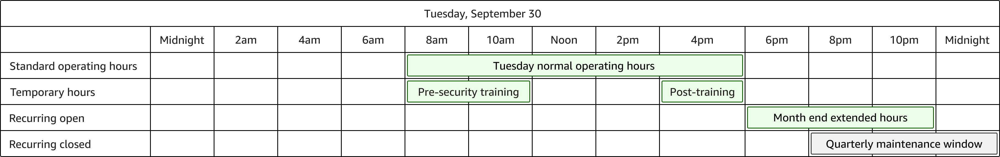

###### Note

Test any configuration that will impact your customers, to be sure they produce the desired results.

###### View audit history for overrides

An audit history of overrides appears on the **Hours of operation** page, distinct from the standard hours of operations audit history. Each audit record refers to the ID of the related hours of operation record.

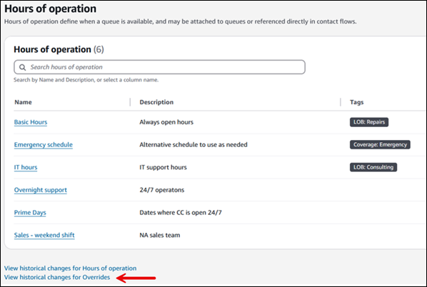

###### Note

AWS CloudTrail tracks the history of all resource changes. For more information, see Log Amazon Connect API calls with AWS CloudTrail.
