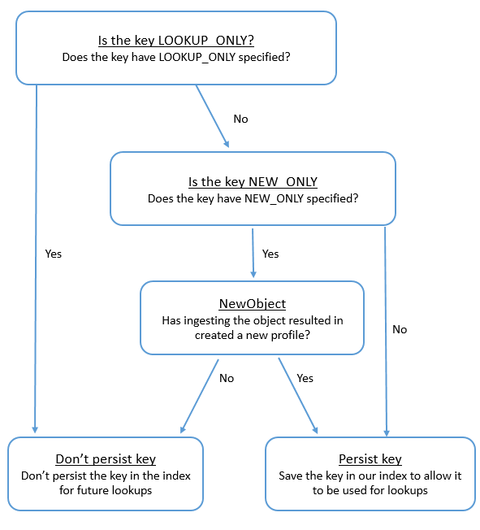

# How Customer Profiles adds keys to the index for

lookups

The following diagram shows how Customer Profiles processes the standard
identifiers to determine whether to persist the key.

The flowchart shows the following steps:

1. Does the key have `LOOKUP_ONLY` specified?
   - If Yes, don't persist the key.

2. If No, does the key have `NEW_ONLY` specified?
   - If No, save the key in the index to allow it to be used for
     lookups.

3. If Yes, has ingesting the object results in creating a new profile?
   - If Yes, save the key in the index to allow it to be used for
     lookups.
   - If No, don't persist the key in the index for future
     lookups.
