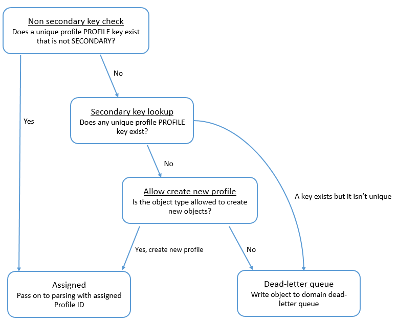

# How Customer Profiles processes

key definitions

When Customer Profiles ingests the custom object mappings, it processes the
key definitions. The following diagram shows how it processes standard
identifiers in key definitions to determine which profile to assign the object
to.

