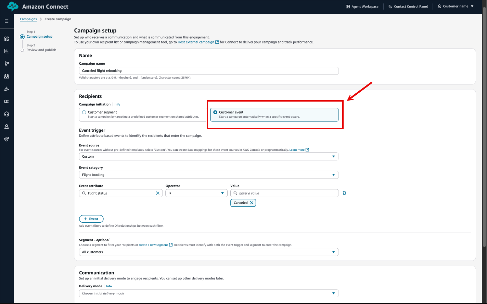
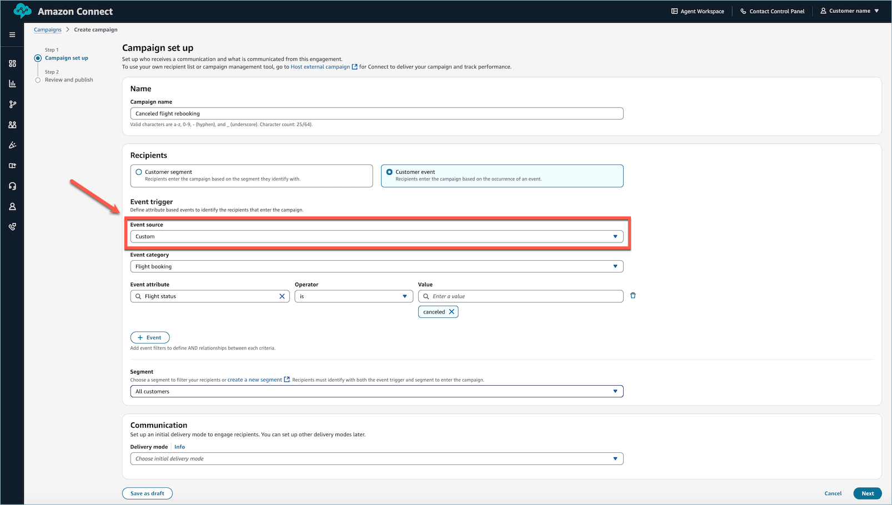
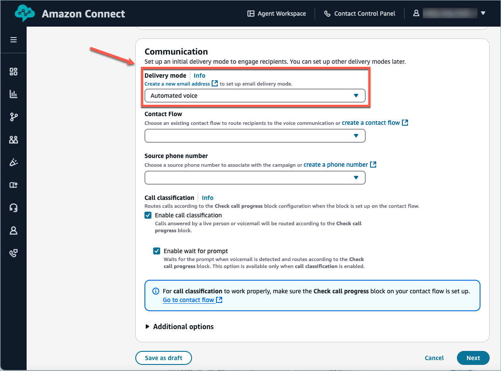
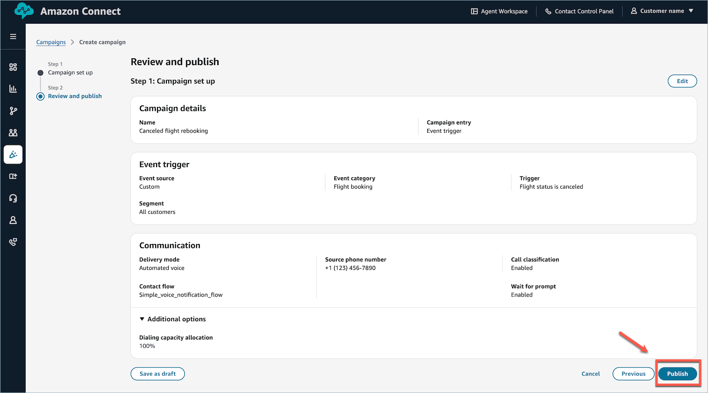

# Create an outbound campaign using

event triggers

###### Set up event triggers in the Amazon Connect admin website

1. On the **Campaign set up** page, select **Customer
   event** under **Recipients**.

 2. Select an **Event source** to specify where the data originates, and
configure the attribute conditions that will activate the event trigger.

Event sources are based on integrations in your Customer Profiles domain. details on
setting up your external application, see [Integrate with external applications](integrate-external-apps-customer-profiles.md#setup-integrations-title-menu "integrate-external-apps-customer-profiles.md#setup-integrations-title-menu"). You can also integrate with [Kinesis](customer-profiles-kinesis-integration.md "customer-profiles-kinesis-integration.md") or [S3](customer-profiles-object-type-mappings.md "customer-profiles-object-type-mappings.md").

 3. Select the **Delivery mode** and additional communication
settings.

 4. Verify your configurations and choose **Publish**.



## Create outbound campaigns with event

triggers using APIs

###### Amazon Connect Customer Profiles event trigger APIs

- Two API calls are made to create a functioning event trigger:
  - [CreateEventTrigger](../APIReference/API_connect-customer-profiles_CreateEventTrigger.md "../APIReference/API_connect-customer-profiles_CreateEventTrigger.md"): Defines which action to perform based on a specified
    condition.
  - [PutIntegration](../APIReference/API_connect-customer-profiles_PutIntegration.md "../APIReference/API_connect-customer-profiles_PutIntegration.md"): Defines the action to use.

**Example of an event trigger request:**

```
{
"Description": "string",
"EventTriggerConditions": [
{
"EventTriggerDimensions": [
{
"ObjectAttributes": [
{
"ComparisonOperator": "string",
"FieldName": "string",
"Source": "string",
"Values": [ "string" ]
}
]
}
],
"LogicalOperator": "string"
}
],
"EventTriggerLimits": {
"EventExpiration": number,
"Periods": [
{
"MaxInvocationsPerProfile": number,
"Unit": "string",
"Unlimited": boolean,
"Value": number
}
]
},
"ObjectTypeName": "string",
"SegmentFilter": "string",
"Tags": {
"string" : "string"
}
}
```

**The `ComparisonOperator` supports the following
values:**

| ComparisonOperator        | Comment                                                             | Supported type |
| ------------------------- | ------------------------------------------------------------------- | -------------- | ------------------------------------------------------------------------------------------------------------------------------------------------------------------------------------------------------------------------------------------------------------------------------------------------------------------------------------------------------------------------------------------------------------------------------------------------------------------------------------------------------------------------------------------------------------------------------------------------------------------------------------------------------------------------------------------------------------------------------------------------------------------------------------------------------------------------------------------------------------------------------------------------------------------------------------------------------------------------------------------------------------------------------------------------------------------------------------------------------------------------------------------------------------------------------------------------------------------------------------------------------------------------------------------------------------------------------------------------------------------------------------------------------------------------------------------------------------------------------------------------------------------------------------------------------------------------------------------------------------------------------------------------------------------------------------------------------------------------------------------------------------------------------------------------------------------------------------------------------------------------------------------------------------------------------------------------------------------------------------------------------------------------------------------------------------------------------------------------------------------------------------------------------------------------------------------------------------------------------------------------------------------------------------------------------------------------------------------------------------------------------------------------------------------------------------------------------------------------------------------------------------------------------------------- |
| **INCLUSIVE**             | Checks if the target includes all the specified values.             | String         |
| **EXCLUSIVE**             | Checks if the target does not contain all the specified values.     | String         |
| **CONTAINS**              | Checks if the target contain any of the specified values.           | String         |
| **BEGINS_WITH**           | Checks if the target begins with the specified value.               | String         |
| **ENDS_WITH**             | Checks if the target ends with the specified value.                 | String         |
| **GREATER_THAN**          | True if the target is greater than the specified value.             | Number         |
| **LESS_THAN**             | True if the target is less than the specified value.                | Number         |
| **GREATER_THAN_OR_EQUAL** | True if the target is greater than or equal to the specified value. | Number         |
| **LESS_THAN_OR_EQUAL**    | True if the target is less than or equal to the specified value.    | Number         |
| **EQUAL**                 | True if the target is equal to the specified value.                 | Number         |
| **BETWEEN**               | True if the target is within specific value range or timestamp.     | Number/Date\*  |
| **NOT_BETWEEN**           | True if the target is not within specific value range or timestamp. | Number/Date\*  |
| **BEFORE**                | True if the target is before the specified timestamp.               | Date           |
| **AFTER**                 | True if the target is after the specified timestamp.                | Date           |
| **ON**                    | True if the target is on the specified timestamp.                   | Date           | <br>• **Source**: Used to define an attribute in the object. + Only one attribute is allowed in a single `ObjectAttribute` entry. <br>• **FieldName**: Used to point to the mapped attribute in Data Mapping. + Only one attribute is allowed in a single `ObjectAttribute` entry. <br>• **ObjectTypeName**: Supports all default and custom object type names, but not standard object types, such as `_profile`, `_asset`, `_order`, and others. <br>• **EventTriggerLimits**: + Allow max of concurrent 20 event triggers per customer domain by default. + Default limit of 10 invocations per day, per profile, per trigger. You can override this by specifying `UNLIMITED` in `MaxInvocationPerProfile`. + **MaxInvocationPerProfile**: <br>• Valid Range: Minimum value of 1. Maximum value of 1000. (or `UNLIMITED`) + Unit: <br>• Valid Values: HOURS, DAYS, WEEKS, MONTHS + Value: <br>• Valid Range: Minimum value of 1. Maximum value of 24 <br>• Time range comparison + Customer Profiles uses standard libraries to parse time values. For global services, it is important to account for timezone conversions to ensure accurate processing. <br>• The `EventExpiration` value is specified in milliseconds. When used to trigger a campaign, the maximum expiration time is capped at 15 minutes. **Outbound campaigns event trigger APIs** <br>• **CreateCampaignV2** The only changes needed for creating an event triggered campaign are the highlighted fields. The rest of the fields are the same as Scheduled Campaigns. ``{ "name": "string", "connectInstanceId": "string", "channelSubtypeConfig": { // or other channel parameters "email": { "outboundMode": { "agentless":{ } }, "defaultOutboundConfig":{ "connectSourceEmailAddress":"example@example.com", "wisdomTemplateArn":"arn:aws:wisdom:us-west-2:123456789012:message-template/dXXXXX0Pc8-195a-776f-0000-EXAMPLE/51219d5c-b1f4-4bad-b8d3-000673332", "sourceEmailAddressDisplayName": "testEmailDisplayName" } } }, "connectCampaignFlowArn": `<Flow ARN>`, "schedule": { "endTime": "2024-12-11T21:22:00Z", "startTime": "2024-10-31T20:14:49Z", "timeZone": "America/Los_Angeles" }, "source": { "eventTrigger": { "customerProfilesDomainArn": `<Domain ARN>` }`` <br>• **PutProfileOutboundRequestBatch** You are not able to directly invoke this API, but it will be logged within your Cloudtrail logs. This API is used to trigger a campaign after receiving an event, and is the mechanism that initiates a voice call, email, or SMS. |
