# Create an outbound campaign in Amazon Connect

1. Open the Amazon Connect Outbound campaigns page from the Amazon Connect admin website.

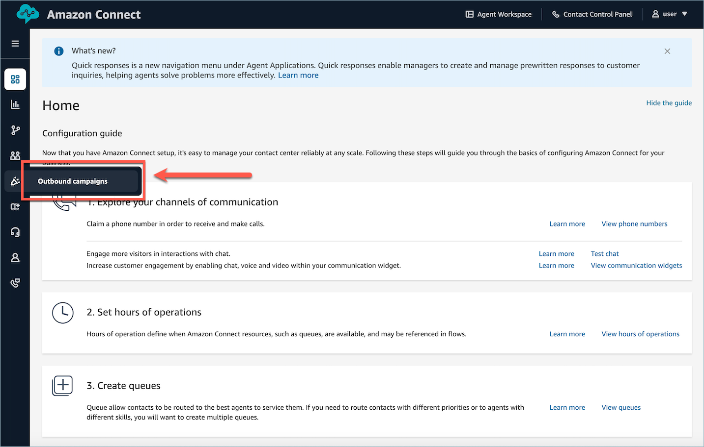 2. From the **Campaign management** page, choose **Create Campaign**.

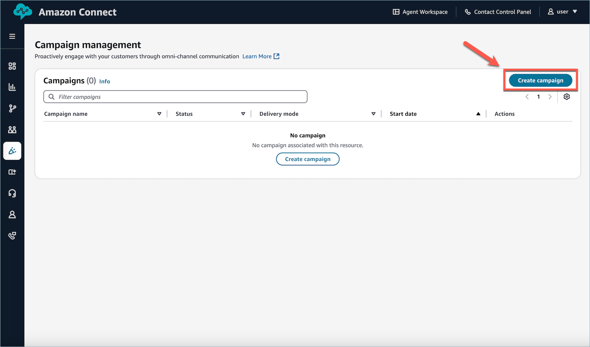 3. Enter a campaign **Name**.

###### Note

You can also use your own recipient list or campaign management tool by choosing
**Host external campaign**. For more information on setting up a campaign
with your own resources, see the [High
Volume Outbound Communication with Amazon Connect Outbound Campaigns](https://aws.amazon.com/blogs/aws/new-high-volume-outbound-communication-with-amazon-connect-outbound-campaigns/ "https://aws.amazon.com/blogs/aws/new-high-volume-outbound-communication-with-amazon-connect-outbound-campaigns/") blog
post.

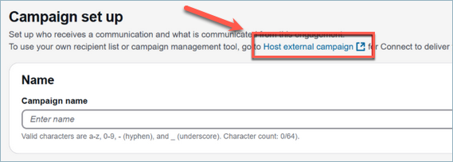

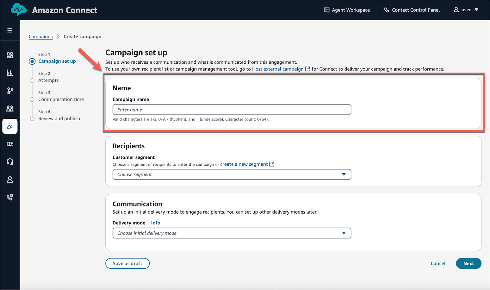 4. Select a **[Customer
Segment](customer-segments-managing-segments.md "customer-segments-managing-segments.md")** to use for this campaign.  Recipients for the campaign will be
determined at the campaign's scheduled start time using the chosen segment. 5. Choose the **Channel** for the main communication of the campaign. The
supported channels include **Agent assisted voice**, **Automated
voice**, **Email**, and **SMS**.

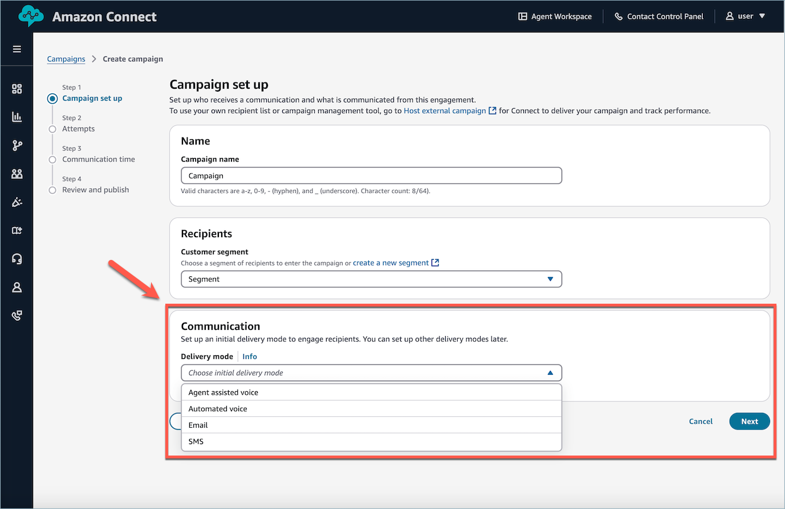

###### Note

Recipients with incorrect or invalid endpoints are dropped from the communication. For
example, for an Email campaign, a recipient with email address "jane.doe@abc!com" is
not valid and will not be processed.

## Outbound campaigns channel

configurations

Email

1. Select an [Outgoing email address](create-email-address1.md "create-email-address1.md") to send
   the email from.  This address must be one already added to your Amazon Connect Instance.
2. Optionally enter a **Friendly Sender Name**.  This is
   the name that the recipients' email client will display.
3. Select an **Email Message Template** to use when
   sending.
4. Select the **Template Alias or Version** number to use
   with the campaign.  If an alias is selected, then the contents of emails sent by the
   campaign may change when the alias is updated to point to a new template version. If a
   version is selected, the campaign will always send the exact same content for the life of
   the campaign.

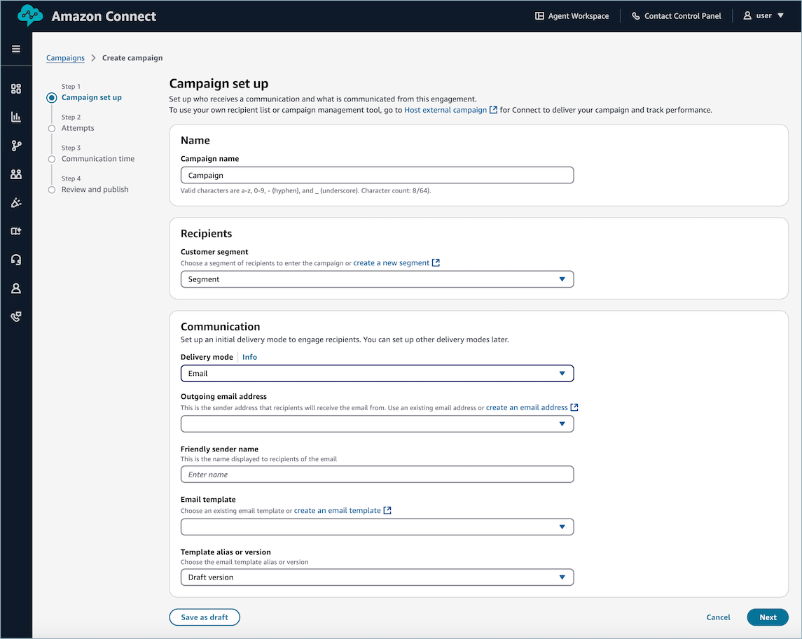

Agent Assisted Voice

1. Select the **Contact Flow** to use for the outbound
   call.  If you want reattempts, call classification, or waiting for a prompt, then the flow
   must contain a [Check call progress](check-call-progress.md "check-call-progress.md")
   block. The Check call progress block is not supported for preview dialing mode.
2. Select an **Agent Queue** to use for the outbound
   calls.  Any call originating from the campaign is routed to agents assigned to this queue.
3. Select a **Source Phone Number**.  This is a phone
   number associated with the Amazon Connect instance.

###### Important

- Not all phone numbers can be used for Amazon Connect Outbound campaigns. Outside of the US,
  UK, Japan, you need to check whether your number is outbound campaigns capable. If you
  have problems with a specific number not working, contact AWS Support to
  verify whether your number can be enabled for Outbound campaigns calls.
- Telecom regulations in certain countries dictate use of phone numbers from specific
  carriers for outbound calling. For more information, see the [Amazon Connect
  Telecoms Country Coverage Guide](https://d1v2gagwb6hfe1.cloudfront.net/Amazon_Connect_Telecoms_Coverage.pdf "https://d1v2gagwb6hfe1.cloudfront.net/Amazon_Connect_Telecoms_Coverage.pdf") to learn more.
- Select the dialing mode.  See [Best practices for Outbound
  Campaigns](campaign-best-practices.md "campaign-best-practices.md") for more information on the dialing modes.
- Disable call classification when using preview dialing mode.
- Enable call classification and waiting for a prompt.
- Input the desired **Dialing Capacity Allocation**. 
  Allocates dialing capacity for this campaign between multiple active campaigns.

The purpose of this field is you can indicate the most telecom capacity to be
allocated for that specific campaign by the predictive dialer algorithm.

For example, if there are 3 campaigns concurrently running, and this field has been
configured to say:

    + 50% for Campaign1
    + 70% for Campaign2
    + 90% for Campaign3

The dialer will allocate the most capacity to Campaign3 (up to 90%), then to Camaign2
(up to 70%) and then to Campaign1 (up to 50%) of the telecom capacity dynamically
available.

If two campaigns are idle and only third one has contacts, it get full capacity. Its
capacity reduces if any other campaigns start actively dialing.

- Enter the desired **Agent Allocation**.  This allocation
  is a weight assigned to this campaign and used to determine the total number of
  *available* agents belonging to the provided queue for which an
  outbound call should be placed.  This allocation is converted to a percentage based on the
  allocation provided to all other campaigns using the same queue.

###### Note

- To reduce call connection latency between your customers and available agents we
  recommend disabling the use of call classification.
- If you disable call classification, and if your flow includes the [Check call
  progress](check-call-progress.md "check-call-progress.md") block, the contact is routed down the Error branch.
- For preview dialing mode, a contact is enqueued only when there is a [Transfer to queue](transfer-to-queue.md "transfer-to-queue.md") set in the flow. For a list of
  supported blocks, see **Chat** channel of
  [Supported channels for flow blocks in
  Amazon Connect](block-support-by-channel.md "block-support-by-channel.md").
- Preview dialing mode does not support [agent
  whisper flow](create-contact-flow.md#contact-flow-types "create-contact-flow.md#contact-flow-types"), however the [outbound whisper
  flow](create-contact-flow.md#contact-flow-types "create-contact-flow.md#contact-flow-types") can play the intended whisper to the customer.
- Configuring maximum ring time is not supported for the preview dialing mode.
- For preview dialing mode, please adjust contact flow to use profile id
  as the default search key in agent workspace. For more information, see
  [Use contact
  attributes to autopopulate customer profiles](auto-pop-customer-profile.md "auto-pop-customer-profile.md").

```
{
  "profileSearchKey": "_profileId",
  "profileSearchValue": "$.Attributes.connect_customer-profile_profile-id"
}
```

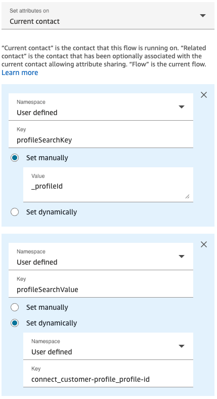

- Ensure **Enable wait for prompt** is selected. If it is
  not selected, the ML-powered call classifier won't listen for a voicemail prompt, and
  instead the next block in the flow will be triggered immediately.

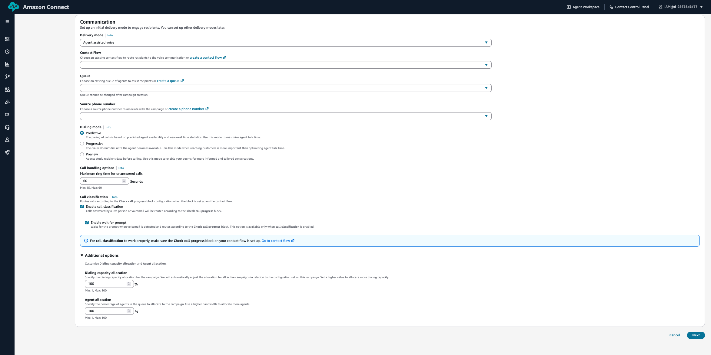

Automated Voice

1. Select the **Contact Flow** to use for the outbound
   call.  If **Reattempts**, call classification, or waiting for
   a prompt is desired, then the Flow must contain a [Check call progress](check-call-progress.md "check-call-progress.md")
   block.
2. Select a **Source Phone Number**.  This is a phone
   number associated with the Connect Instance.

###### Important

- Not all phone numbers can be used for Amazon Connect Outbound campaigns. Outside of the US,
  UK, Japan, you need to check whether your number is outbound campaigns capable. If you
  have problems with a specific number not working, contact AWS Support to
  verify whether your number can be enabled for Outbound campaigns calls.
- Telecom regulations in certain countries dictate use of phone numbers from specific
  carriers for outbound calling. For more information, see the [Amazon
  Connect Telecoms Country Coverage Guide](https://d1v2gagwb6hfe1.cloudfront.net/Amazon_Connect_Telecoms_Coverage.pdf "https://d1v2gagwb6hfe1.cloudfront.net/Amazon_Connect_Telecoms_Coverage.pdf") to learn more.
- Enable call classification if desired.

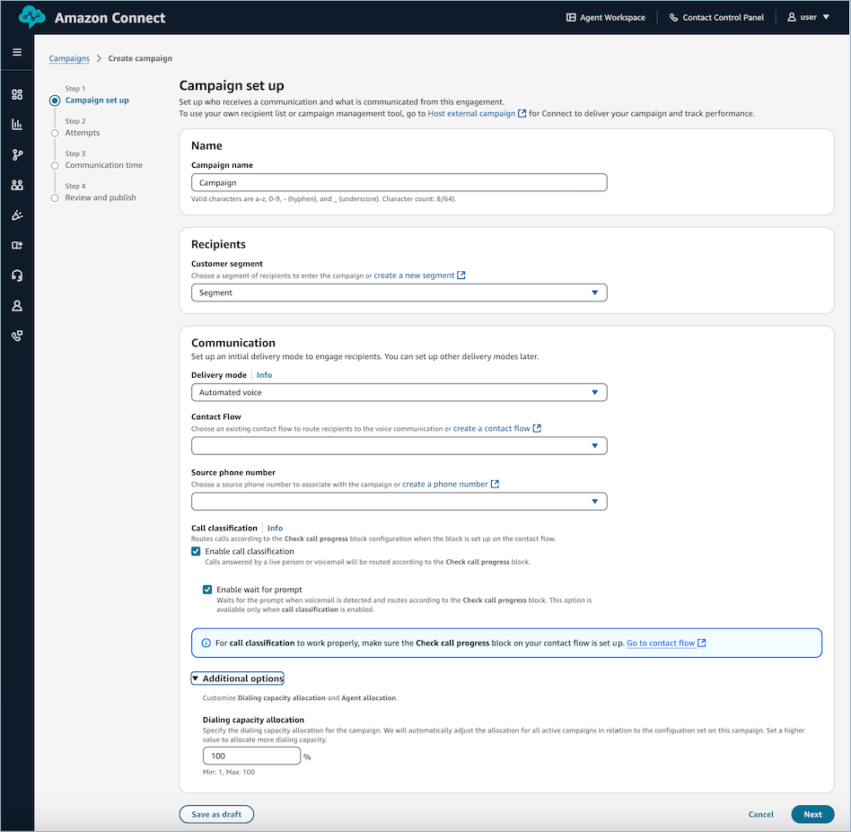

SMS

1. Select an **Originator**.  This is the phone number used
   to *send* the text messages. For more information, see [Step 1: Request a number in AWS End User Messaging SMS](setup-sms-messaging.md#get-sms-number "setup-sms-messaging.md#get-sms-number").
2. Select an **SMS Message Template** to use when
   sending.
3. Select the **Template alias or version** number to use
   with the campaign.  If an alias is selected, then the contents of SMS sent by the campaign
   may change when the alias is updated to point to a new template version.  On the other
   hand, if a Version is selected, the campaign will always send the exact same content for
   the life of the campaign.

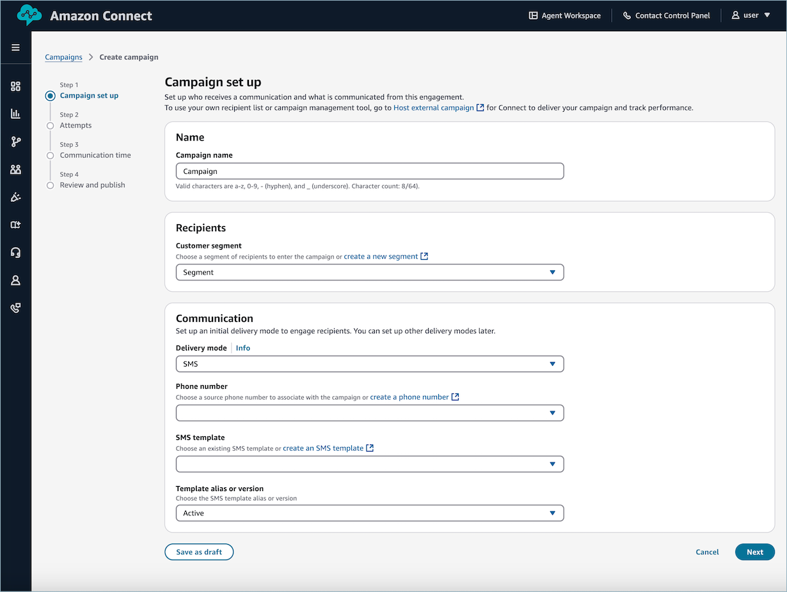

## Outbound campaigns attempts

### Communications per recipient

You can control how often each recipient is contacted by setting communication limits for
the campaign. Simply specify the maximum number of messages a recipient can receive within a
defined time frame (e.g., per day, week, or month). If a recipient has already received the
maximum number of communications within any of the time frames you set, Amazon Connect Outbound
Campaigns will automatically skip that recipient and they won’t receive additional messages
from the campaign.

**Example:**

If you set a limit of 4 communications per 2 days and 6 communications per 2 weeks (14
days), any recipient who has already received 4 messages in the last 2 days or 6 messages in
the last 14 days will not be contacted again by this campaign.

Amazon Connect Outbound Campaigns considers any time a recipient has been contacted,
regardless of the recipients interaction with the message, as a communication. For example, a
phone call ending in a voicemail is still considered a communication. Amazon Connect Outbound
Campaigns will adjust the count of communications if it can determine that the message never
reached the end user, and will always err on the side of over-counting.

In addition to setting communication limits for individual campaigns, you can also define
**Total Communication Limits** at the instance level. These limits control
how many messages a recipient can receive across **all campaigns** running
within your Amazon Connect instance over a specific time frame. If a recipient reaches the
specified limit—for example, 10 communications per week—they will be excluded from further
messaging across all campaigns until the time window resets. This helps ensure that overall
message volume stays within acceptable boundaries.

For **critical campaigns**, you have the option to **opt
out** of total communication limits by enabling the **Ignore total
limits** setting. This allows these campaigns to bypass the instance-wide limits,
ensuring important messages are delivered without being blocked by other ongoing
campaigns.

###### Note

- The total count of messages across campaigns will not necessarily be incremented
  immediately, but will eventually be accurate. For example, if two campaigns target the same
  user at the same moment in time, the first campaign's communication may not be reflected in
  the total communication count by the time the second campaign checks.
- All communications across all campaigns in the active state are considered when
  determining if a recipient has breached their total limits.
- Amazon Connect Outbound Campaigns measures a day as a rolling 24 hour window from the current
  moment.
- Any communications sent from a campaign that **ignores total limits**
  will **not count** toward the instance's total communication limits. These
  campaigns are treated as **outside the scope** of instance-level
  limits.

**Total Communication Limits**

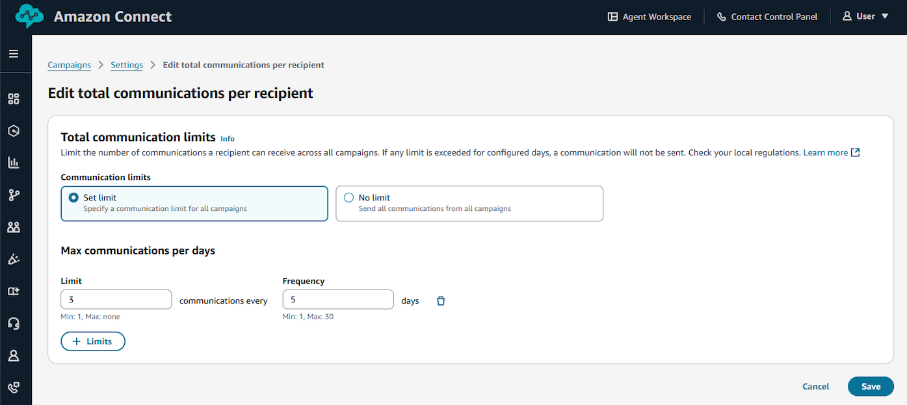

**Campaign Communication Limits frames**

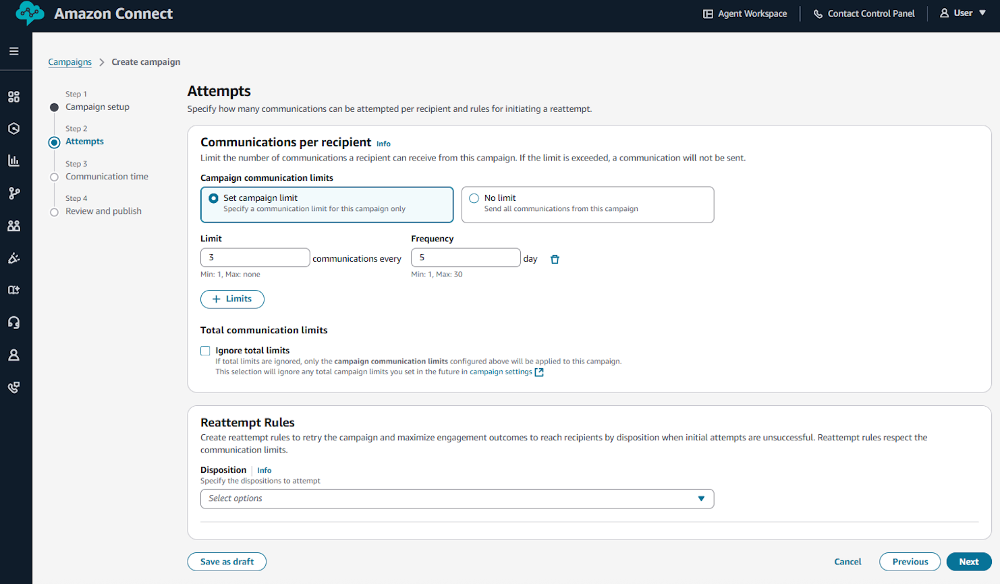

### Outbound campaigns reattempt rules

Outcomes for communication result in disposition codes. You can select a subset of those
disposition codes for which you would like to re-attempt a communication.  The **Dispositions** dropdown is pre-populated with possible codes to use.

- **Retry**: Select the channel on which to retry.  After the
  channel is selected, the possible additional configuration appears.
- **Start**: Select an optional wait time before re-attempting.

Following is a list of disposition codes that are available in the
**Disposition** dropdown menu for you to configure a retry rule.

- **Voice channel (Agent and Automated Voice)**

| Disposition code in the UI | Campaign event ID (the AMD status)     | Description                                                                                                                                                                                                             |
| -------------------------- | -------------------------------------- | ----------------------------------------------------------------------------------------------------------------------------------------------------------------------------------------------------------------------- |
| **Busy**                   | `SIT_TONE_BUSY`                        | The number dialed was busy.<br>The retry behavior for busy numbers can vary. For some campaigns you may want to<br>retry busy numbers, others you might not. It will depend on your specific campaign<br>configuration. |
| **Invalid number**         | `SIT_TONE_INVALID_NUMBER`              | The number dialed was not a valid number.                                                                                                                                                                               |
| **Unanswered**             | `AMD_UNANSWERED`                       | The number dialed kept ringing, but the call was not picked up.<br>Typically this status triggers a retry to reach the customer again later.                                                                            |
| **Voicemail**              | `VOICEMAIL_BEEP`<br>`VOICEMAIL_NOBEEP` | The number dialed was answered by voicemail with a beep and without a<br>beep.<br>Typically this status triggers a retry to reach the customer again later.                                                             |

###### Note

By default, you can only re-attempt one time unless you configure engagement
preferences and upload data into Customer Profiles.

- **Email channel**

| Disposition code in the UI | Campaign event ID | Description                                                                                                                                   |
| -------------------------- | ----------------- | --------------------------------------------------------------------------------------------------------------------------------------------- |
| **Bounced**                | `Bounce`          | An issue related to the recipient's email or server permanently rejected the email,<br>preventing Amazon Connect from delivering the message. |

- **SMS channel**

| **Disposition code in the UI** | Campaign event ID  | Description                                                                                                                                                                |
| ------------------------------ | ------------------ | -------------------------------------------------------------------------------------------------------------------------------------------------------------------------- |
| **Blocked**                    | `TEXT_BLOCKED`     | The recipient's device or carrier is blocking SMS messages.                                                                                                                |
| **Invalid number**             | `TEXT_INVALID`     | The destination phone number is not valid.                                                                                                                                 |
| **Unreachable**                | `TEXT_UNREACHABLE` | Unreachable events occur when the recipient's device is currently unavailable. For<br>example, the device might be powered off, or might be disconnected from the network. |

The following image shows an example of setting the **Retry** rule for
**Bounced** email.

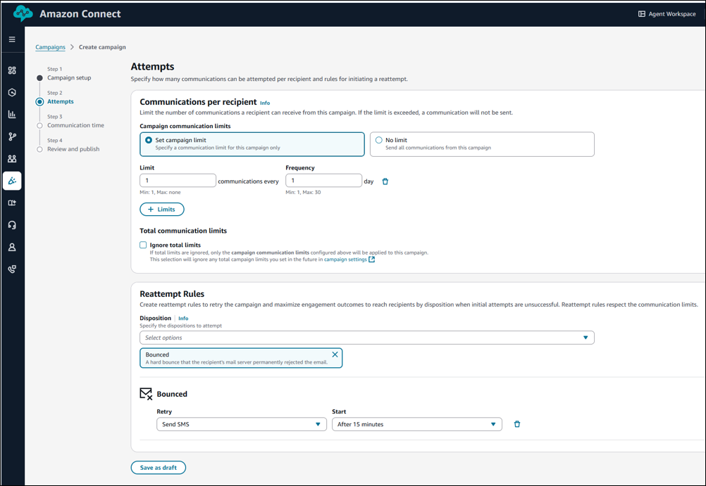

The following image shows if you choose **Send email** in response to a
**Bounced** email, you are prompted to provide the **Outgoing email
address**, **Friendly sender name**, **Email
template**, and version.

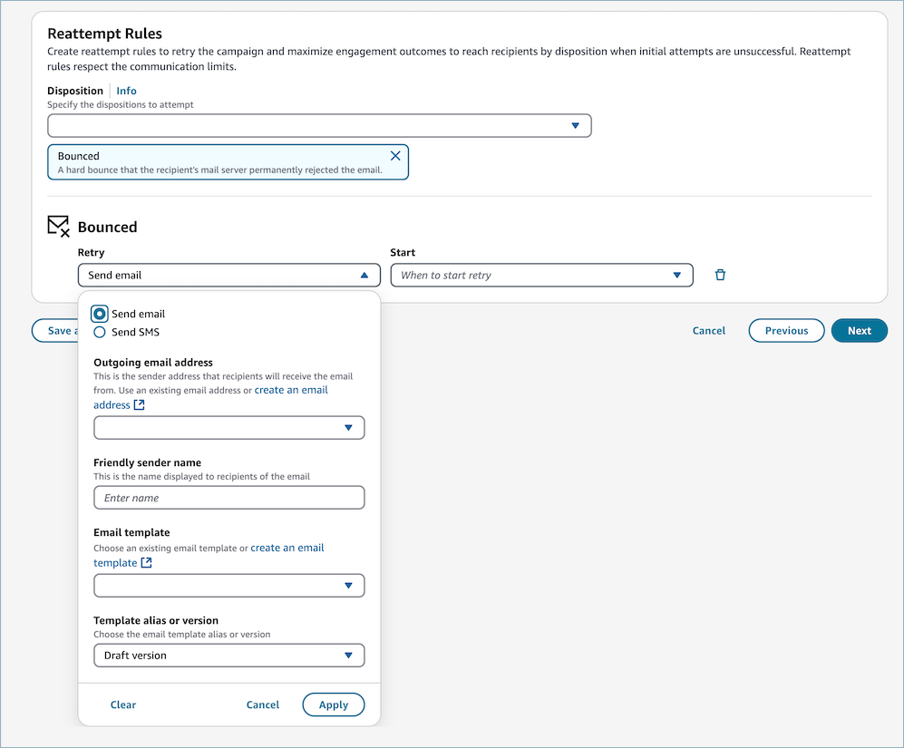

The following image shows if you choose **Send SMS** in response to a
**Bounced** email, you are prompted to provide the **Phone
number**, **SMS template**, and **Template alias or
version**.

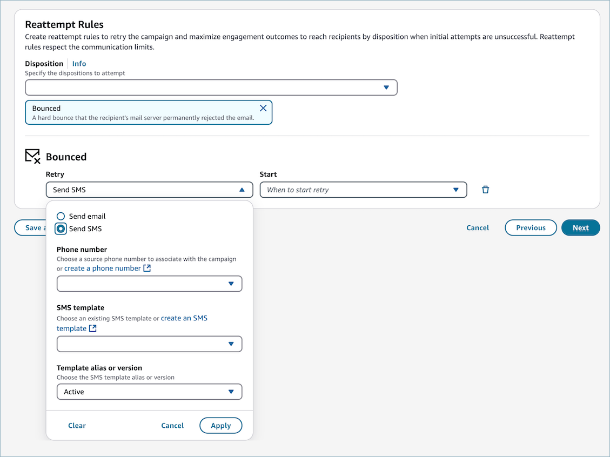

## Campaign set up

and Cycling through recipient contact types for communication

The purpose of this section is to showcase how you can configure the campaign to cycle
through multiple contact types for each recipient.

###### Note

Configure engagement preferences and upload data into Customer Profiles. For details about customer
profile ingestion before to creating a campaign, see [Ingesting account-based
profiles](customer-profiles-object-type-mappings.md#customer-profiles-ingesting-account-based-profiles "customer-profiles-object-type-mappings.md#customer-profiles-ingesting-account-based-profiles").

- The **Max dial re-attempts per number** defines the count of
  reattempts for each contact type across all dispositions.
- **Next action - optional** enables switching to the next
  available contact type for the profile/account as provided using engagement preferences in
  Customer Profiles

###### Note

You can set the number of retry attempts and next actions, but communications will not
exceed the maximum limits set for each recipient.

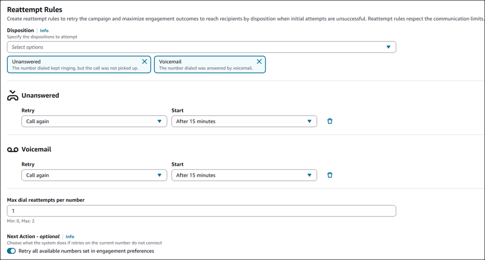

**Example scenarios**

Priority dialing order (in Customer Profile):

- Primary (Mobile)
- Secondary (Home)
- Tertiary (Work)

**Scenario A - Call Attempts:** All numbers fail with "Busy"-
Retry action: Call again. Max dial attempts per number: 0. Toggled to retry all available
numbers for the recipient.

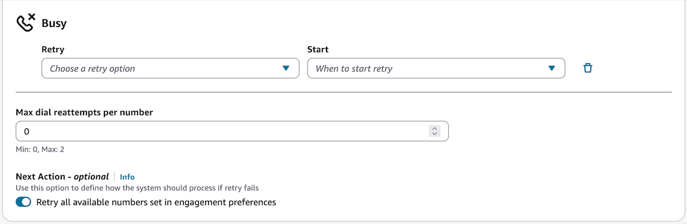

| Attempt | Phone Number | Disposition | Action Taken                       | Total Attempts |
| ------- | ------------ | ----------- | ---------------------------------- | -------------- |
| 1       | Mobile       | Busy        | Move on to next number (home)      | 1              |
| 2       | Home         | Busy        | Move on to next number (work)      | 2              |
| 3       | Work         | Busy        | End<br>• max dial attempts reached | 3              |

**Scenario B - Call Attempts:** All numbers fail with "Busy"-
Retry action: Call again. Max dial attempts per number: 2. Toggled to retry all available
numbers for the recipient.

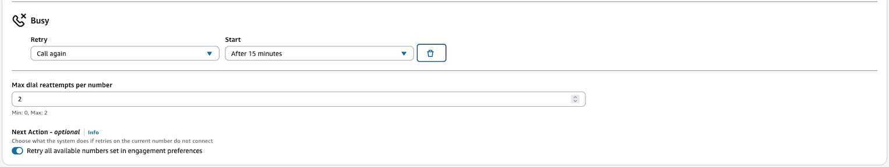

| Attempt | Phone Number | Disposition | Action Taken                       | Total Attempts |
| ------- | ------------ | ----------- | ---------------------------------- | -------------- |
| 1       | Mobile       | Busy        | Wait 15 mins, call again           | 1              |
| 2       | Mobile       | Busy        | Wait 15 mins, call again           | 2              |
| 3       | Mobile       | Busy        | Move on to next number (Home)      | 3              |
| 1       | Home         | Busy        | Wait 15 mins, call again           | 4              |
| 2       | Home         | Busy        | Wait 15 mins, call again           | 5              |
| 3       | Home         | Busy        | Move on to next number (Work)      | 6              |
| 1       | Work         | Busy        | Wait 15 mins, call again           | 7              |
| 2       | Work         | Busy        | Wait 15 mins, call again           | 8              |
| 3       | Work         | Busy        | End<br>• max dial attempts reached | 9              |

**Scenario C - Call Attempts:** All numbers fail with "Busy"-
Retry action: Call again. Max dial attempts per number: 2. Toggled NOT to retry all available
numbers for the recipient.

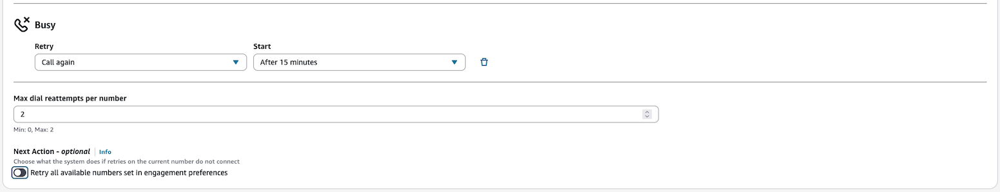

| Attempt | Phone Number | Disposition | Action Taken                       | Total Attempts |
| ------- | ------------ | ----------- | ---------------------------------- | -------------- |
| 1       | Mobile       | Busy        | Wait 15 mins, call again           | 1              |
| 2       | Mobile       | Busy        | Wait 15 mins, call again           | 2              |
| 3       | Mobile       | Busy        | End<br>• max dial attempts reached | 3              |

**Scenario D - Call Attempts:** Mixed disposition between
"Unanswered", "Busy"- Retry action: Call again. Max dial attempts per number: 2. Toggled to
retry all available numbers for the recipient.

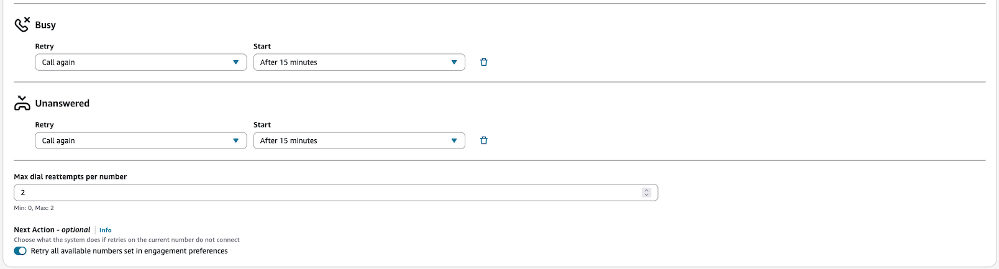

| Attempt | Phone Number | Disposition | Action Taken                       | Total Attempts |
| ------- | ------------ | ----------- | ---------------------------------- | -------------- |
| 1       | Mobile       | Unanswered  | Wait 30 mins, call again           | 1              |
| 2       | Mobile       | Busy        | Wait 15 mins, call again           | 2              |
| 3       | Mobile       | Busy        | Move on to next number (Home)      | 3              |
| 1       | Home         | Busy        | Wait 15 mins, call again           | 4              |
| 2       | Home         | Unanswered  | Wait 30 mins, call again           | 5              |
| 3       | Home         | Unanswered  | Move on to next number (Work)      | 6              |
| 1       | Work         | Busy        | Wait 15 mins, call again           | 7              |
| 2       | Work         | Busy        | Wait 15 mins, call again           | 8              |
| 3       | Work         | Busy        | End<br>• max dial attempts reached | 9              |

## Communication Time

You can specify valid times to attempt to contact your users.  The **Active communication time** specifies those valid times, based on the day of the
week.  **Exceptions to communication time**, an optional setting,
specifies specific days of the year during which you want no communications sent, even if that
day happens to fall in an active communication time.

### Time zone

In order for the Campaign to determine appropriate time to attempt communication with a
particular recipient, you need to provide a **Time Zone**.  You
may either select a **Standard time zone**, which will be used for
all recipients, or you may specify the **Recipient's local time
zone**. Recipients with no time zone specified are excluded from message deliveries. 

- **Standard time zone**:

The time zone selected will be used for all recipients.  Select this option if you know
the time zone of all recipients in your segment or if you want all communications sent at the
same moment in time.

- **Recipient's local time zone**:

Amazon Connect Outbound Campaigns use the provided [Address](../APIReference/API_connect-customer-profiles_CreateProfile.md#connect-connect-customer-profiles_CreateProfile-request-Address "../APIReference/API_connect-customer-profiles_CreateProfile.md#connect-connect-customer-profiles_CreateProfile-request-Address") and/or the area code from the [Phone Number](../APIReference/API_connect-customer-profiles_CreateProfile.md#connect-connect-customer-profiles_CreateProfile-request-PhoneNumber "../APIReference/API_connect-customer-profiles_CreateProfile.md#connect-connect-customer-profiles_CreateProfile-request-PhoneNumber") to infer the recipients time zone. If the time zone cannot be
determined (for example, if either the Address and/or Phone Number is missing or is invalid),
the recipient will be dropped from the Campaign. Select this option if it's important to send
communications to recipients only during their specific local times.

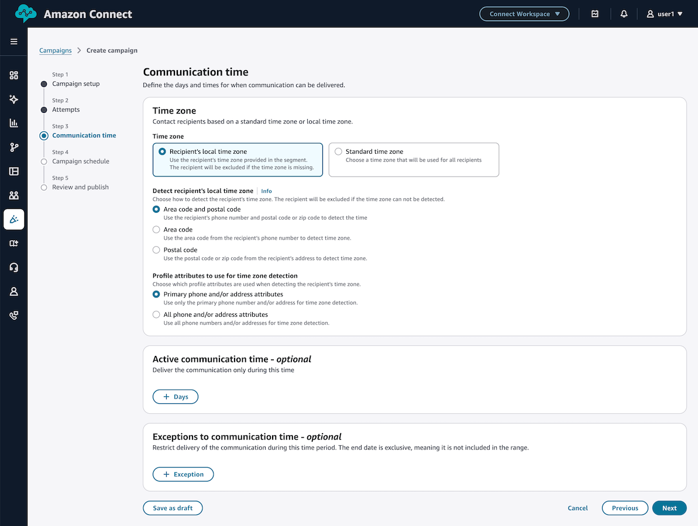

### Active communication time

The **Active communication time** represents the times
during which Amazon Connect Outbound campaigns may send communications for this campaign. To add
active communication times:

1. Select the channel. Alternatively, select **Apply to all
   channels** to apply the active communication times to each channel.
2. Select the day of the week to configure. You can add multiple active communication
   times for each day, if desired.
3. Select the time frame during which Amazon Connect Outbound campaigns can send
   communications on the given day.

###### Note

- Amazon Connect Outbound campaigns will evaluate the **From** and **To** times relative to either the
  **Standard time zone** or the **Recipient's local time zone**, whichever is specified.
- If no **Active communication time** is provided, communications to
  intended recipients will be attempted as soon as the campaign is published.

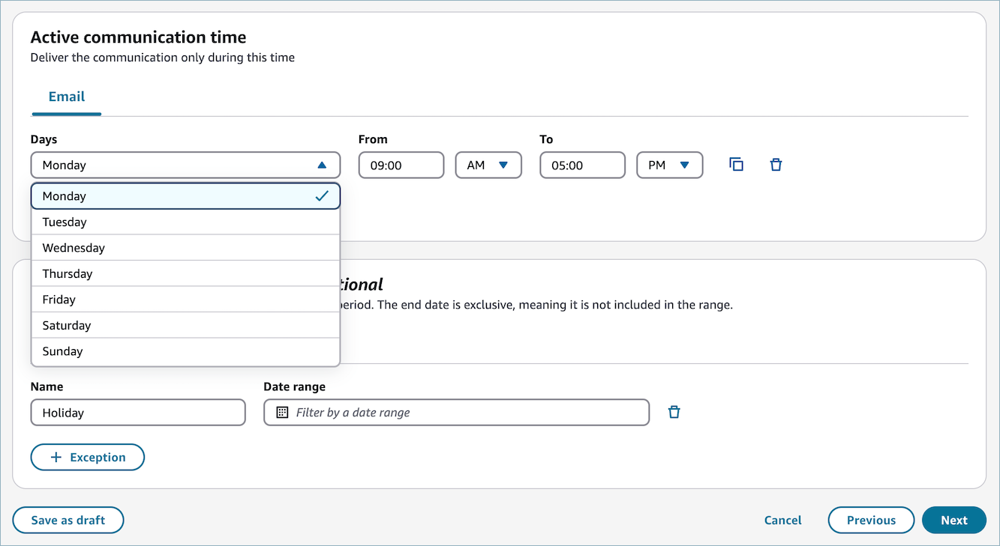

### Exceptions to communication time -

(optional)

**Exceptions to communication time** is an optional set of
specific calendar days for which you do not want communications sent.  If exceptions are
included in the Campaign, then active communication times must also be specified.  To add
exceptions to communication time:

1. Select the channel.
2. Add a **Name** for the exception.  This name is only for
   informational purposes and does not affect the running of the campaign.
3. Select the **Date range** for the exception.

###### Important

The end date is exclusive. For example, if you select July 12 - 13, it blocks all
communications only from 00:00 July 12 to 23:59 July 12. **July 13 would
have no exception**.

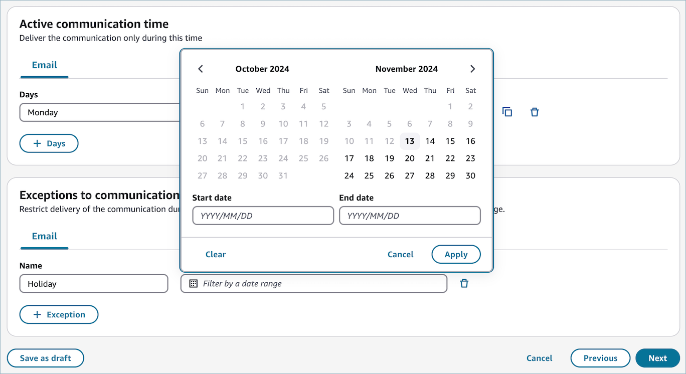

## Review and publish

Take a moment to review your campaign prior to publishing.

###### Important

These settings cannot be changed once your campaign has been published.

Once you have reviewed you campaign, choose **Publish** to
**Schedule** your campaign.

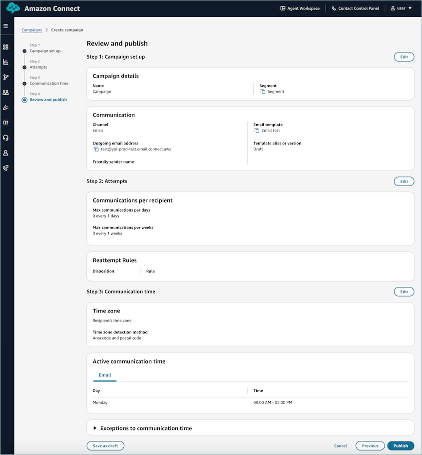

## Schedule campaign

Specify when you want your campaign to begin:

- **Start now**: Start the campaign right away.
- **Start later**: Select the specific day and time for the
  campaign to begin.
- **Expiry Date and Time**: The date and time at which Amazon Connect Outbound campaigns should end the campaign. An expired campaign appears with a
  **Completed** status a few moments after expiry time.

The start and end times of a campaign that starts now or a campaign that starts later are
based on your local time zone.

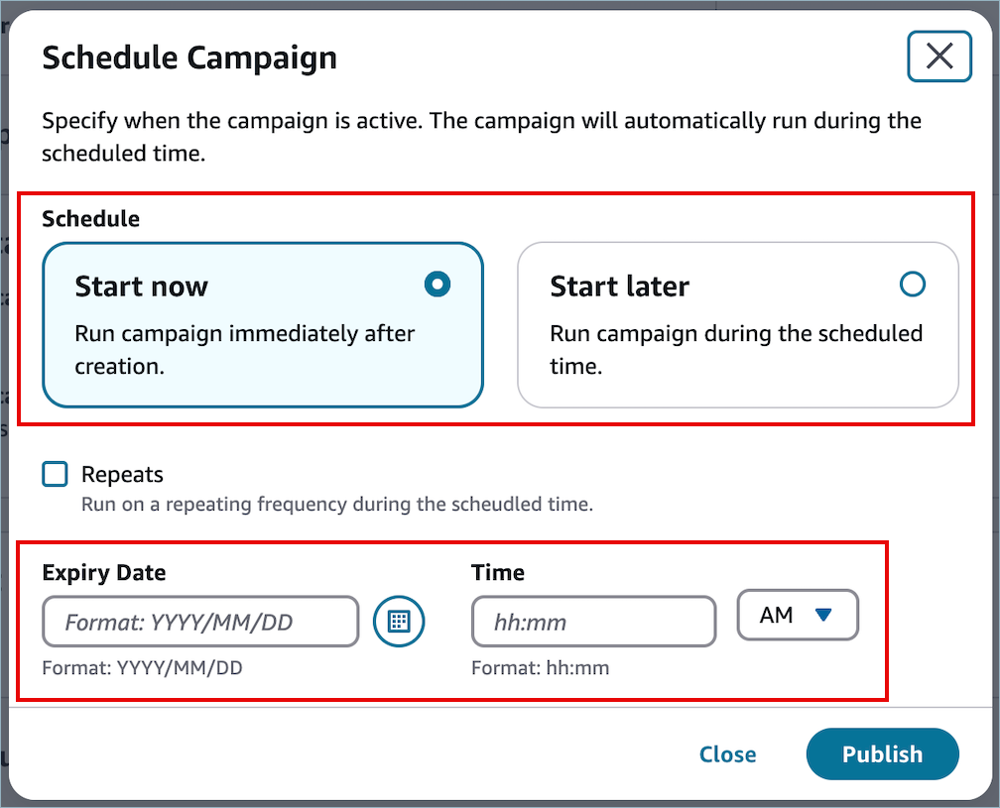

**Repeats**

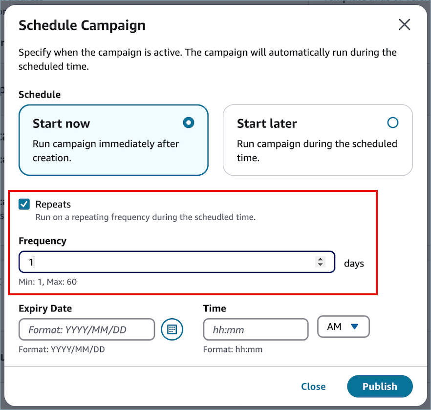

If you want your campaign to repeat running, select the **Repeats** radio button and choose a **Frequency**. 
Amazon Connect Outbound campaigns will then refresh profiles in the segment specified for this
campaign at the same frequency you select.  For example, if you schedule your campaign to start
at 7:03AM EST and use a Daily Frequency, then profiles will be refreshed in the segment daily at
7:03AM EST.

###### Important

- A recipient may be active only in a campaign once at any given time. So if they are
  still waiting to exit the campaign when the next Segment Snapshot is created, and are a
  member of that Snapshot, they are **NOT** allowed to enter the
  campaign as a part of the second Snapshot.
- If a recipient is a part of a segment Snapshot and is not currently in the campaign,
  they are allowed to enter, regardless of whether they have previously gone through the
  campaign.

**Publish**

Choose **Publish** to schedule your campaign.

## Campaign states

After a campaign is running, you can stop it. You can also delete a campaign at any
time.

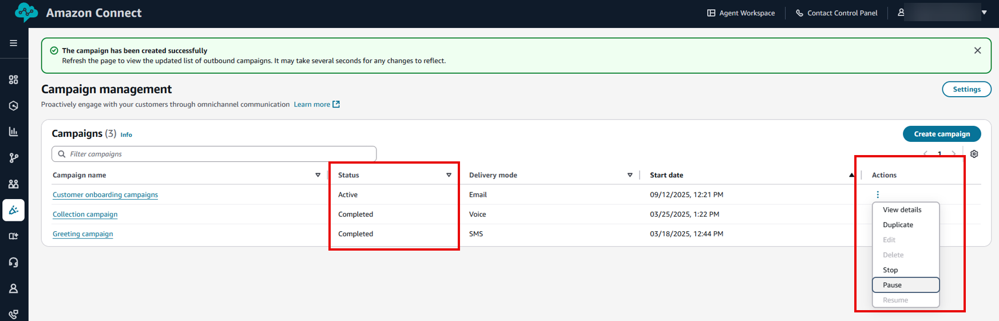

Following is a description of each campaign state:

- **Draft**: The campaign is being developed and hasn't been
  published yet.
- **Active**: The campaign has been developed and published.
  Depending on the campaign's schedule, the campaign may currently be running or scheduled to
  start running at a later time.
- **Stopped**: The campaign is stopped. You can't resume a campaign
  that is stopped.
- **Error**: An error state caused the campaign to fail.
- **Completed**: The campaign has finished running. All
  participants have entered the campaign and no participants are waiting to complete the
  campaign.

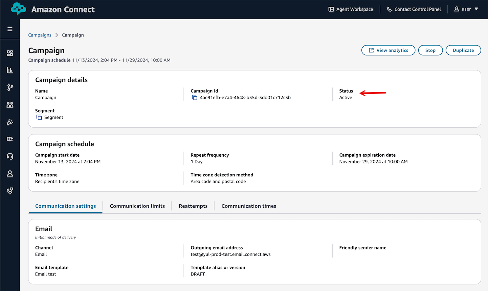
