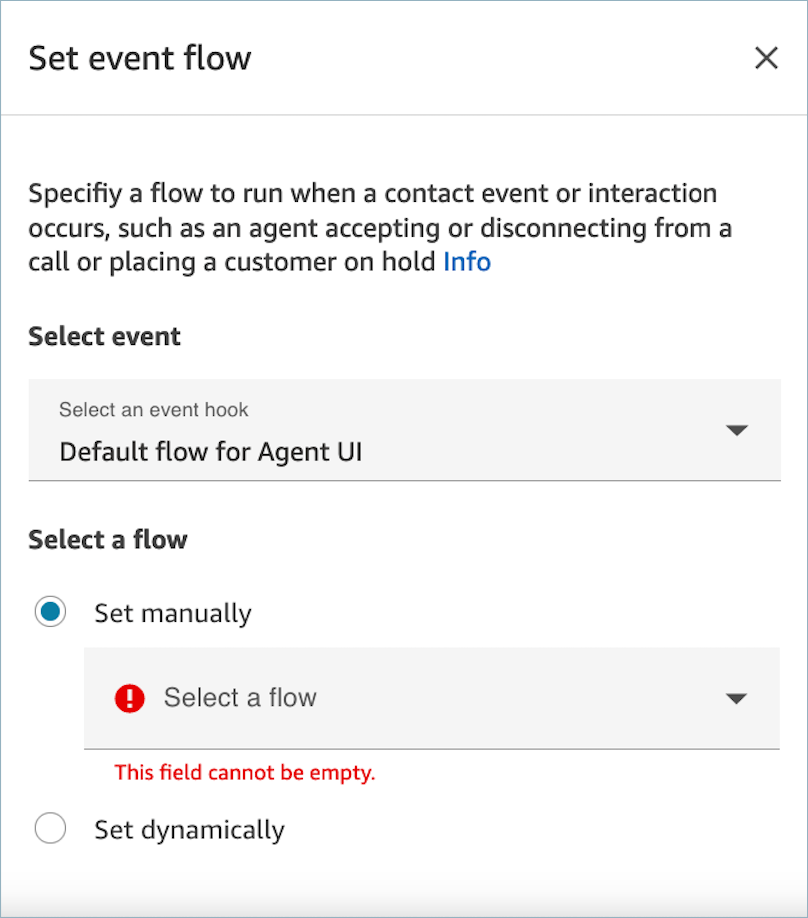

# Invoke a guide at the start of a contact in

Amazon Connect

After you've created your flows, you can dynamically determine which guides to show to
users. To do this:

1. Add a [Flow block in Amazon Connect: Set event flow](set-event-flow.md "set-event-flow.md") block to
   your flow.
2. In the **Set event flow** block, configure a
   **DefaultFlowForAgentUI** event hook
   Guides start as soon as the contact is offered to the agent. They don't wait for the
   contact to be accepted.

For example, by checking the IVR responses, queue name, and customer info, you can
create branching logic in flows that determines which flow ID to set. Use the
**Check attribute** block to set your conditional logic and the
**Set event flow** block to set the flow you want to send to your
agent.

The following image shows the **Properties** page for the
**Set event flow** block. The event hook is set to
**Default flow for Agent UI**.

