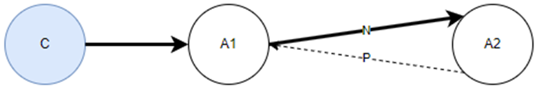
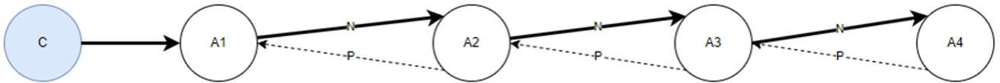
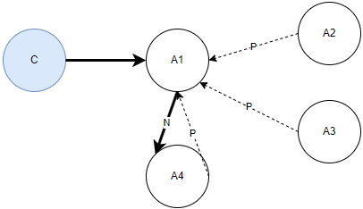
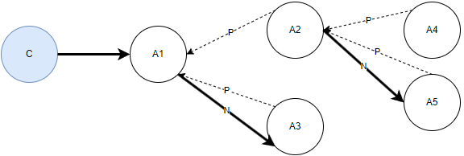

# Identify conferences and transfers by using

Amazon Connect contact records

Contact records capture the events associated with a contact in your contact center. For
every new contact, Amazon Connect creates a contact record and assigns a unique Contact ID to the
contact.

Each time an agent consults with another agent (internal to Amazon Connect or external, by using a
toll free or direct inward dial number), Amazon Connect creates a consult leg contact record and
issues a new Contact ID for this leg.

The main contact record and any subsequent consult leg contact record can be linked
together by several Contact ID fields, for example, Initial Contact ID, Next Contact ID and
Previous Contact ID.

This topic explains how you can use these fields to differentiate conferences and
transfers in contact records. It also provides a logic to establish the type of consultative
operation: Consult call, Conference, or Transfer.

###### Contents

- [Terminology](#consultative-terms "#consultative-terms")
- [Contact records for
  consultative calls](#ctr-structure-consultative-calls "#ctr-structure-consultative-calls")
- [How to identify consultative
  calls](#logic-consultative-calls "#logic-consultative-calls")
- [Code
  snippets](#codesnippets-consultative-calls "#codesnippets-consultative-calls")

## Terminology

The following terminology is used in this topic:

**Consultative call**

A call involving three participants:

1. The initiator, for example, a customer
2. The recipient, for example, an agent
3. A consulted participant, for example, a supervisor or an external
   third-party translator

A consultative call can end up being a consult call, a transfer call, or a
conference call.

**Consult call**

A call in which the recipient agent consults with another participant (for
example, an agent in the same Amazon Connect instance or an external entity), while
the initiator is placed on hold.

After a call is disconnected, Amazon Connect places the agent in an After Call Work
(ACW) state. The contact record is updated with the timestamp when this
state was entered. In the case of consult calls, the consulted participant
disconnects earlier than the customer.

The contact record records the timestamp when the agent was placed in ACW
state under `AfterContactWorkStartTimestamp`.

**Transfer call**

The recipient transfers the initiator to the consulted participant. In
this case, the recipient agent enters ACW earlier than the consulted agent.

**Conferenced call**

The recipient conferences the initiator to the consulted participant
(three-way call).

Amazon Connect allows more than three participants to be conferenced together. For
internal calls, the consulted participant enters ACW earlier than the
recipient in both Consult and Conference situations. The difference,
however, is that in a conference situation, the consulted participant also
gets to speak with the customer, while in a consult case, the customer is
placed on hold by the recipient.

The following sections explain how you can identify each of these types of calls in a
contact record.

## Contact records for consultative

calls

Let's say customer calls Agent1. The agent doesn't transfer or consult with others.
When call is disconnected, the contact record looks like the following sample (only the
relevant fields are shown):

```
{
    "AWSAccountId": "`account-id`",
    "Agent": {
        "ARN": "`agent-arn`",
        "AfterContactWorkStartTimestamp": "2024-08-02T17:50:53Z",
        .
        .
        "Username": "Agent1"
    },
    "ContactId": "497f04ca-6de1-408f-9b8a-ec57bcc99b31",
    .
    .
    "InitialContactId": null,
    "NextContactId": null,
    "PreviousContactId": null,
    .
    .
}
```

If Agent1 were to initiate a consultative call with another agent (Agent2), it be a
Consult, a Transfer, or a Conference.

The following sample contact record shows how this would look for the initiating
agent (Agent1) and the recipient agent (Agent2):

- Initiating agent (Agent1)

```
{
    "Agent": {
        "ARN": "`agent-arn`"
        "AfterContactWorkStartTimestamp": "2024-08-02T17:50:53Z",
        .
        .
        "Username": "Agent1"
    },
    "ContactId": "497f04ca-6de1-408f-9b8a-ec57bcc99b31",
    "InitialContactId": null,
    "NextContactId": "6aa058d3-e771-4544-8e93-f5ce9c9003b3",
    .
    .
}
```

- Recipient agent (Agent2)

```
{
    "Agent": {
        "ARN": "`agent-arn`",
        "AfterContactWorkStartTimestamp": "2024-08-02T17:51:07Z",
        .
        .
        "Username": "Agent2"
    },
    "ContactId": "6aa058d3-e771-4544-8e93-f5ce9c9003b3",
    "InitialContactId": "497f04ca-6de1-408f-9b8a-ec57bcc99b31",
    "NextContactId": null,
    "PreviousContactId": "497f04ca-6de1-408f-9b8a-ec57bcc99b31",
    .
    .
}
```

The relationship between the two parts of the contact record is shown in the
following diagram:



Where Agent1 (A1) and Agent2 (A2) are linked by:

    + N = Next Contact ID. This field appears in the contact record for the
     initial leg. This is the Contact ID of the last agent that this agent
     consulted with (in this case, the last agent is A2).
    + P = Previous Contact ID. This field appears in the contact record for
     the consult leg. This is the Contact ID of the leg that called this leg.
     In this case, that is A1.

Not shown in the diagram are:

    + Initial Contact ID: This is the Contact ID of the first interaction
     between the Agent1 (A1) and the customer (C).
    + Contact ID: This is the unique identifier of a given interaction.

Contact ID, Initial Contact ID, and Previous Contact ID are system attributes.
For descriptions of each one, see [System attributes](connect-attrib-list.md#attribs-system-table "connect-attrib-list.md#attribs-system-table").

This model can be extended to a consult call that involves multiple agents. Following
are example use cases for how it can be extended.

- **Use case 1**: Agent1 invites Agent2, Agent2
  invites Agent3, and Agent3 invites Agent4. The Previous Contact ID is always the
  previous agent. The following diagram illustrates this use case.



- **Use case 2**: Agent1 invites Agent2, Agent1
  invites Agent3, and Agent1 invites Agent4. The Previous Contact ID is always
  Agent1. The following diagram illustrates this use case.



- **Use case 3**: Agent1 invites Agent2, Agent2
  invites Agent4 and Agent5, Agent1 invites Agent3. The Previous Contact ID for
  Agents2 and 3 is Agent1. For Agents4 and 5 the Previous Contact ID is Agent2.
  The following diagram illustrates this use case.



## How to identify consultative calls

1. [Step 1: Group all the legs associated
   with the main contact](#step1-consultative-calls "#step1-consultative-calls")
2. [Step 2: Identify relation between each
   pair by using their Contact ID fields](#step2-consultative-calls "#step2-consultative-calls") (Previous Contact ID, Next
   Contact ID, Initial Contact ID and Contact ID). Examine additional fields in the
   contact record to identify the type of consultative operation: Consult /
   Transfer or Conference.

### Step 1: Group all the legs associated

with the main contact

This step helps you group all the calls that were initiated by a given initiator /
caller. The fields of interest are Contact ID, Previous Contact ID, Next Contact ID,
Initial Contact ID, and Contact ID. This also helps you understand the number of
legs it took to resolve the call. The workflow for this is as follows:

1. Establish the initiator: This is the contact record where the
   `InitialContactId` field is `NULL`. Additionally,
   `PreviousContactId` is also `NULL` for this
   record.
2. Every contact record where the `InitialContactId` field equals
   the `ContactId` of the initiator contact record is related to
   this contact record.

### Step 2: Identify relation between each

pair by using their Contact ID fields

You can use following logic to identify consults versus transfers versus
conferences. The logic uses timestamp fields noted in the contact record. All
relevant fields have been marked as `code`.

#### Consult calls

Initiator consults with another party - within the same Amazon Connect instance
(Internal) or external to that instance (External), using a DID or toll-free
number.

- Internal consults characteristics:
  - The consulted agent enters ACW before the initiator
    agent
  - The consulted agent never speaks with the customer, this is
    because the customer has been placed on hold by the initiator.
    Therefore the field `AgentInteractionDuration` for
    the consulted agent is ZERO.

- External consult characteristic:
  - The initiator's Customer Hold Duration is higher than the
    external party's Interaction Duration
    (`ExternalThirdPartyInteractionDuration`).

#### Conference calls

Initiator conferences with another participant within the same Amazon Connect instance
(Internal) or external to that instance (External), using a DID or toll-free
number.

- Internal consults characteristics:
  - The consulted agent enters ACW before the initiator
    agent.
  - The consulted agent speaks with the customer:
    `AgentInteractionDuration` is non ZERO.

- External consult characteristics:
  - The initiator's Customer Hold Duration is lesser than the
    external party's Interaction Duration
    (`ExternalThirdPartyInteractionDuration`) . This
    means the customer was briefly placed on hold, and then all
    participants were engaged in the call.

#### Transfer calls

Initiator consults with another party - within the same Amazon Connect instance
(Internal) or external to that instance (External), using a DID or toll-free
number.

- Internal consults characteristics:
  - The consulted agent enters ACW after the initiator
    agent.
  - The field `TransferCompletedTimestamp` is non ZERO
    for the initiator agent.

- External consult characteristics:
  - The initiator enters ACW
    (`AfterContactWorkStartTimestamp`) before the
    external leg is disconnected
    (`DisconnectTimestamp`).
  - The field `TransferCompletedTimestamp` is non ZERO
    for the initiator agent.

## Code snippets

The following example code snippets—in SQL, Java script, and Python—demonstrate how to
identify conference, transfer and consultative calls by leveraging the logic described in the previous section.
These snippets are provided as an example, and not
intended for production.

### SQL code

```
-- Conference transfer query DO NOT EDIT --
SELECT current_cr.contact_id,
    current_cr.initial_contact_id,
    current_cr.previous_contact_id,
    current_cr.next_contact_id,
    previous_cr.agent_username as initiator_agent_username,
    COALESCE (
        current_cr.agent_username,
        current_cr.customer_endpoint_address
    ) as recipient_agent_username,
    current_cr.agent_connected_to_agent_timestamp,
    current_cr.agent_after_contact_work_start_timestamp,
    current_cr.transfer_completed_timestamp,
    CASE
        WHEN previous_cr.agent_after_contact_work_start_timestamp < current_cr.agent_after_contact_work_start_timestamp
            AND previous_cr.transfer_completed_timestamp IS NOT NULL THEN 'TRANSFER'
        WHEN previous_cr.agent_after_contact_work_start_timestamp > current_cr.agent_after_contact_work_start_timestamp
            AND current_cr.agent_interaction_duration_ms <= 2000 THEN 'CONSULT'
        WHEN previous_cr.agent_after_contact_work_start_timestamp > current_cr.agent_after_contact_work_start_timestamp
            AND current_cr.agent_interaction_duration_ms > 2000 THEN 'CONFERENCE'
        WHEN current_cr.agent_username is NULL
            AND current_cr.initiation_method = 'EXTERNAL_OUTBOUND'
            AND previous_cr.agent_after_contact_work_start_timestamp > current_cr.disconnect_timestamp
            AND previous_cr.agent_customer_hold_duration_ms > current_cr.external_third_party_interaction_duration_ms THEN 'EXTERNAL_CONSULT'
        WHEN current_cr.agent_username is NULL
            AND current_cr.initiation_method = 'EXTERNAL_OUTBOUND'
            AND previous_cr.agent_after_contact_work_start_timestamp > current_cr.disconnect_timestamp
            AND previous_cr.agent_customer_hold_duration_ms < current_cr.external_third_party_interaction_duration_ms THEN 'EXTERNAL_CONFERENCE'
        WHEN current_cr.agent_username is NULL
            AND current_cr.initiation_method = 'EXTERNAL_OUTBOUND'
            AND current_cr.disconnect_timestamp > previous_cr.transfer_completed_timestamp THEN 'EXTERNAL_TRANSFER' ELSE 'START'
    END AS TYPE
FROM contact_record_link current_cr
    LEFT JOIN contact_record_link previous_cr ON previous_cr.contact_id = current_cr.previous_contact_id
WHERE (
        -- INPUT CONTACT ID --
        current_cr.initial_contact_id = 'A CONTACT ID'
        or current_cr.contact_id = 'SAME CONTACT ID AS ABOVE'
    )
order by current_cr.agent_connected_to_agent_timestamp asc


```

### Python code

```
"""Module Compare CTR's and establish relation"""
###############################################################################
# Usage python ctr_processor.py [Initial Contact ID]
# Example: python CTR_Processor.py 497f04ca-6de1-408f-9b8a-ec57bcc99b31
#
# Have your CTR record JSON files in the same directory as this Python module
# and execute the module as noted above. The input parameter is the
# Initial Contact ID / the Contact ID of the first leg of the call.
#
####################################################################z###########

import json
import re
import os
import sys
from dateutil import parser

PATH_OF_FILES   = './'
JSON            = '.json'
ENCODING        = 'UTF-8'
INTERACTION_DURN_THRESHOLD = 2
TYPE_INITIAL        = 'STAND ALONE'
TYPE_CONSULT        = 'CONSULT'
TYPE_EXT_CONSULT    = 'EXT_CONSULT'
TYPE_EXT_CONF       = 'EXT_CONFERENCE'
TYPE_CONFERENCE     = 'CONFERENCE'
TYPE_TRANSFER       = 'TRANSFER'
TYPE_UNKNOWN        = 'UNKNOWN'
CONTACT_STATE_INT   = 'INTERMEDIATE'
CONTACT_STATE_FINAL = 'FINAL'
CONTACT_STATE_START = 'START'
PRINT_INDENT        = 4

def process_ctr_records(ctr_array):
    """ Function to process CTR Records"""
    relation = {}
    output_list = []
    if ctr_array is None : return None
    for i, a_record in enumerate(ctr_array):
        if (prev_cid := a_record.get('PreviousContactId', None)) is not None:
            if (parent_ctr := get_parent_node(ctr_array, a_record['ContactId'], prev_cid)) is not None:
                relation = establish_relation(parent_ctr, a_record)
        else:
            relation = establish_parent(a_record)
        if relation is not None:
            output_list.append(relation)
    return output_list

def establish_parent(a_ctr):
    """ Establish the first record - the one that doesn't have a Previous Contact ID"""
    if a_ctr.get('Agent', None) is not None:
        return {
                'Agent': a_ctr['Agent']['Username']
                ,'ConnectedToAgentTimestamp': a_ctr['Agent']['ConnectedToAgentTimestamp']
                ,'Root Contact ID': a_ctr['ContactId']
                ,'Type': TYPE_INITIAL
                ,'Contact State': CONTACT_STATE_START
            }

def establish_relation(parent, child):
    """ Establish Conf / Transfer / Consult relation between two Agents"""
    if is_external_call(child):
        return establish_external_relation(parent, child)
    else:
        return establish_internal_relation(parent, child)

def establish_external_relation(parent, child):
    """ Establish Conf / Transfer / Consult relation between two Agents - External call"""
    ret = {
        'Parties': parent['Agent']['Username'] + ' <-> External:' + child['CustomerEndpoint']['Address']
        ,'Contact State': parent.get('Contact State', CONTACT_STATE_INT)
        ,'ConnectedToAgentTimestamp': child['ConnectedToSystemTimestamp']
    }

    parent_acw_start_ts = parser.parse(parent['Agent']['AfterContactWorkStartTimestamp'])
    child_disconnect_ts  = parser.parse(child['DisconnectTimestamp'])
    if (parent_acw_start_ts - child_disconnect_ts).total_seconds() > 0: # Parent ended after child: Consult or conference
        ret['Type'] = TYPE_EXT_CONSULT if (parent['Agent']['CustomerHoldDuration'] - child['ExternalThirdParty']['ExternalThirdPartyInteractionDuration']) > INTERACTION_DURN_THRESHOLD else TYPE_EXT_CONF
    elif ((transfer_completed_ts := parser.parse(parent.get('TransferCompletedTimestamp', None))) is not None) and \
         ((child_disconnect_ts - transfer_completed_ts).total_seconds() > 0): # ACW started after transfer was completed
        ret['Type'] = TYPE_TRANSFER
    return ret

def establish_internal_relation(parent, child):
    """ Establish Conf / Transfer / Consult relation between two Agents - Internal call"""
    ret = {
        'Parties': parent['Agent']['Username'] + ' <-> ' + child['Agent']['Username']
        ,'Contact State': parent.get('Contact State', CONTACT_STATE_INT)
        ,'Child Contact ID': child.get('ContactId', 'NOTHING')
        ,'ConnectedToAgentTimestamp': child['Agent']['ConnectedToAgentTimestamp']
    }

    parent_acw_start_ts = parser.parse(parent['Agent']['AfterContactWorkStartTimestamp'])
    child_acw_start_ts  = parser.parse(child['Agent']['AfterContactWorkStartTimestamp'])

    if (parent_acw_start_ts - child_acw_start_ts).total_seconds() > 0: # Parent ended after child: Consult or conference
        ret['Type'] = TYPE_CONSULT if child['Agent']['AgentInteractionDuration'] < INTERACTION_DURN_THRESHOLD else TYPE_CONFERENCE
    elif ((transfer_completed_ts := parser.parse(parent.get('TransferCompletedTimestamp', None))) is not None) and \
         ((child_acw_start_ts - transfer_completed_ts).total_seconds() > 0): # ACW started after transfer was completed
        ret['Type'] = TYPE_TRANSFER
    return ret

def is_external_call(a_record):
    """Is this an external call """
    if (a_record.get('Agent', None) is None and
        a_record.get('InitiationMethod', None) == 'EXTERNAL_OUTBOUND'):
        return True
    return False

def get_parent_node(ctr_array, child_cid, child_prev_cid):
    """ Get the parent node when we have a Previous Contact ID"""
    for i, a_record in enumerate(ctr_array):
        if (parent_cid := a_record.get('ContactId', None)) is not None:
            if compare_strings(parent_cid, child_prev_cid):
                if (parent_next_cid := a_record.get('NextContactId', None)) is not None:
                    if compare_strings(parent_next_cid, child_cid):
                        return a_record |  {'Contact State': CONTACT_STATE_FINAL}
                    else:
                        return a_record
                else:
                    return a_record |  {'Contact State': CONTACT_STATE_INT}

def compare_strings(s1, s2):
    """ Compare two Contact IDs"""
    if s1 is None or s2 is None : return False
    return re.search(re.compile(s2), s1)

def read_all_ctr_records(a_cid):
    """ Read all the CTR records for a given Initial Contact ID. Modify for S3 read"""
    ctr_array = []
    for file_name in [file for file in os.listdir(PATH_OF_FILES) if file.endswith(JSON)]:
        with open(PATH_OF_FILES + file_name, encoding=ENCODING) as json_file:
            try:
                a_ctr = json.load(json_file)
            except ValueError:
                print('Error in parsing JSON. File name:[', file_name, ']')

            if a_ctr is not None:
                c_id = a_ctr['ContactId']
                init_cid = a_ctr.get('InitialContactId', None)
                if compare_strings(a_cid, c_id):
                    ctr_array.append(a_ctr)
                elif compare_strings(a_cid, init_cid):
                    ctr_array.append(a_ctr)

    return ctr_array

def main():
    """ Entry point"""
    if len(sys.argv) < 2:
        print('Incorrect number of arguments (', len(sys.argv), ') --> python ctr_processor.py [Initial Contact ID]')
        return
    else:
        output_list = process_ctr_records(read_all_ctr_records(sys.argv[1]))
        if output_list is not None and len(output_list) > 0:
            output_list.sort(key=lambda x: x['ConnectedToAgentTimestamp'])
            for i, an_entry in enumerate(output_list):
                print(json.dumps(an_entry, indent=PRINT_INDENT))
        else:
            print('Unable to find Contact ID:[', sys.argv[1], '] in the input CTR Records. Please check the files and try again.')

if __name__ == "__main__":
    main()
```

### JS code

```
// Has a dependency on the following Node.js modules: - date-fns, fs, path
//sample input: node index.js 497f04ca-6de1-408f-9b8a-ec57bcc99b31

const fs = require('fs');
const path = require('path');
const { parseISO } = require('date-fns');

const PATH_OF_FILES = './';
const JSON_EXT = '.json';
const ENCODING = 'UTF-8';
const INTERACTION_DURATION_THRESHOLD = 2;
const CONTACT_TYPES = {
    INITIAL: 'STAND ALONE',
    CONSULT: 'CONSULT',
    EXTERNAL_CONSULT: 'EXT_CONSULT',
    EXTERNAL_CONFERENCE: 'EXT_CONFERENCE',
    CONFERENCE: 'CONFERENCE',
    TRANSFER: 'TRANSFER',
    EXTERNAL_TRANSFER: 'EXT_TRANSFER',
};
const CONTACT_STATES = {
    INTERMEDIATE: 'INTERMEDIATE',
    FINAL: 'FINAL',
    START: 'START',
};
const PRINT_INDENT = 4;

function processCtrRecords(ctrArray) {
    if (!ctrArray) return null;
    const outputList = [];

    ctrArray.forEach(record => {
        let relation = null;
        const prevCid = record.PreviousContactId;
        if (prevCid) {
            const parentRecord = findParentRecord(ctrArray, record.ContactId, prevCid);
            if (parentRecord) {
                relation = establishRelation(parentRecord, record);
            }
        } else {
            relation = establishInitialRecord(record);
        }
        if (relation) {
            outputList.push(relation);
        }
    });

    return outputList;
}

function establishInitialRecord(record) {
    if (record.Agent) {
        return {
            'Agent': record.Agent.Username,
            'ConnectedToAgentTimestamp': record.Agent.ConnectedToAgentTimestamp,
            'Root Contact ID': record.ContactId,
            'Type': CONTACT_TYPES.INITIAL,
            'Contact State': CONTACT_STATES.START,
        };
    }
}

function establishRelation(parent, child) {
    return isExternalCall(child)
        ? establishExternalRelation(parent, child)
        : establishInternalRelation(parent, child);
}

function establishExternalRelation(parent, child) {
    const parentAcwStartTs = parent.Agent?.AfterContactWorkStartTimestamp
        ? parseISO(parent.Agent.AfterContactWorkStartTimestamp)
        : null;
    const childDisconnectTs = child.DisconnectTimestamp
        ? parseISO(child.DisconnectTimestamp)
        : null;

    const relation = {
        'Parties': `${parent.Agent.Username} <-> External:${child.CustomerEndpoint.Address}`,
        'Contact State': parent['Contact State'] || CONTACT_STATES.INTERMEDIATE,
        'ConnectedToAgentTimestamp': child.ConnectedToSystemTimestamp,
    };

    if (parentAcwStartTs && childDisconnectTs && (parentAcwStartTs - childDisconnectTs) > 0) {
        if (parent.Agent.CustomerHoldDuration - child.ExternalThirdParty.ExternalThirdPartyInteractionDuration > INTERACTION_DURATION_THRESHOLD) {
            relation['Type'] = CONTACT_TYPES.EXTERNAL_CONSULT;
        } else {
            relation['Type'] = CONTACT_TYPES.EXTERNAL_CONFERENCE;
        }
    } else if (parent.TransferCompletedTimestamp) {
        const transferCompletedTs = parseISO(parent.TransferCompletedTimestamp);
        if (transferCompletedTs && childDisconnectTs && (childDisconnectTs - transferCompletedTs) > 0) {
            relation['Type'] = CONTACT_TYPES.EXTERNAL_TRANSFER;
        }
    }

    return relation;
}

function establishInternalRelation(parent, child) {
    const parentAcwStartTs = parent.Agent?.AfterContactWorkStartTimestamp
        ? parseISO(parent.Agent.AfterContactWorkStartTimestamp)
        : null;
    const childAcwStartTs = child.Agent?.AfterContactWorkStartTimestamp
        ? parseISO(child.Agent.AfterContactWorkStartTimestamp)
        : null;

    const relation = {
        'Parties': `${parent.Agent.Username} <-> ${child.Agent.Username}`,
        'Contact State': parent['Contact State'] || CONTACT_STATES.INTERMEDIATE,
        'Child Contact ID': child.ContactId || 'NOTHING',
        'ConnectedToAgentTimestamp': child.Agent.ConnectedToAgentTimestamp,
    };

    if (parentAcwStartTs && childAcwStartTs && (parentAcwStartTs - childAcwStartTs) > 0) {
        relation['Type'] = child.Agent.AgentInteractionDuration < INTERACTION_DURATION_THRESHOLD
            ? CONTACT_TYPES.CONSULT
            : CONTACT_TYPES.CONFERENCE;
    } else if (parent.TransferCompletedTimestamp) {
        const transferCompletedTs = parseISO(parent.TransferCompletedTimestamp);
        if (transferCompletedTs && childAcwStartTs && (childAcwStartTs - transferCompletedTs) > 0) {
            relation['Type'] = CONTACT_TYPES.TRANSFER;
        }
    }

    return relation;
}

function isExternalCall(record) {
    return !record.Agent && record.InitiationMethod === 'EXTERNAL_OUTBOUND';
}

function findParentRecord(ctrArray, childCid, childPrevCid) {
    for (const record of ctrArray) {
        const parentCid = record.ContactId;
        if (compareStrings(parentCid, childPrevCid)) {
            const parentNextCid = record.NextContactId;
            if (parentNextCid && compareStrings(parentNextCid, childCid)) {
                return { ...record, 'Contact State': CONTACT_STATES.FINAL };
            } else {
                return { ...record, 'Contact State': CONTACT_STATES.INTERMEDIATE };
            }
        }
    }
    return null;
}

function compareStrings(s1, s2) {
    return s1 && s2 && s1.includes(s2);
}

function readAllCtrRecords(contactId) {
    return fs.readdirSync(PATH_OF_FILES)
        .filter(file => file.endsWith(JSON_EXT))
        .map(fileName => JSON.parse(fs.readFileSync(path.join(PATH_OF_FILES, fileName), ENCODING)))
        .filter(record => compareStrings(contactId, record.ContactId) || compareStrings(contactId, record.InitialContactId));
}

function main() {
    const [initialContactId] = process.argv.slice(2);
    if (!initialContactId) {
        console.log('Usage: node index.js [Initial Contact ID]');
        return;
    }

    const outputList = processCtrRecords(readAllCtrRecords(initialContactId));
    if (outputList.length) {
        outputList.sort((a, b) => new Date(a.ConnectedToAgentTimestamp) - new Date(b.ConnectedToAgentTimestamp));
        outputList.forEach(entry => console.log(JSON.stringify(entry, null, PRINT_INDENT)));
    } else {
        console.log(`Unable to find Contact ID: [${initialContactId}]. Please check and try again.`);
    }
}

if (require.main === module) {
    main();
}
```
