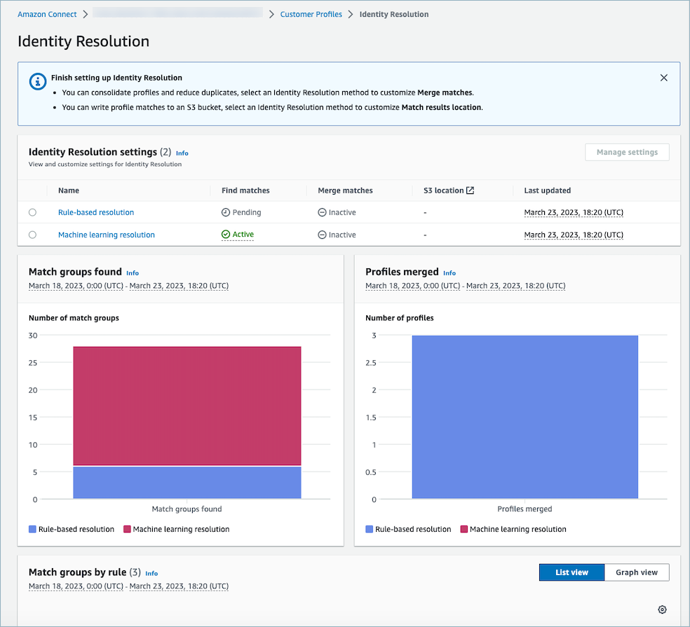

# View Identity Resolution metrics in Amazon Connect

Customer Profiles

Whenever Identity Resolution matches or merges profiles, metrics about the process are displayed
on the Customer Profiles dashboard. You can review metric for the pass week on the
**Identity Resolution** summary page.

The following metrics are generated each time the Identity Resolution Job runs:

- **Match groups found**: The number of match groups that
  were found.
  - Available for both ML-based and rule-based Identity Resolution.

- **Profiles Merged**: The number of profiles that were
  merged.
  - Available for both ML-based and rule-based Identity Resolution.

- **Match Group by rule**: The number of match group that
  were created by each rule level.
  - Only available for rule-based Identity Resolution.

