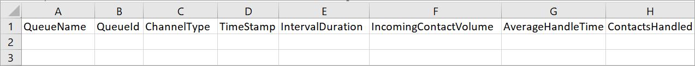
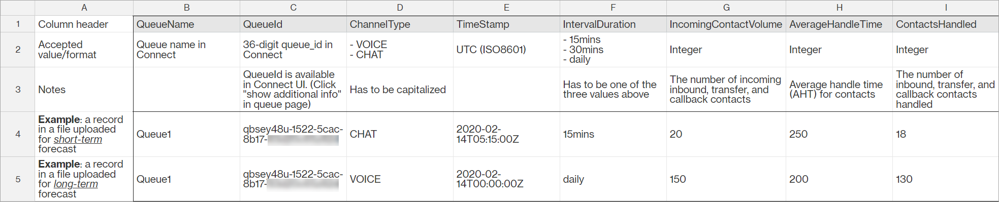
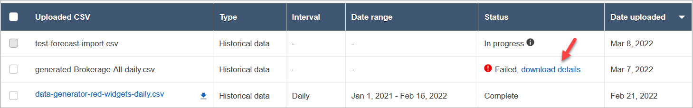
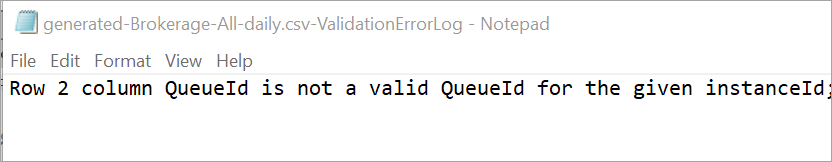
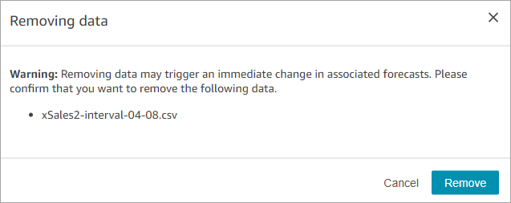

# Import historical data for forecasting

in Amazon Connect

Amazon Connect requires sufficient historical data to learn the contact pattern and make
good forecasts. By default, it uses historical contact data in Amazon Connect for
forecasting. You can import historical data from external applications for Amazon Connect to
use for forecasting. When you import data, Amazon Connect uses both its data and the imported
data for forecasting. However, _the imported data takes
precedence over the Amazon Connect data_.

## When to import data

We recommend importing historical data from external applications in the
following use cases:

- **Insufficient historical data in
  Amazon Connect**. If you have less than one year of historical data in
  Amazon Connect, we strongly recommend that you extract historical data from your
  previous system and upload the data to Amazon Connect. It is fine to have data
  split between your Amazon Connect data and uploaded historical data. For example,
  if you want to generate forecasts on January 1, 2022, and you have nine
  months of historical in Amazon Connect (from April 1 to December 31, 2021), we
  recommend importing three additional months of data (from January 1 to
  March 31, 2022) to make a _continuous_ one-year
  historical data set available.
- **Incorrect historical data in Amazon Connect**.
  If the historical contact pattern is incorrect (for example, the contact
  volume is abnormally low on the day of a wide-spread power outage in the
  contact center), you can import data that is more representative to
  override historical data and correct for the anomaly.

If you have more than one year of historical data in Amazon Connect, you can choose to
skip data import and start [creating
forecasts](create-forecasts.md "create-forecasts.md").

## Important things to

know

- The data file must be a CSV file and it must be in the required
  format. If the file format and data don't meet the requirements, the
  upload does not work. We recommend downloading and using the template
  provided through the Amazon Connect admin website (see step 4 in [How to import historical
  data](#how-import-data-for-forecasting "#how-import-data-for-forecasting")) to help you
  prepare the historical data.

The following image shows an example of the CSV template. There are
headings in the first row for `QueueName`,
`QueueId`, `ChannelType`, and so on.

Following are the requirements for imported data:

    + `QueueName`: Enter the Amazon Connect queue name.
    + `QueueId`: Enter the Amazon Connect queue ID. To find the
     queue ID in the Amazon Connect admin website, on the left navigation, go to
     **Routing**, **Queues**,
     choose the queue, select **Show additional queue
     information**. The queue ID is the last number
     after `/queue/`.
    + `ChannelType`: Enter `CHAT` or
     `VOICE`. You must capitalize the channel
     type.
    + `TimeStamp`: Enter the timestamp in ISO8601 format.
     For `Daily` interval data, the time value must be
     midnight in the [selected
     time zone](set-forecast-timezone.md "set-forecast-timezone.md").
    + `IntervalDuration`: Enter `15mins` or
     `30mins` for short-term forecast, depending on
     your forecast and schedule interval. Enter `daily`
     for long-term forecast.
    + `IncomingContactVolume`: Enter the number of
     inbound, transfer, and callback contacts as an integer.
    + `AverageHandleTime`: Enter the amount of average
     handle time (in seconds) as type double/decimal.
    + `ContactsHandled`: Enter the number of inbound,
     transfer, and callback contacts handled as an integer.

- You can import multiple files. You do not have to consolidate all data
  in one big file. You can divide data by year, queue, interval duration
  types, and more, per your preference.

If duplicate data are found across multiple files, the last uploaded
records are used. For example:

    1. You have the original historical data (from Amazon Connect) from 7/1 to
     8/1.
    2. You uploaded a new historical data file X to override 7/10 to
     8/1.
    3. You uploaded another new historical file Y to override 7/15 to
     8/1.
    4. And now, the historical data baseline is: 7/1 to 7/9 from
     original, 7/10 to 7/14 from file X, 7/15 to 8/1 from file
     Y.

- You need to upload historical data _separately_ for
  short-term and long-term forecast.
  - Data aggregated in 15- or 30-minute intervals is used for
    short-term forecasting.
  - Data aggregated at daily grain is used for long-term
    forecasting.

For example, if you only upload data in 15- or 30-minute interval, you won't
be able to generate long-term forecasts.

- The following special characters are allowed in the CSV file: -, \_, .,
  (, and ). Space is allowed.

The following image shows an example of what the data looks like in a CSV file
that has been opened with Excel.

## How to import historical

data

1. Log in to the Amazon Connect admin website with an account that has security profile
   permissions for **Analytics**, **Forecasting -
   Edit**.

For more information, see [Assign
permissions](required-optimization-permissions.md "required-optimization-permissions.md"). 2. On the Amazon Connect navigation menu, select **Analytics and
optimization**, **Forecasting**, and then
choose the **Import Data** tab. 3. Choose **Upload data**. 4. On the **Upload historical data** dialog box, choose
**download the .csv template for historical data**. 5. Add historical data to the CSV file, and then choose **Upload
file** to upload it. Choose
**Apply**. 6. If the upload fails, choose **download details** to
view the error log message for more information. The following image of
the **Forecasts** page shows the location of the
**download details** link, next to the
**Failed** status message.

The following image shows the download details file opened by using
Notepad. It indicates the error is in Row 2, the QueueId is not valid.

 7. If the forecast was uploaded successfully, its
**Status** = **Complete** and
**Date uploaded** = today.

## Delete imported historical

data

You can delete previously imported historical data in Amazon Connect.

###### Note

Deleting or adding historical data triggers an immediate change in
associated forecasts because this action changes the historical data
baseline that the model is trained for.

The following image shows an example warning message about the consequences of
removing data.

After the imported historical data is deleted, the last previously uploaded
data is used for the baseline. Take the previous example:

- You have the original historical data (from Amazon Connect) from 7/1 to 8/1.
- You uploaded a new historical data file X to override 7/10 to 8/1.
- You uploaded another new historical file Y to override 7/15 to
  8/1.
- And now, the historical data baseline is: 7/1 to 7/9 from original,
  7/10 to 7/14 from file X, 7/15 to 8/1 from file Y.
- If:
  1.  You deleted file Y, the baseline will be: 7/1 to 7/9 from
      original, 7/10 to 8/1 from X.
  2.  You deleted file X, the baseline will be: 7/1 to 7/14 from
      original, 7/15 to 8/1 is from Y.
