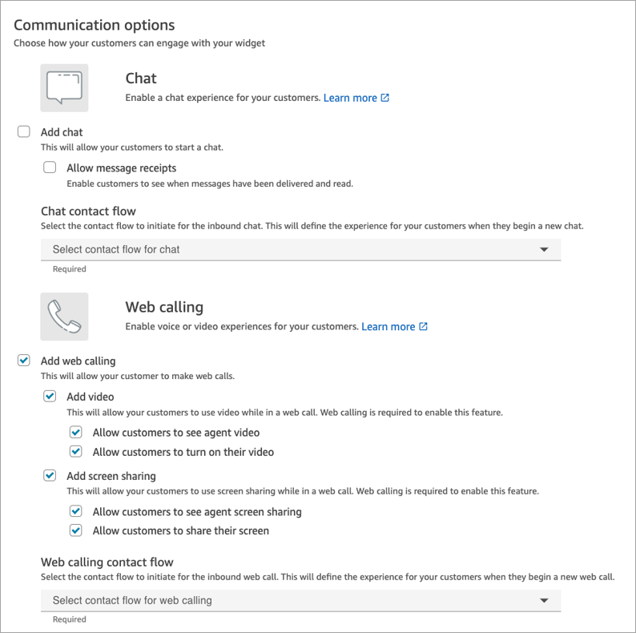

# Set up in-app, web, video calling, and screen sharing

capabilities

The Amazon Connect in-app, web, and video calling capabilities enable your customers
to contact you without ever leaving your web or mobile application. You can use these
capabilities to pass contextual information to Amazon Connect. This enables you to
personalize the customer experience based on attributes such as the customer's profile or
other information, like actions previously taken within the app.

## Important things to know

- During a video call or screen sharing session, agents are able to see the
  customer's video or screen share even when the customer is on hold. It is the customer's
  responsibility to handle PII accordingly. If you want to change this behavior, you can build a
  custom CCP and communication widget. For more information, see [Integrate in-app, web, video calling, and screen
  sharing natively into your application](config-com-widget2.md "config-com-widget2.md").

## Communication widget: Configure chat, voice, and video all in

one place

To set up in-app, web, and video calling, you use the **Communication
widgets** page. It supports chat, voice, video, and screen sharing. The
following image shows the **Communication options** section of the page
when it's configured for all of these options.

## Multi-user in-app, web, and video calling

You can add up to four additional users to an ongoing or scheduled web, in-app or
video call, for a total of six participants: the agent, the first user, and four other
participants (users or agents).

For example, to help close a mortgage transaction, you can have the agent and the
customer, the customer's spouse, a translator, and even a supervisor (that is, another
agent) on the call to help resolve any issues quickly.

To learn how to enable multi-user web, in-app and video calling, see [Enable multi-user in-app, web, and video
calling](enable-multiuser-inapp.md "enable-multiuser-inapp.md").

## How to set up in-app, web, video calling, and screen

sharing

There are two ways to embed Amazon Connect in-app, web, and video calling, and
screen sharing onto your website or mobile application:

- Option 1: [Configure an out-of-the-box
  communications widget](config-com-widget1.md "config-com-widget1.md"). You can use the UI builder to customize the
  font and colors, and secure the widget so that it can be launched only from your
  website.
- Option 2: [Integrate in-app, web, and video
  calling natively into your mobile application](config-com-widget2.md "config-com-widget2.md") . Choose this option to
  build a communications widget from scratch and integrate it with your mobile application
  or website. Use the Amazon Connect APIs and Amazon Chime SDK client
  APIs to integrate natively into your mobile application or website.

###### Note

If you have custom agent desktops, you don't need to make any changes for Amazon Connect
in-app and web calling. However, you need to [integrate video calling and screen
sharing](integrate-video-calling-for-agents.md "integrate-video-calling-for-agents.md").
