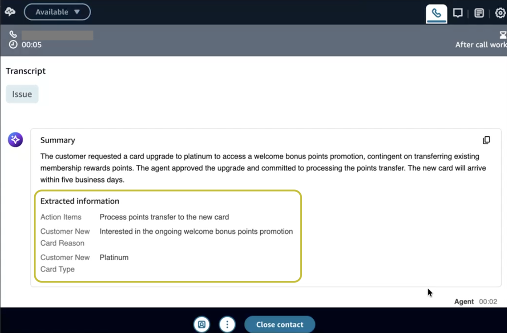
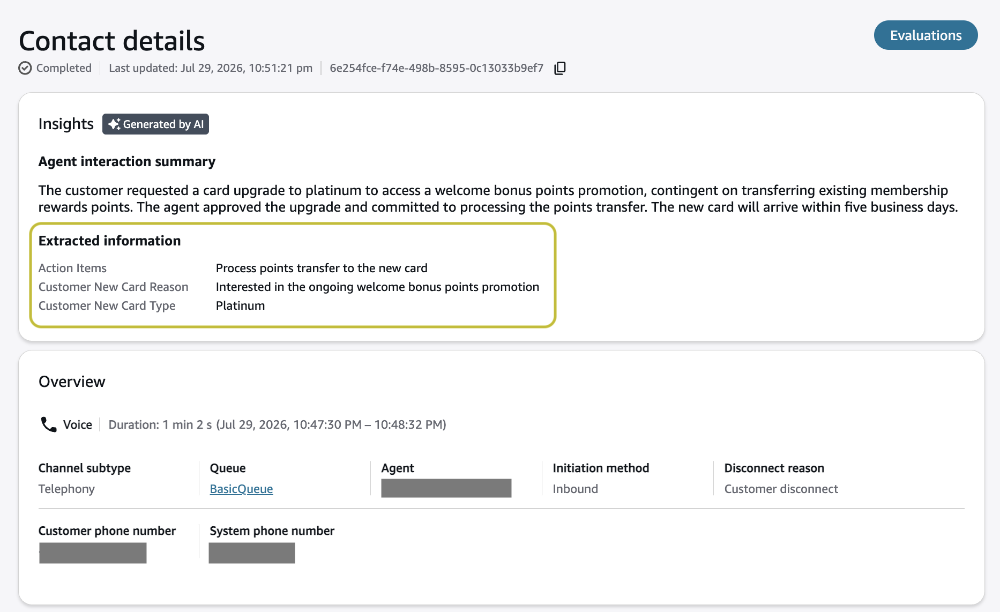
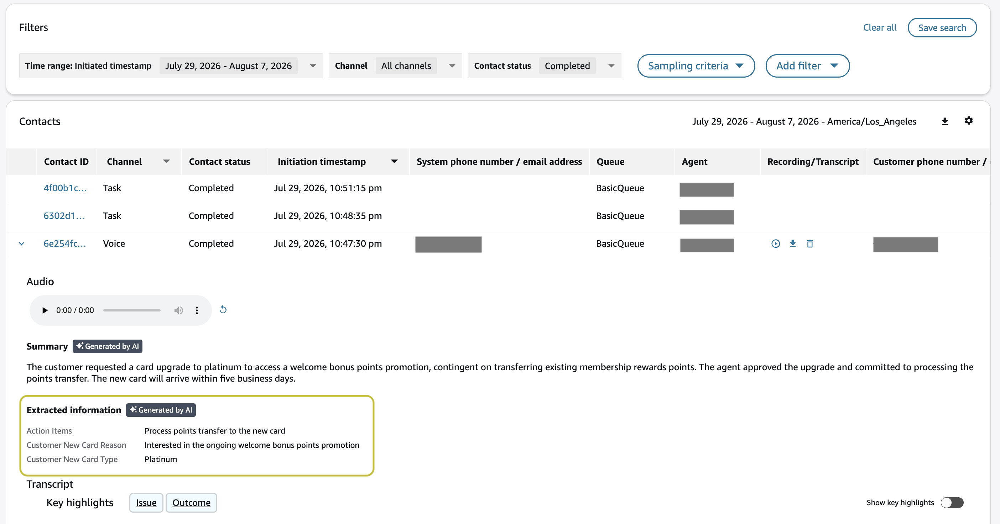

# View extracted information

Extracted information is available in the following locations:

- **Contact Control Panel (CCP)** – During
  after-call work
- **Contact details page** – After the
  contact ends
- **Contact search** – Filter and search
  contacts by extracted values

## Contact Control Panel (CCP)

During the after-call work process, any information extracted with an ACW
analysis event source is displayed in the **Extracted
Information** widget in the CCP.



## Contact details page

After the contact ends, all extracted information appears in the
**Extracted Information** section of the **Contact
details** page.



## Contact search

You can search for contacts by extracted information values using the
**Extracted Information** filter in the **Contact
search** dropdown.



## Errors

If information extraction fails with a runtime error, the failure is displayed
similarly to a category error.

### In the UI (Contact details page)

Failed extractions are displayed with dashed borders, transparent
backgrounds, and an error icon. Pausing on a failed extraction shows
why it failed.

### In the S3 analysis output file

Failed extractions appear under
`JobDetails.SkippedAnalysis` with the feature
`INFORMATION_EXTRACTION` and a reason code:

```
"SkippedAnalysis": [
    {
        "Feature": "INFORMATION_EXTRACTION",
        "ReasonCode": "QUOTA_EXCEEDED",
        "SkippedEntities": [
            { "ExtractionName": "Flight Number", "RuleId": "a113..." }
        ]
    },
    {
        "Feature": "INFORMATION_EXTRACTION",
        "ReasonCode": "FAILED_SAFETY_GUIDELINES",
        "SkippedEntities": [
            { "ExtractionName": "Credit Card Type", "RuleId": "cccc..." }
        ]
    }
]
```

### Common failure reasons

| Reason code                | Meaning                                                                                                         |
| -------------------------- | --------------------------------------------------------------------------------------------------------------- |
| `QUOTA_EXCEEDED`           | The AI actions service quota was exceeded at the time<br>of execution.                                          |
| `FAILED_SAFETY_GUIDELINES` | Extraction processing did not satisfy security or quality<br>guardrails.                                        |
| `FEATURE_UNAVAILABLE`      | The instance is an Amazon Connect Customer Basic<br>instance, which does not support information<br>extraction. |
| `SYSTEM_ERROR`             | An unexpected system error occurred during<br>extraction.                                                       |
