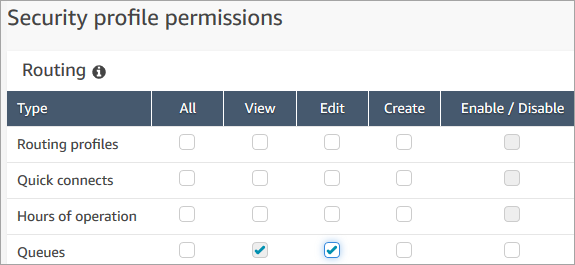
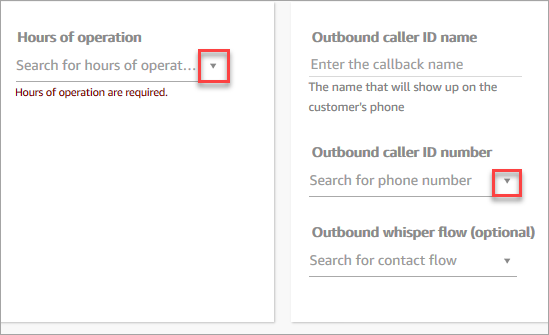

# Inherited permissions for Amazon Connect and Contact

Control Panel (CCP) security profiles

Some security profiles included inherited permissions: when you give a user explicit
permissions to **View** or **Edit** one resource type,
such as queues, they implicitly inherit permissions to **View** another
resource type, such as phone numbers.

For example, assume you explicitly grant someone permission to
**Edit/View** queues, as shown in the following image:

By doing this you also implicitly grant them permissions to **View**
a list of all phone numbers and hours of operation in your Amazon Connect instance, **when they add them to the queue**. On the **Add new
queue** page, the available phone numbers and hours of operation appear in
dropdown lists, as shown in the following image.

However, the user doesn't have permissions to **Edit** the phone
numbers and hours of operation.

In this case, they also don't inherit permissions to **View** contact
flows (the outbound whisper flow) and quick connects because those resources are
optional.

## List of inherited

permissions

The following table lists permissions that are implicitly inherited when you
assign dedicated permissions to a user.

###### Tip

When a user has only explicit **View** permissions and not
also **Edit** permissions, the objects are retrieved but Amazon Connect
doesn't surface them in drop-down lists for the user to peruse.

| Dedicated permission            | Inherited permissions                                                                                                                                                                                                                                                                                                                                                 |
| ------------------------------- | --------------------------------------------------------------------------------------------------------------------------------------------------------------------------------------------------------------------------------------------------------------------------------------------------------------------------------------------------------------------- |
| Users • View or Edit         | When someone edits a user's information in the Amazon Connect console, they can \*_view_ • the following information in drop-down boxes when they add it to the user's account: • All security profiles in the instance • All routing profiles in the instance • All agent hierarchies in the instance • All agent proficiencies in the instance |
| Queues • View or Edit        | When someone edits queues in the Amazon Connect console, they can \*_view_ • the following information in drop-down and search boxes when they add it to the queue: • All quick connects in the instance • All phone numbers in the instance • All operating hours in the instance                                                                  |
| Quick connects • View        | • All queues in the instance • All flows in the instance • All users in the instance                                                                                                                                                                                                                                                                            |
| Quick connects • Edit        | • All queues in the instance • All flows in the instance                                                                                                                                                                                                                                                                                                           |
| Phone numbers • View or Edit | When someone edits phone numbers in the Amazon Connect console (not the CCP), they can \*_view_ • the following information in a drop-down box when they associate it with the phone number: • All flows in the instance                                                                                                                               |
