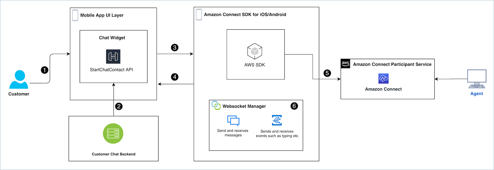

# Integrate Amazon Connect chat into a mobile

application

This topic explains how to integrate Amazon Connect Chat into your mobile application. You
can use one of the following options:

- [WebView integration](#webview "#webview")
- The [Amazon Connect Chat SDKs for iOS and Android](#integrate-chat-with-mobile-sdks-for-mobile "#integrate-chat-with-mobile-sdks-for-mobile")
- [React Native integration](#react-native-integration "#react-native-integration")
  Use the Amazon Connect
  [StartChatContact](../APIReference/API_StartChatContact.md "../APIReference/API_StartChatContact.md") API to initiate contact.

###### Contents

- [Which integration option to use](#integrate-options "#integrate-options")
- [Amazon Connect chat
  integration workflow](#integrate-chat-with-mobile-workflow "#integrate-chat-with-mobile-workflow")
- [Get started with
  Amazon Connect chat integration](#integrate-chat-with-mobile-getting-started "#integrate-chat-with-mobile-getting-started")

## Which integration option to use

This section provides a description of each integration option to help you decide which one to use for your solution.

### WebView integration

The Amazon Connect Chat WebView integration allows you to embed the full chat experience
into your mobile applications with minimal development effort. This method uses
`WebView` on Android and `WKWebView` on iOS to provide a
seamless and comprehensive chat interface. It is ideal for teams looking for a
quick, out-of-the-box solution to integrate chat functionality without extensive
customizations.

This approach ensures secure communication and leverages the web-based Amazon Connect chat
interface. However, you will need to configure your app to handle cookies and
JavaScript properly.

For more information on implementing WebView integration, see the Amazon Connect chat
[UI Examples](https://github.com/amazon-connect/amazon-connect-chat-ui-examples/tree/master/mobileChatExamples "https://github.com/amazon-connect/amazon-connect-chat-ui-examples/tree/master/mobileChatExamples") GitHub repository.

**Recommendation**: WebView-based integration is
ideal for rapid development and minimal maintenance while ensuring comprehensive
chat functionality.

### Amazon Connect Chat

SDKs for Mobile

The Amazon Connect Chat SDKs for iOS and Android simplify the integration of
Amazon Connect chat for native mobile applications. The SDKs help handle
client side chat logic and back-end communications similar to the Amazon Connect
ChatJS Library.

The Amazon Connect Chat SDKs wrap the Amazon Connect Participant Service APIs
and abstracts away the management of the chat session and WebSocket. This allows you
to focus on the user interface and experience while relying on the Amazon Connect Chat SDK to interact with all the back-end services. This approach still requires
you to use your own chat back end to call the Amazon Connect
`StartChatContact` API to initiate contact.

- For more information on the Swift-based iOS SDK, see the [Amazon Connect Chat SDK for iOS](https://github.com/amazon-connect/amazon-connect-chat-ios "https://github.com/amazon-connect/amazon-connect-chat-ios") GitHub page.
- For more information on the
  Kotlin-based Android SDK, see the [Amazon Connect Chat SDK for Android](https://github.com/amazon-connect/amazon-connect-chat-android "https://github.com/amazon-connect/amazon-connect-chat-android") GitHub page.

**Benefits**: The Native SDKs enable robust
functionality and high performance, making them ideal for applications that require
deep customization and a seamless user experience.

### React Native integration

Amazon Connect Chat React Native integration offers a cross-platform solution.
It enables teams to build chat functionality for both Android and iOS with a
shared codebase. This method balances customization and development efficiency
while leveraging React Native's capabilities for creating robust mobile
applications.

This integration uses native bridges to access advanced features and ensures
consistent performance and a uniform user experience across platforms. It's
easier to implement key features such as WebSocket communication by using
libraries such as `react-native-websocket` and API calls with
`axios`.

**Best for**: Teams that want to maximize code
reuse while maintaining functional flexibility.

## Amazon Connect chat

integration workflow

The following diagram shows the programming flow between a customer using a mobile app
and an agent. Numbered text in the diagram corresponds to numbered text below the
image.

###### In the diagram

1. When a customer starts a chat in the mobile app, the app should send a request
   to Amazon Connect using the [StartChatContact](../APIReference/API_StartChatContact.md "../APIReference/API_StartChatContact.md") API. This requires specific parameters, such as
   the API endpoint and IDs for the [instance](amazon-connect-instances.md "amazon-connect-instances.md") and [contact](connect-contact-flows.md "connect-contact-flows.md")
   flow, to authenticate and initiate the chat.
2. The `StartChatContact` API interacts with your back-end system to
   obtain a participant token and a contact ID that act as unique identifiers for
   the chat session.
3. The app's UI passes the `StartChatContact` response to the mobile
   SDK in order for the SDK to properly communicate with the [Amazon Connect Participant Service](../APIReference/API_Operations_Amazon_Connect_Participant_Service.md "../APIReference/API_Operations_Amazon_Connect_Participant_Service.md") and set up the
   customer’s chat session.
4. The SDK exposes a [chatSession](https://github.com/amazon-connect/amazon-connect-chat-ios?tab=readme-ov-file#chatsession-apis "https://github.com/amazon-connect/amazon-connect-chat-ios?tab=readme-ov-file#chatsession-apis") object to the UI, which contains easily usable methods
   to interact with the chat session.
5. Under the hood, the SDK interacts with the [Amazon Connect Participant Service](../APIReference/API_Operations_Amazon_Connect_Participant_Service.md "../APIReference/API_Operations_Amazon_Connect_Participant_Service.md") using the [AWS SDK](https://aws.amazon.com/developer/tools/ "https://aws.amazon.com/developer/tools/"). The communication with the Amazon Connect
   Participant Service is responsible for all customer interactions with the chat
   session. This includes actions such as `CreateParticipantConnection`,
   `SendMessage`, `GetTranscript`, or
   `DisconnectParticipant`.
6. The SDK also manage the WebSocket connection needed to receive messages,
   events and attachments from the agent. This will all be handled and parsed by
   the SDK and surfaced to the UI in an easily consumed structure.

## Get started with

Amazon Connect chat integration

The following steps and resources will help you get started with integrating Amazon Connect Chat into your native mobile applications:

1. You can quickly set up a [CloudFormation](../../../AWSCloudFormation/latest/UserGuide/Welcome.md "../../../AWSCloudFormation/latest/UserGuide/Welcome.md")
   stack to provide the necessary back-end to call StartChatContact by looking at our [startChatContactAPI](https://github.com/amazon-connect/amazon-connect-chat-ui-examples/tree/master/cloudformationTemplates/startChatContactAPI "https://github.com/amazon-connect/amazon-connect-chat-ui-examples/tree/master/cloudformationTemplates/startChatContactAPI") example on GitHub.
2. For examples that show how to
   build your mobile chat UI powered by the Amazon Connect Chat SDKs, check out our [UI
   Examples](https://github.com/amazon-connect/amazon-connect-chat-ui-examples "https://github.com/amazon-connect/amazon-connect-chat-ui-examples") GitHub project.

Refer to our
sample [iOS](https://github.com/amazon-connect/amazon-connect-chat-ui-examples/tree/master/mobileChatExamples/iOSChatExample "https://github.com/amazon-connect/amazon-connect-chat-ui-examples/tree/master/mobileChatExamples/iOSChatExample") and [Android](https://github.com/amazon-connect/amazon-connect-chat-ui-examples/tree/master/mobileChatExamples/androidChatExample "https://github.com/amazon-connect/amazon-connect-chat-ui-examples/tree/master/mobileChatExamples/androidChatExample") chat examples that showcase how to power a chat application
using the Amazon Connect Chat SDK for iOS/Android. 3. Check out the [Amazon Connect Chat SDK for iOS](https://github.com/amazon-connect/amazon-connect-chat-ios "https://github.com/amazon-connect/amazon-connect-chat-ios") and [Amazon Connect Chat SDK for Android](https://github.com/amazon-connect/amazon-connect-chat-android "https://github.com/amazon-connect/amazon-connect-chat-android") GitHub pages. The GitHub page
contains API documentation and an implementation guide that explains
any prerequisites and installation steps. 4. Set up React Native integration: Leverage the [React Native](https://github.com/amazon-connect/amazon-connect-chat-ui-examples/tree/master/mobileChatExamples/connectReactNativeChat "https://github.com/amazon-connect/amazon-connect-chat-ui-examples/tree/master/mobileChatExamples/connectReactNativeChat") example for guidance on implementing react native
based solution. 5. If there are any questions or issues regarding the set up or use of the
Amazon Connect Chat SDK on your mobile applications, you can file an
issue on either the [Amazon Connect Chat SDK for iOS Issues](https://github.com/amazon-connect/amazon-connect-chat-ios/issues "https://github.com/amazon-connect/amazon-connect-chat-ios/issues") page or the [Amazon Connect Chat SDK for Android Issues](https://github.com/amazon-connect/amazon-connect-chat-android/issues "https://github.com/amazon-connect/amazon-connect-chat-android/issues") page. If there
is an issue with the mobile chat UI examples, you can file an issue on the
[Amazon Connect Chat UI Examples Issues](https://github.com/amazon-connect/amazon-connect-chat-ui-examples/issues "https://github.com/amazon-connect/amazon-connect-chat-ui-examples/issues") page.
