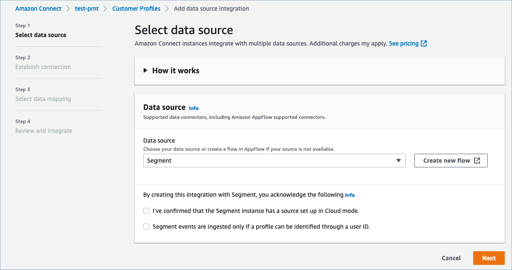
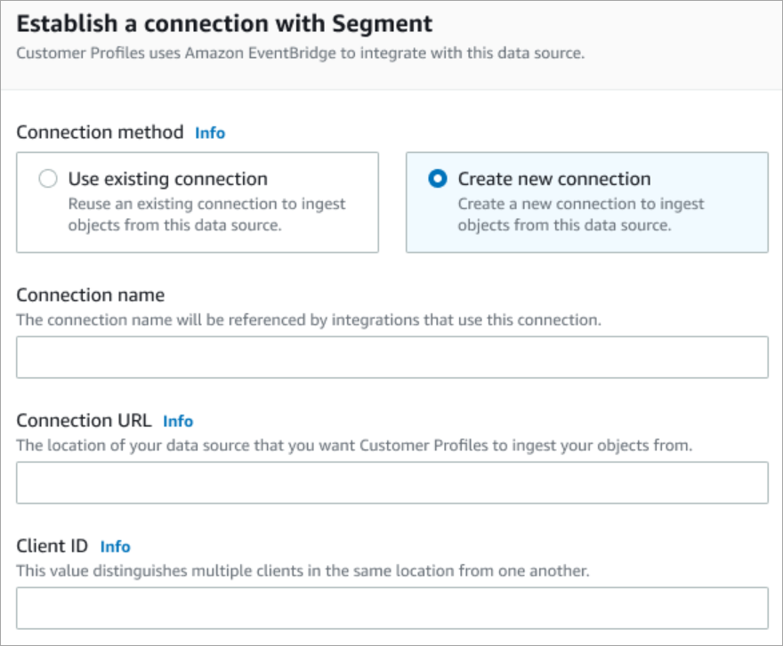
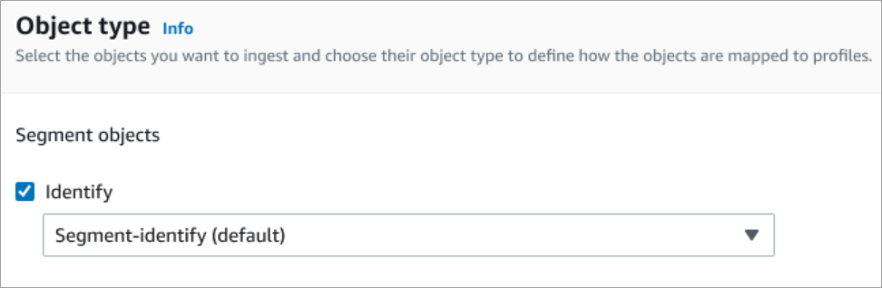
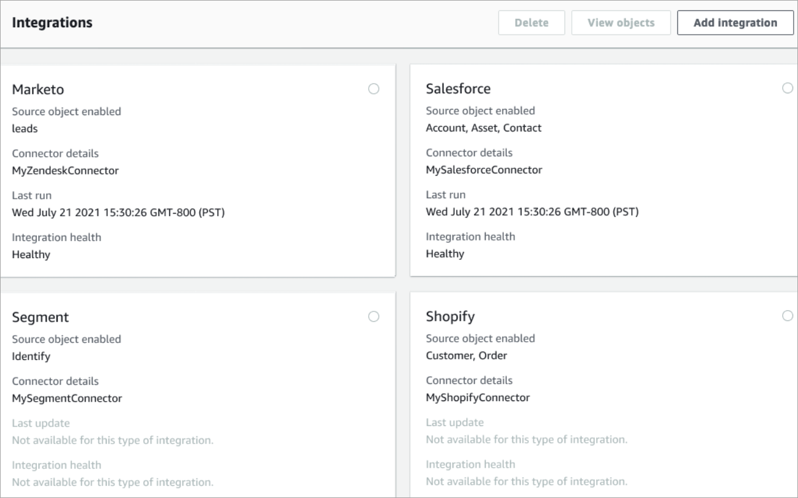
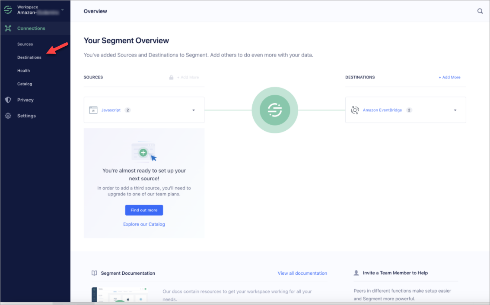
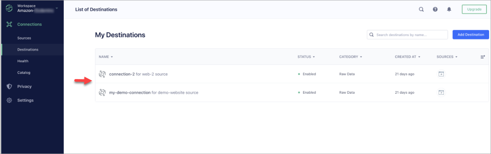
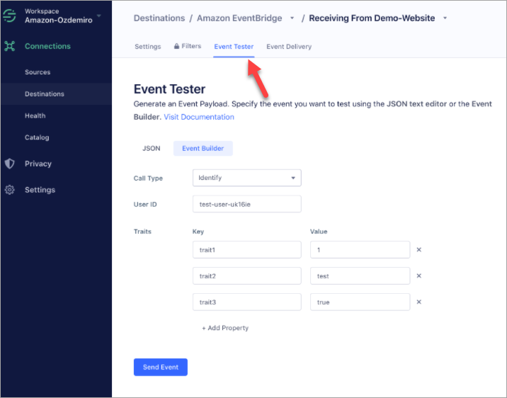

# Set up integration for

Segment to provide periodic updates to Amazon Connect Customer Profiles

To provide periodic updates to Amazon Connect Customer Profiles, you can integrate with Segment using
Amazon AppFlow. You first set up the connection in Amazon Connect and Segment, and then verify the
Segment integration.

## Set up the connection in Amazon Connect

and Segment

1. Open the Amazon Connect console at
   [https://console.aws.amazon.com/connect/](https://console.aws.amazon.com/connect/ "https://console.aws.amazon.com/connect/").
2. On the instances page, choose the instance alias. The instance alias is also
   your **instance name**, which appears in your Amazon Connect
   URL. The following image shows the **Amazon Connect virtual contact center instances** page, with a box
   around the instance alias.

 3. In the navigation pane, choose **Customer
profiles**. 4. On the **Customer profiles configuration** page,
choose **Add integration**.

 5. On the **Select data source** page, choose
**Segment**. Review the application
requirements that are listed on the **Select
application** page.

 6. On the **Establish connection** page, choose one
of the following:

    * **Use existing connection**: This allows
     you to reuse existing Amazon EventBridge resources that you may have
     created in your AWS account.
    * **Create new connection**: Enter the
     information required by the external application.

    

    	+ **Connection name**: Provide a
    	 name for your connection. The connection name is
    	 referenced by integrations that use this
    	 connection.
    	+ **Connection URL**: Enter your
    	 application connection URL. This URL is used for
    	 deep-linking into the objects created in your
    	 external application. The connection URL is the
    	 Segment workspace URL available on the application
    	 website.

    	To find your workspace URL:

    		1. Log in to your segment.com account.
    		2. Go to **Settings**, **General settings**.
    		3. Copy the URL from your browser.

7. Customer Profiles uses Amazon EventBridge for integrations with Segment. On the
   **Source set up** page, copy your AWS account ID to your clipboard, and then choose
   **Log in to Segment** to configure Amazon EventBridge.
8. Use the following instructions to set up Segment:
   1. Log in to Segment.
   2. In your application, select a source to set up the
      destination to Amazon EventBridge.
   3. Paste in your AWS account ID and select
      your AWS Region.
   4. Toggle **ON**, to activate your partner
      event source.

9. Go to **Event Tester**, and
   send
   a test event to complete activating your partner
   event source.
10. **Client ID**: This is a string that uniquely
    distinguishes the client in your external application. This client
    ID is the Source Name available on the application website. You use
    the ID that you specify to identify the client that you want Customer Profiles to
    ingest your objects from.

To find your source ID:

    1. Go to **Sources**, and choose a
     source.
    2. Go to **Settings**, **API
     Keys**.
    3. Copy your **Source ID**.

After you set up the event source destination, return to the Customer Profiles
console and paste the Client ID. 11. You will see an alert that indicates Amazon Connect has successfully
connected with Segment. 12. On the **Integration options** page, choose which
source objects you want to ingest and select their object type.

Object types store your ingested data. They also define how
objects from your integrations are mapped to profiles when they are
ingested. Customer Profiles provides default object type templates you can use
that define how attributes in your source objects are mapped to the
standard objects in Customer Profiles. You can also use the object mappings that
you've created from the [PutProfileObjectType](../../../customerprofiles/latest/APIReference/API_PutProfileObjectType.md "../../../customerprofiles/latest/APIReference/API_PutProfileObjectType.md").

 13. For the **Ingestion start date**, Customer Profiles starts
ingesting records created after the integration is added.

###### Note

If you need historical records, you can [use Amazon S3 as
an integration source to import them](customer-profiles-object-type-mappings.md "customer-profiles-object-type-mappings.md"). 14. On the **Review and integrate** page, check that
the **Connection status** says
**Connected**, and then choose **Add
integration**. 15. After the integration is set up, back on the **Customer
profiles configuration** page, the
**Integrations** page displays which
integrations are currently set up. The **Last run** and **Integration health** are not
currently available for this type of integration.

To see what data is being sent, choose the integration and+ then
choose **View objects** .

## Verify your

Segment integration

To perform this step you need the following prerequisites:

- Access to your Segment workspace.
- [Access to the
  Amazon Connect Contact Control Panel](amazon-connect-contact-control-panel.md "amazon-connect-contact-control-panel.md").

###### To verify your Segment integration

1. Go to your Segment workspace dashboard and choose
   **Destinations**.

 2. You will see a list of destinations where that Segment sends data.
Choose the EventBridge destination for Customer Profiles.

 3. Choose the **Event Tester** tab. From this page
you will send a test event to Customer Profiles. The event is ingested and turned
into a customer profile that you can view in the Amazon Connect agent
application.

 4. Select **Identify** as the event type, and select
**Event Builder** as your input method. 5. You can specify a **User ID** and some traits.
Agents can search for these traits in the agent application. 6. Choose **Send Event**. 7. The event delivery should be almost instantaneous but allow it a
minute for it to be delivered and create a customer profile. 8. Open the Amazon Connect agent application. Search for the user ID you
entered in the **Event Builder**. You should be
able to see the customer profile with the user ID and the traits you
entered. 9. If you cannot see the customer profile, then there is a problem
with your integration. To troubleshoot:

    1. Go to the Amazon EventBridge console.
    2. Check whether the EventSource is Active and the matching
     EventBus exists and is running.

If these are working, contact Support for assistance investigating
the issue.

## Monitor your Customer Profiles

integrations

After your connection is established, if it stops working, delete the
integration and then re-establish it.

## What to do if objects

aren't being sent

If an object fails to be sent, choose **Flow details** to
learn more about what's gone wrong.

You may need to delete the configuration and re-connect to the external
application.
