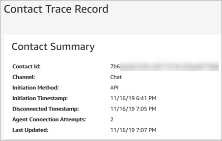

# Start chats in your applications

by using Amazon Connect APIs

Use the StartChatContact API in Amazon Connect APIs to start chats in your own
applications.

To start a chat, use the [StartChatContact](../APIReference/API_StartChatContact.md "../APIReference/API_StartChatContact.md") API.

When you explore the chat experience for the first time, you'll notice that chats
aren't counted in the **Contacts Incoming** metric in your historical
metrics report. This is because the initiation method for the chat in the contact record
is **API**.

The following image of a contact record shows the _Initiation
Method_ set to _API_.

After a chat is transferred to an agent, the **Contacts Incoming**
metric is incremented. The contact record for the transfer no longer increments the API,
but it does increment **Contacts Incoming**.
