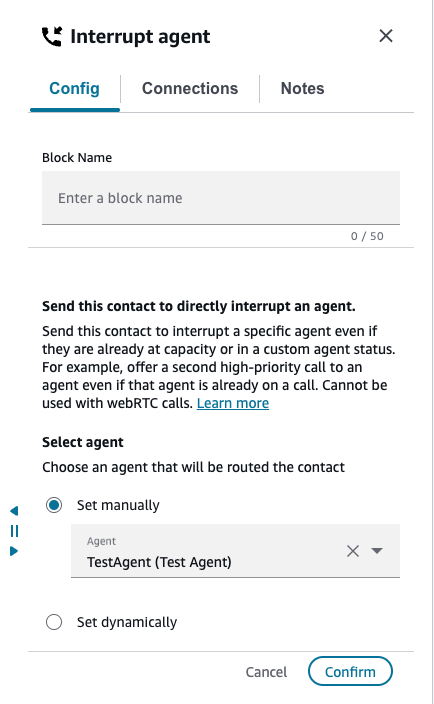
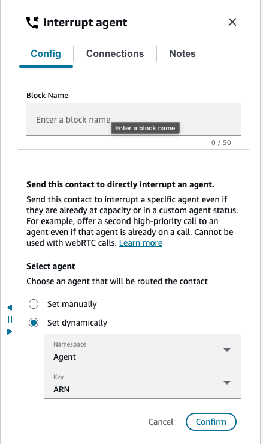
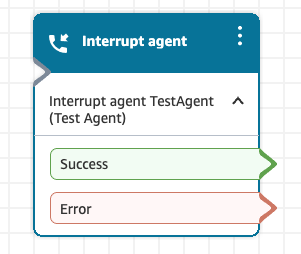

# Flow block in Connect Customer: Interrupt agent

This topic defines the flow block for routing a contact to a specific agent,
overriding their normal routing configuration.

## Description

- Use this block to offer a contact to a specific agent even if that agent
  is currently at maximum concurrency or is in a custom (non-routable) status.
  This is useful for time-sensitive or high-priority contacts, such as calls to
  a personal extension, that must reach a specific agent regardless of their
  current availability.
- When the block is executed, the routing engine offers the contact to the specified
  agent. If the agent is being offered a second interrupt call when they are already on
  a call, then their existing call is placed on hold and they are connected to the new
  contact. The agent can then toggle between the two calls.
- This block can only be used in a **Customer queue
  flow**.

## Supported channels

The following table lists how this block routes a contact who is using the
specified channel.

| Channel | Supported? |
| ------- | ---------- |
| Voice   | Yes        |
| Chat    | Yes        |
| Task    | Yes        |
| Email   | Yes        |

## Flow types

You can use this block in the following [flow
types](create-contact-flow.md#contact-flow-types "create-contact-flow.md#contact-flow-types"):

- Customer queue flow

###### Note

If this block is used inside a Flow module that is invoked from a flow type
other than Customer queue flow, the block takes the
**Error** branch.

## How to configure this block

There are two ways to specify the target agent in this block.

### Set manually

Select an agent from the instance-level user list in the block's properties
panel.

### Set dynamically

Pass the agent's identity as a contact attribute. The following values are
accepted:

- User ARN
- User ID
- Username

## Block branches

This block has the following branches:

| Branch      | When it is taken                                                                                                                                                                                                                                                                                                                   |
| ----------- | ---------------------------------------------------------------------------------------------------------------------------------------------------------------------------------------------------------------------------------------------------------------------------------------------------------------------------------- |
| **Success** | Taken as soon as the contact is successfully offered to the agent. This branch is taken regardless of whether the agent ultimately accepts or rejects the contact.                                                                                                                                                           |
| **Error**   | Situations include: the agent is offline; the agent is already at max concurrency +1 for the channel; the agent has deskphone or mobile forwarding enabled and is already on a call; the agent's existing contact is in a Connecting or Incoming state; the contact is of in-app or web calling type; system error. |

###### Note

After the **Success** branch is taken, the caller remains
in the queue flow while the agent decides whether to accept or reject the
contact. The caller's experience while waiting depends on how you have
configured the queue flow.

## Configuration tips

###### **Voice contacts – personal extension (DID) routing**

A common use case for this block is routing calls to an agent's
personal or direct inward dial (DID) extension, even when the agent is
already on another call.

If you have already implemented personal extension routing in
Connect Customer – for example, a flow that transfers the caller to a specific
agent queue and then forwards to voicemail after a timeout – you might
want to add interrupt behavior as follows:

- In the **Customer queue flow** that executes
  when the contact is placed in the agent queue, add the
  **Interrupt agent** block as the first
  block.
- Configure your voicemail transfer logic to wait **at least 30 seconds** before transferring
  the caller to voicemail. Because the interrupt call rings for 30
  seconds before timing out, a shorter voicemail timeout might start
  to route the caller to voicemail before the agent has had a
  chance to accept.

###### **Chat, task, and email contacts**

You can use this block to offer a chat, task, or email contact to an
agent even if the agent is already at maximum concurrency for that
channel, or is in a custom status.

###### Tip

When using this block with chat, do not place the
**Interrupt agent** block as the first block in the
queue flow. Instead, add a [Wait](wait.md "wait.md") block directly before it to wait for
3 seconds and ensure the chat contact has been fully enqueued before
it is offered to the agent.

###### **Restricting interrupts to agents in Available status only**

By default, this block offers the contact to the agent regardless of
whether they are in Available status or a custom status. If you want to
offer the contact only when the agent is in Available status, use a
[Check staffing](check-staffing.md "check-staffing.md") block before this block to
verify that the agent queue is staffed, and branch to the
**Interrupt agent** block only when staffed.

###### **Auto-accept behavior**

If the agent has auto-accept enabled, the following behavior applies
when the **Interrupt agent** block is used:

| Agent state                                | Auto-accept? |
| ------------------------------------------ | ------------ |
| Available status, below max concurrency | Yes          |
| Available status, at max concurrency    | No           |
| Custom status                              | No           |

###### **Agent comes online after the block has already executed**

If the agent is offline when the block executes, the block takes the
**Error** branch and the contact is routed using
standard queueing behavior. This means that if the agent subsequently
comes back online while the contact is still enqueued, the contact is
only offered to the agent if the agent sets themselves to
**Available** status.

## Agent experience: Dual Calls

Note the following differences in agent experience if the
**Interrupt agent** block is used to offer a second call to an
agent who is already handling one.

### Incoming interrupt call notification

An agent already on a voice call receives an incoming call notification for
the interrupt contact. The notification is presented for **30
seconds** (compared to 20 seconds for a standard call), giving the
agent time to wrap up or inform the existing customer that they will be placed
on hold.

The ring tone for an interrupt call is a subtle "call waiting" style
tone, distinct from the standard ring tone. This tone plays for the full 30
seconds or until the agent accepts the call. The tone is played to the agent
only – it is not audible to the end customer.

An interrupt call is **never auto-accepted**
when the agent is already on a call, regardless of the agent's auto-accept
setting.

In Agent Workspace, contextual apps such as Customer Profiles continue to
display context for the original contact while the interrupt call is being
offered.

### Accepting the interrupt contact

After the agent accepts the interrupt contact, the original contact is
automatically placed on hold and contextual apps such as Customer Profiles
update to reflect the new contact.

Both calls remain assigned to the agent, but the agent is only active on one
call at a time. The other call will remain on hold until the agent explicitly
resumes it. To resume the other contact, the agent must first select the call
and then choose **Resume** in its contact card.

### Transfers and multi-party conferencing

Agents can use Quick Connects on an interrupt contact to consult with another
agent, transfer the contact, or initiate a multi-party conference. If the agent
is currently handling two calls, then the agent can only select Quick Connects
for the call they are currently active on; if the caller is on hold due to the
agent handling two calls, then the agent must first resume the call before they
can transfer it.

If an agent is in a multi-party conference and accepts a second call, the
conference is not put on hold as a unit. The remaining conference participants
can continue their conversation independently while the agent handles the second
call. While the agent is on the second call, the conference owner cannot
force-unmute the agent. If your Connect Customer instance is enabled for [multi-party calls
(enhanced conferencing/contact monitoring)](monitor-conversations.md "monitor-conversations.md"), then the agent can toggle back to the
conference at any time, placing the second call on hold.

###### Note

This feature is supported with the [multi-party
calls](three-party-multi-party-comparison.md "three-party-multi-party-comparison.md") feature only. If you are using the legacy three-party
conferencing feature, then the agent can accept a second call while on a
conference but cannot resume the conference until they have completed the
second call.

### Supervisor monitoring and barge

Supervisor monitoring is based on individual contacts, not on the agent. If
an agent is handling two calls, both calls appear as separate rows in the
**Current agent performance** dashboard. The
**Contact State** column indicates which call the agent is
actively connected to versus which is on hold. The supervisor chooses the
monitor icon next to the desired call to begin listening.

Once monitoring, the supervisor can escalate to barge as usual.

If a supervisor is actively monitoring a contact and then receives a second
call, they must terminate the monitoring session before they can accept the
second call.

If a supervisor is actively barging a contact and receives a second call, they
can accept it. The barged call is automatically placed on hold when the second
call is accepted.

## Limitations and requirements

- **Softphone required.** This feature is
  supported only for agents using the Connect Customer softphone (Agent Workspace,
  standalone CCP, or custom CCP integrations through StreamsJS or ConnectSDK). It
  is not supported for agents using deskphone or mobile device forwarding. If
  an agent has deskphone forwarding enabled and is already on a call, the block
  takes the **Error** branch. If the agent is fully idle, a
  single call can still be forwarded to a deskphone as usual.
- **Maximum concurrency.** An agent can be
  offered at most 1 contact past their normal maximum concurrency using this
  feature. This means an agent can handle at most 2 concurrent voice calls. If
  an agent is already handling 2 calls when this block is executed, the block
  takes the **Error** branch.
- **Connecting and preview dialer states.** If
  the agent's existing contact is in a Connecting state or the agent is in
  preview dialer mode, a second call cannot be offered. The block takes the
  **Error** branch.
- **In-app, web, and video calling.** In-app/web
  calling, video, and screen share contacts cannot be set as interrupt
  contacts. If an agent is handling an in-app or web calling contact, they
  cannot be offered a second call even if it is a standard voice call. The
  block takes the **Error** branch.
- **Browser support.** This feature is supported
  on Google Chrome ([supported
  browsers](connect-supported-browsers.md "connect-supported-browsers.md")) and Microsoft Edge Chromium. It is not
  supported on Mozilla Firefox.
- **Agent-first callbacks.** An agent currently
  handling an agent-first callback cannot be offered a second agent-first
  callback through this block. The agent can be offered a standard inbound voice
  call.

## Frequently asked questions

**What is the Interrupt agent block and how does it work?**

The block offers a contact to the specified agent even if the agent is
already on one call or in a custom status. It can only be used in a
Customer queue flow. The **Success** branch is taken as
soon as the contact is successfully offered – not when the agent
accepts. The caller remains in the queue flow until the agent accepts
the contact.

**What does the caller hear while waiting for the agent to accept?**

The caller's experience depends on how you have configured your
Customer queue flow. The caller remains in the queue flow (for example,
hearing hold music configured through [Loop prompts](loop-prompts.md "loop-prompts.md") blocks) while the contact is
being offered to the agent.

**What happens if the agent does not answer or rejects the contact?**

The contact returns to the Customer queue flow. The subsequent
behavior depends on your flow configuration – for example, the
contact might be transferred to voicemail or placed back in a
queue.

**How long does the interrupt call ring before timing out?**

The interrupt call rings for 30 seconds. This is not
configurable.

**How do I use this block with the Flow language?**

The **Interrupt agent** block is represented as the
`RouteContactToAgent` action in the Connect Customer Flow
language.

**Can I use this feature if my agents use a custom Contact Control Panel (CCP)?**

Yes. If you use a custom CCP, make sure you are using the latest version
of StreamsJS and review whether you need to make additional changes to
your implementation.

For example:

- If your custom CCP uses the softphone from Connect Customer
  embedded iframe (that is, if `allowFramedSoftphone`
  is passed as `true` to initiate the CCP using [Connect Customer Streams JS](https://github.com/amazon-connect/amazon-connect-streams "https://github.com/amazon-connect/amazon-connect-streams")), then you might not need to
  make any changes for this functionality to work. However, if
  your custom CCP integrates [Connect Customer
  RTC JS](https://github.com/aws/connect-rtc-js "https://github.com/aws/connect-rtc-js") in its own frame, you might need to upgrade
  RTC JS.
- The `agent.getState()` API is not supported for
  dual call scenarios where each call might have a different status
  (for example, Connected vs ACW) and therefore the agent no
  longer has a single overall state. If you are using
  `agent.getState()` in your custom CCP today, we
  recommend migrating to
  `agent.getAvailabilityState()` to get the agent's
  current status such as Available or Offline, or
  `contact.getState()` for channel-agnostic contact
  states such as Connecting and Connected.

For more details, see the [StreamsJS release notes](https://github.com/amazon-connect/amazon-connect-streams/releases "https://github.com/amazon-connect/amazon-connect-streams/releases").

## More resources

- [How Connect Customer uses routing profiles](concepts-routing.md "concepts-routing.md")
- [Check staffing](check-staffing.md "check-staffing.md")
- [Wait](wait.md "wait.md")
- [Transfer to agent
  (beta)](transfer-to-agent-block.md "transfer-to-agent-block.md")
