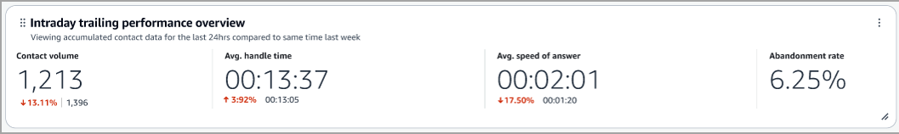
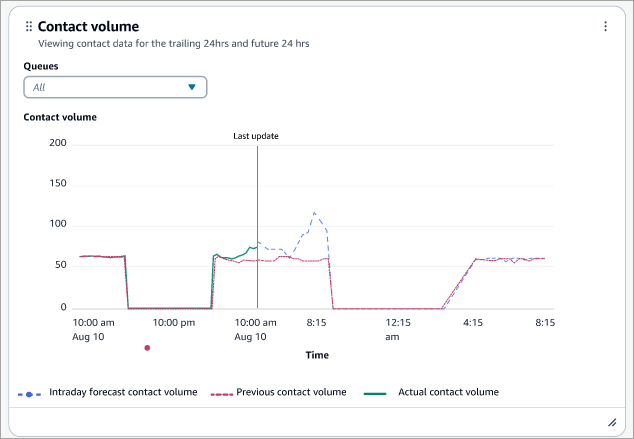
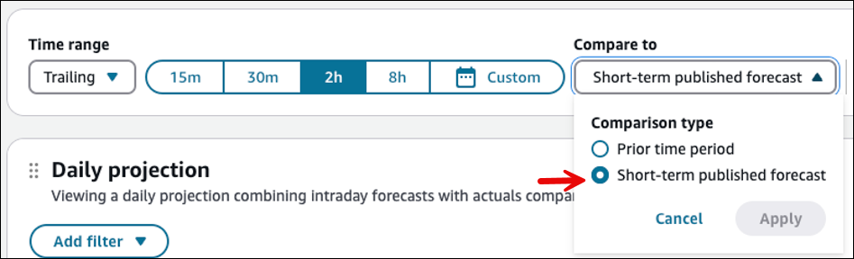
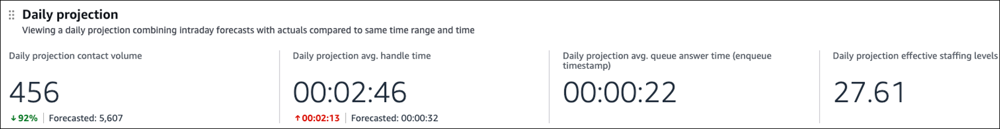

# Intraday forecast performance

dashboard

The Intraday forecast performance dashboard provides forecasts for:

- [Contact volume](metrics-definitions.md#contact-volume "metrics-definitions.md#contact-volume") and [Average handle time](metrics-definitions.md#average-handle-time "metrics-definitions.md#average-handle-time") for
  queues that have a minimum of 2000 unique contacts per week per queue-channel
  for the last 4 weeks. This is evaluated every day for the trailing time period.
- [Average queue answer time](metrics-definitions.md#average-queue-answer-time "metrics-definitions.md#average-queue-answer-time") for queues that have 5000 unique
  contacts per month with the same evaluation timing.

###### Contents

- [Enable
  access to the dashboard](#intraday-forecast-performance-dashboard-enable-access "#intraday-forecast-performance-dashboard-enable-access")
- [Performance
  overview chart](#intraday-forecast-performance-dashboard-performance-overview "#intraday-forecast-performance-dashboard-performance-overview")
- [Comparison trend
  graphs](#intraday-forecast-comparison-trend-graphs "#intraday-forecast-comparison-trend-graphs")
- [Comparison against short
  term forecasts](#intraday-forecast-comparison-shortterm "#intraday-forecast-comparison-shortterm")
- [Daily projection chart](#intraday-forecast-daily-projection "#intraday-forecast-daily-projection")

## Enable

access to the dashboard

Ensure users are assigned the appropriate **Analytics and
Optimization** security profile permissions:

- **Access metrics - Access permission** or the
  **Dashboard - Access permission**. For information
  about the difference in behavior, see [Assign permissions to view dashboards
  and reports in Amazon Connect](dashboard-required-permissions.md "dashboard-required-permissions.md").
- **Forecasting - View**. If you don't see this permission
  on the security profiles page, ask your Administrator to [enable
  forecasting, capacity planning, and scheduling](enable-forecasting-capacity-planning-scheduling.md "enable-forecasting-capacity-planning-scheduling.md") in the AWS
  console.

## Performance

overview chart

The **Intraday trailing performance overview** chart that
provides aggregated metrics based on your filters. Each metric in the chart is
compared to your "compare to" benchmark time range filter.

The following image shows an example **Intraday trailing performance
overview** chart:

This chart shows the following information:

- Contact volume during your time range selection was 1,213.
- This is down ~13% compared to your benchmark number of contacts
  handled.
- The percentages are rounded up or down.
- The colors that appear for the metrics indicate positive (green) or
  negative (red) compared to your benchmark.

## Comparison trend

graphs

The Intraday performance dashboard displays the following three trend graphs,
which cover different metrics:

- [Contact volume](metrics-definitions.md#contact-volume "metrics-definitions.md#contact-volume")
- [Average handle time](metrics-definitions.md#average-handle-time "metrics-definitions.md#average-handle-time")
- [Average speed of answer](metrics-definitions.md#average-queue-answer-time "metrics-definitions.md#average-queue-answer-time")
- [Effective staffing](metrics-definitions.md#effective-staffing "metrics-definitions.md#effective-staffing")

These graphs include the intraday forecast that projects up to 24 hours on a 15
minute interval based on:

- The value of the respective metric.
- The historical actuals from the current day.
- The historical actuals from the same time in the past week.

These trend graphs provide data only for the next 24 hours and the past 24 hours.
There is no option to change the time range.

The following image shows an example of a **Contact volume**
trend graph.

## Comparison against short

term forecasts

You can compare **Average handle time** and **Contact
volume** against published short term forecasts.

To select this option, choose the compare to button and select
**Short-term published forecast**. This automatically picks up
the published short term forecast for the time range selected. You can't select an
unpublished forecast or a specific published forecast.

For historical widgets, it compares against the same time range as the widget,
while for the daily projection widget it compares against the entire day.

This is the new default comparison for this dashboard.

## Daily projection chart

The **Daily projection** chart provides a projection of how the
day will end by combining historical metrics for the day so far with intraday
forecasts for the remainder of the day. This is available for the following metrics:

- [Average handle time](metrics-definitions.md#average-handle-time "metrics-definitions.md#average-handle-time")
- [Average queue answer time](metrics-definitions.md#average-queue-answer-time "metrics-definitions.md#average-queue-answer-time")
- [Contact volume](metrics-definitions.md#contact-volume "metrics-definitions.md#contact-volume")
- [Effective staffing](metrics-definitions.md#effective-staffing "metrics-definitions.md#effective-staffing")

This widget only supports comparing against short term forecasts for
**Contact volume** and **Average handle
time**.

