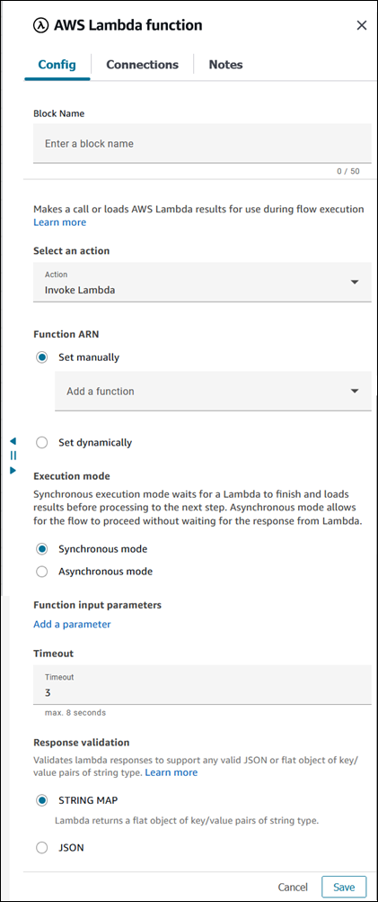
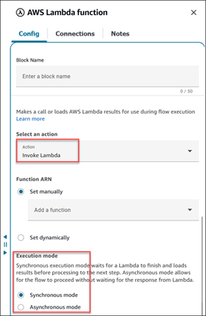
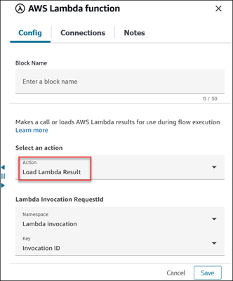
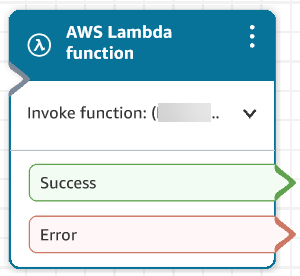

# Flow block in Amazon Connect: AWS Lambda

function

This topic defines the flow block for calling AWS Lambda. The fetched response can be
used in the [Set contact
attributes](set-contact-attributes.md "set-contact-attributes.md") block.

## Description

- Calls AWS Lambda.
- The returned data can be used to set contact attributes in the [Set contact
  attributes](set-contact-attributes.md "set-contact-attributes.md") block.
- For an example, see [Tutorial: Create a Lambda function and invoke in
  a flow](connect-lambda-functions.md#tutorial-invokelambda "connect-lambda-functions.md#tutorial-invokelambda").

## Supported channels

The following table lists how this block routes a contact who is using the
specified channel.

| Channel | Supported? |
| ------- | ---------- |
| Voice   | Yes        |
| Chat    | Yes        |
| Task    | Yes        |
| Email   | Yes        |

## Flow types

You can use this block in the following [flow
types](create-contact-flow.md#contact-flow-types "create-contact-flow.md#contact-flow-types"):

- Inbound flow
- Customer Queue flow
- Customer Hold flow
- Customer Whisper flow
- Agent Hold flow
- Agent Whisper flow
- Transfer to Agent flow
- Transfer to Queue flow

## Properties

The following image shows the **Properties** page of the
**AWS Lambda function** block.

In the **Select an action** box, choose from the following
options:

- [Invoke Lambda](#properties-invoke-lamdba "#properties-invoke-lamdba")
- [Load Lambda result](#properties-load-lamdba "#properties-load-lamdba") (if run
  asynchronously)

### Invoke Lambda

When **Select an action** is set to **Invoke
Lambda**, note the following properties:

- **Execution mode**:
  - **Synchronous**: When Synchronous is
    selected, the contact is routed to the next block only after the
    Lambda invocation completes.
  - **Asynchronous**: The contact is routed to
    the next block without waiting for the Lambda to complete.

  You can configure [Wait](wait.md "wait.md") block to wait for a Lambda that
  is invoked using the asynchronous execution mode.

- **Timeout**: Enter how long to wait for Lambda to time
  out. You can enter maximum of 8 seconds for **Synchronous
  mode** and 60 seconds for **Asynchronous
  mode**.

If your Lambda invocation gets throttled, the request is retried. It is
also retried if a general service failure (500 error) happens.

When a Lambda invocation returns an error, Amazon Connect retries up to three
times, for maximum until timeout specified. At that point, the contact
is routed down the **Error** branch.

- **Response validation**: The Lambda function response
  may be either a STRING_MAP or JSON. You must set it when you configure
  the **AWS Lambda function** block in the flow.
  - When the response validation is set to STRING_MAP, the Lambda
    function returns a flat object of key/value pairs of the string
    type.
  - When the response validation is set to JSON, the Lambda
    function returns any valid JSON including nested JSON.

### Load Lambda Result

When **Select an action** is set to **Load Lambda
Result**, note the following properties:

- **Lambda Invocation RequestId**: This is the requestId
  of the Lambda when it is run in **Asynchronous
  mode**.

`$.LambdaInvocation.InvocationId` contains the requestId of
the most recent asynchronously run Lambda.

When you choose the **Load Lambda Result** action, choose the
following options under **Lambda Invocation RequestId**:

- **Namespace** = **Lambda
  Invocation**
- **Key** = **Invocation ID**

## Configuration tips

- To use an AWS Lambda function in a flow, first add the function to your
  instance. For more information, see [Add a Lambda function to your Amazon Connect
  instance](connect-lambda-functions.md#add-lambda-function "connect-lambda-functions.md#add-lambda-function").
- After you add the function to your instance, you can select the function
  from the **Select a function** drop-down list in the block
  to use it in the flow.

## Configured block

The following image shows an example of what this block looks like when it is
configured. It has two branches: **Success** and
**Error**. It is configured for
**Asynchronous** execution mode. When it's configured for
**Synchronous** execution mode, it has a
**Timeout** branch.

## Sample flows

Amazon Connect includes a set of sample flows. For instructions that explain how to access the sample flows in the flow designer, see
[Sample flows in Amazon Connect](contact-flow-samples.md "contact-flow-samples.md"). Following are topics
that describe the sample flows which include this block.

[Sample Lambda integration flow in
Amazon Connect](sample-lambda-integration.md "sample-lambda-integration.md")

## Scenarios

See these topics for scenarios that use this block:

- [Grant Amazon Connect access to your AWS Lambda
  functions](connect-lambda-functions.md "connect-lambda-functions.md")
