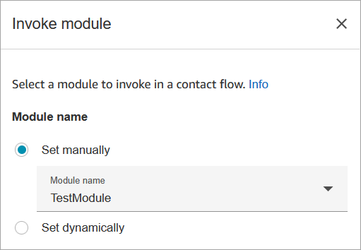
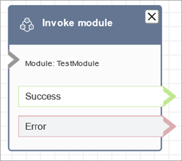

# Flow block in Connect Customer: Invoke a published module

This topic defines the flow block for calling a published module to create reusable
sections in a flow.

## Description

Calls a published module, which you can use to create reusable sections of a contact
flow.

For more information, see [Flow modules for reusable functions in Connect Customer](contact-flow-modules.md "contact-flow-modules.md").

## Supported channels

The following table lists how this block routes a contact who is using the
specified channel.

| Channel | Supported? |
| ------- | ---------- |
| Voice   | Yes        |
| Chat    | Yes        |
| Task    | Yes        |
| Email   | Yes        |

## Flow types

You can use this block across all [flow types](create-contact-flow.md#contact-flow-types "create-contact-flow.md#contact-flow-types"). If your module contains blocks that are not supported by the specific flow type, this incompatibility might cause interruptions in the flow execution.

## Properties

The following image shows the **Properties** page of the
**Invoke module** block.

## Configured block

The following image shows an example of what this block looks like when it is
configured. It has two branches: **Success** and
**Error**.

