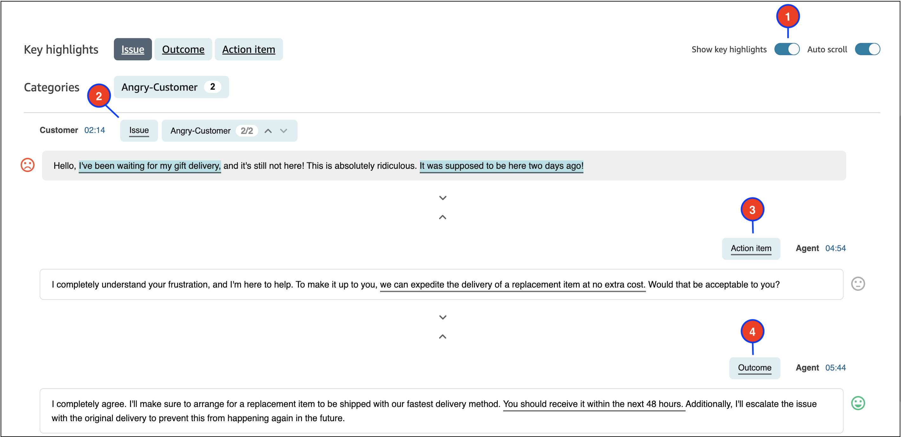

# View key highlights of customer conversations in

the Contact Control Panel (CCP)

It can be time-consuming to review contact transcripts that are hundreds of lines
long. To make this process faster and more efficient, Contact Lens
automatically identifies and labels key parts of customer conversations, then
displays highlights of the conversations. Managers can view those highlights on the
**Contact details** page. Agents can view the highlights in the
Contact Control Panel (CCP).

###### Tip

For a list of supported languages, see the _Key highlights_
column in the [Amazon Connect Contact Lens supported languages](supported-languages.md#supported-languages-contact-lens "supported-languages.md#supported-languages-contact-lens") topic.

After you enable Contact Lens, it identifies key parts of a customer
conversation, assigns labels (such as issue, outcome, or action item) to those
parts, and displays highlights of the customer conversation. You can expand the
highlights to view the full transcript of the contact.

The following example shows the key highlights on the **Contact
details** page.

1. Toggle **Show key highlights** on and off as
   needed.
2. **Issue** represents the contact driver. For example,
   "I'm thinking of upgrading to your online subscription plan."
3. **Action item** represents the action item the agent
   takes. For example, "Please keep an eye out for an email with a price quote.
   I will send it to you shortly."
4. **Outcome** represents the likely conclusion or outcome
   of the contact. For example, "Based on your current plan I would recommend
   our online essentials plan."
   Contacts have only one issue, one outcome, and one action item. It's possible for
   some contacts to not have all three.

###### Note

You see this message **There are no key highlights for this
transcript** when Contact Lens can't identify an issue,
outcome, or action item.

To learn about the agent's experience—what part of the transcript is
displayed in the Contact Control Panel (CCP), and when—see [Design a flow for key
highlights](enable-analytics.md#call-summarization-agent "enable-analytics.md#call-summarization-agent").
