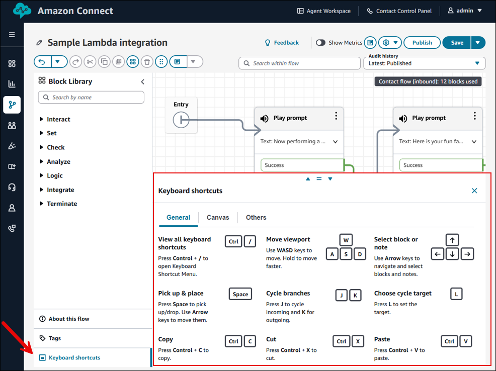
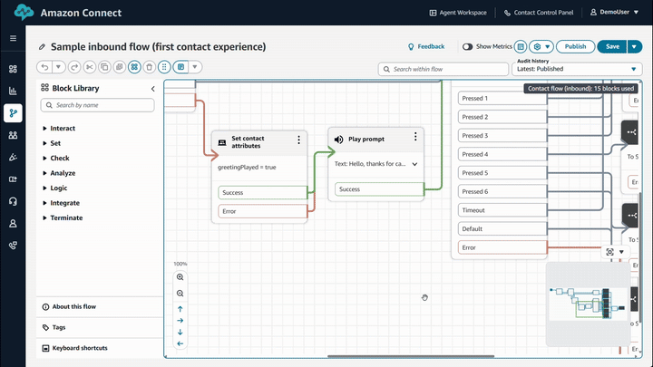
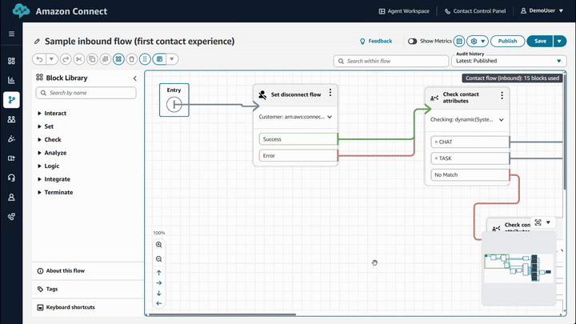
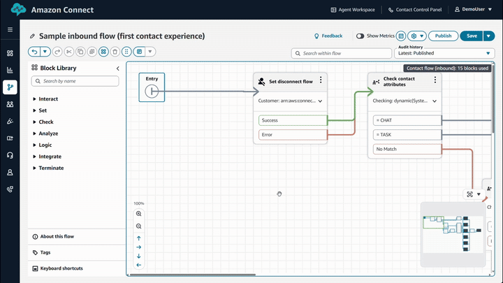
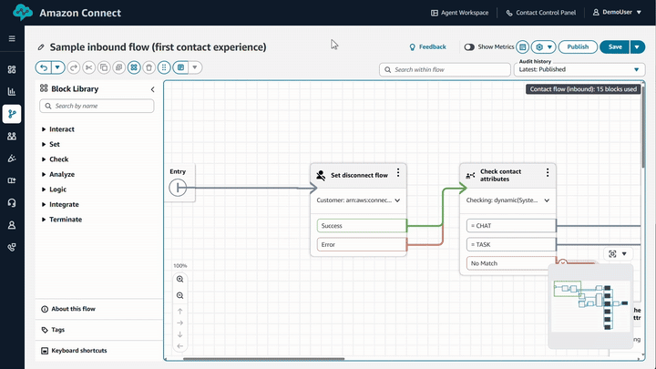
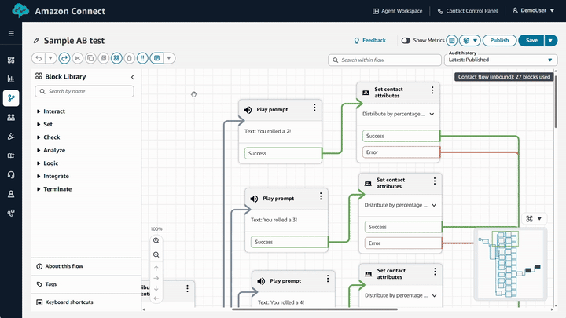
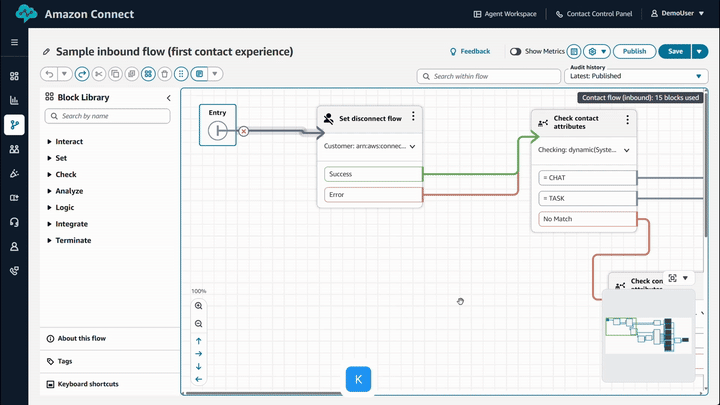
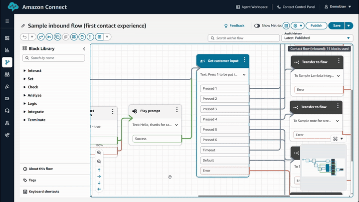
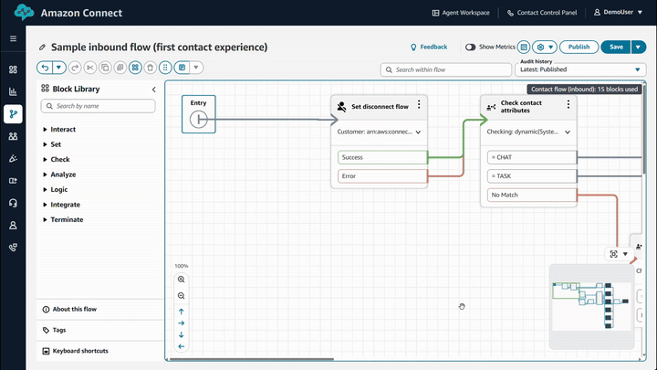
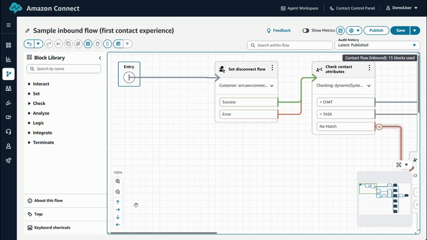

# Keyboard shortcuts for the

Amazon Connect flow designer

The Amazon Connect flow designer includes keyboard shortcuts to
help you use the designer efficiently.

To access the complete list of keyboard shortcuts, press **Ctrl + /** or
choose **Keyboard shortcuts**, as shown in the following image.

The **Keyboard shortcuts** pane displays three tabs:

- **General**. Provides a summary of the most important
  keyboard shortcuts.
- **Canvas**. Lists shortcuts that are active only when
  the cursor is focused on the canvas area.
- **Other**. Includes all remaining keyboard shortcuts
  not covered in the previous tabs.
  The following sections explain how use some of the keyboard shortcuts.

## **Home** key: Go to **Entry** block

Press **Home** to jump to the **Entry** block.

When the canvas is in motion, a blue indicator appears at the center of the viewport
to signify active movement.

The following GIF shows how to use the **Home** keyboard shortcut to jump
to the **Entry** block.

## Move viewport

After pressing the **Home** key, you can use **W**,
**A**, **S**, and **D** to scroll through the
canvas; hold to move faster.

The following GIF shows how to use these keyboard shortcuts to scroll through the flow
designer canvas.

## Select and move item

Use **Arrow keys** to navigate and select.

Press **Space** to pick up/drop, and move with **Arrow
keys**.

The following GIF shows how to use the **Arrow keys** to navigate
through, select, and move blocks on the flow designer canvas.

The following GIF shows pressing **Space** to pick up/drop and move
with **Arrow keys**.

## Auto-Arrange

The Auto-Arrange feature enables blocks to align within a structured, grid-based
layout.

Use **Ctrl + A** to select all blocks, and **Ctrl + Alt +
A** to auto-arrange them.

If **one or more blocks** are selected, **only the selected blocks** are auto-arranged.

This function is also accessible from the toolbar.

The following GIF shows how to use the keyboard shortcut to navigate between blocks on
the flow designer canvas.

## Navigate between blocks

When a block is selected, press **K** to cycle the outgoing branches of a
block, and press **L** to select the cycled target.

This eliminates the need to manually trace the path to a connected block.

The following GIF shows how to use these keyboard shortcuts to navigate between blocks
on the flow designer canvas.

Press **J** to trace the incoming branches to a block, as shown in the
following GIF.

## Sequentially step through all items

After clicking on the canvas, use the **Page Up** and **Page
Down** keys to step through items sequentially, following a row-wise
order.

The following GIF shows how to use these keyboard shortcuts to step through items
sequentially.

## Notes

After pressing the **Home** key, press **N** to create a new
note.

Use **Alt + N** to fold or unfold the selected note.

When a note is selected, press **Enter** to begin editing.

The following GIF shows how to create notes using these keyboard shortcuts.

