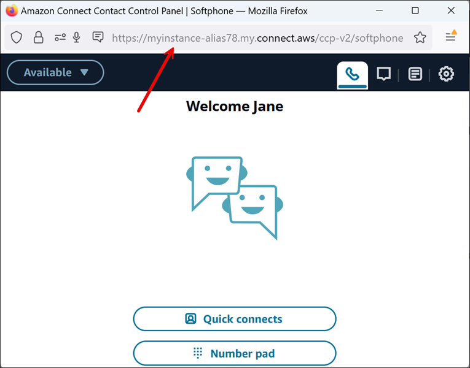

# Launch the Contact Control Panel (CCP) in Amazon Connect

The URL to launch the CCP is:

- https://`instance name`.my.connect.aws/ccp-v2/
  Where `instance name` is provided by your IT department or
  whoever set up Amazon Connect for your business. The following image shows an example URL for the
  CCP.

With this updated CCP, your agents can manage voice, chat, and tasks from this single
interface.

As the administrator, you can also launch the CCP directly from the Amazon Connect console.
Just choose the phone icon in the upper right corner.

To provide agents the ability to launch the CCP from their desktop and start handling
contacts, there are a few things you need to do:

- Add agents as users to the instance. For more information, see [Manage users that you add to Amazon Connect](manage-users.md "manage-users.md").
- Configure permissions for the agents. By default, agents assigned to the Agent
  security profile can access the CCP and make outbound calls. But you can create
  a custom security profile and add additional permissions. For more information,
  see [Security profiles for Amazon Connect and Contact Control
  Panel (CCP) access](connect-security-profiles.md "connect-security-profiles.md").
- Give agents the URL the CCP.
- Provide agents with their user name and password so that they can log in to
  the CCP.
  We recommend telling agents to bookmark the URL to the CCP for more convenient
  access.

Agents can use the CCP with a softphone on their computer, or a desk phone. If they're
using a softphone, they must use Chrome, Edge, or Firefox for their web browser. For
more information, see [Grant microphone access in Chrome, Firefox, or
Edge](amazon-connect-contact-control-panel.md#accessing-microphone "amazon-connect-contact-control-panel.md#accessing-microphone").

###### Note

If you see the **Session expired** message while logging in, you probably just need to
refresh the session token. Go to your identity provider and log in. Refresh the
Amazon Connect page. If you still get this message, contact your IT team.
