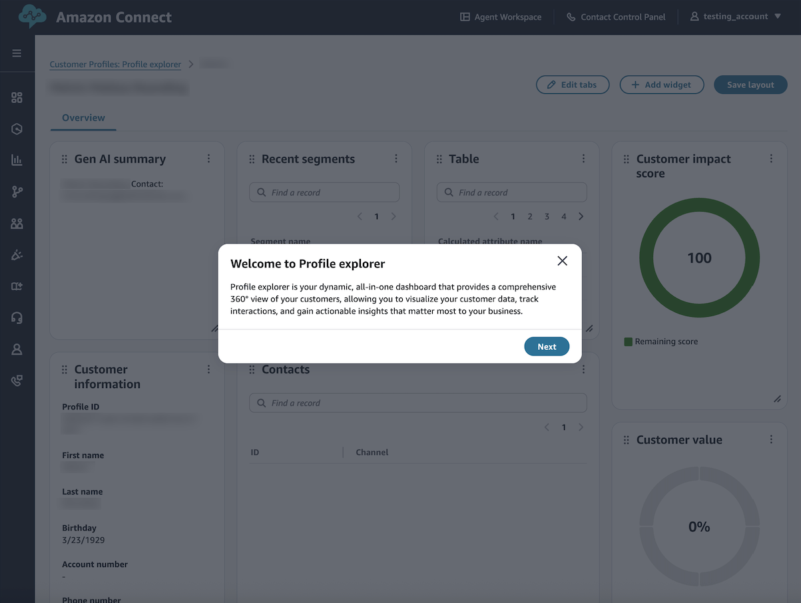
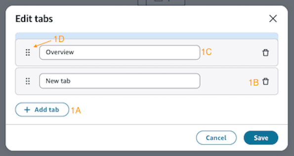
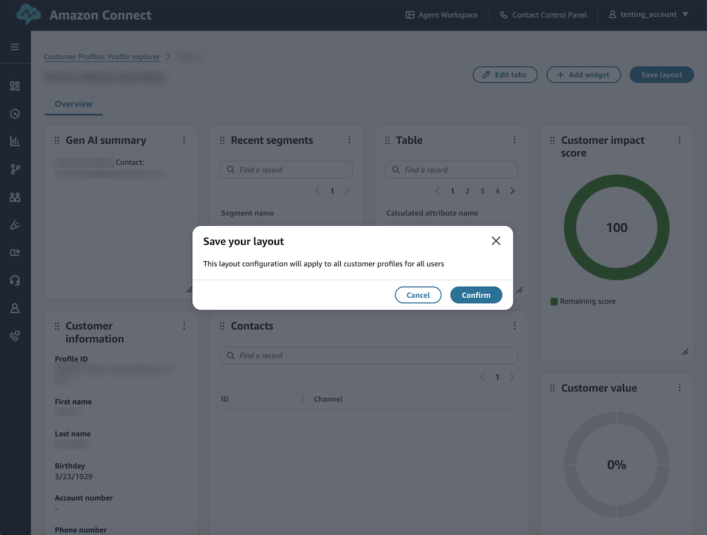

# Layout controls

Profile explorer welcome console.

1. Edit Tabs
2. Add Widgets
3. Layout Actions

## Edit Tabs

Organize your dashboard into logical sections using tab controls:

- **1a. Add Tab**: Create new tabs to
  separate different aspects of customer data
- **1b. Remove Tab**: Delete unnecessary
  tabs from your layout
- **1c. Rename Tab**: Customize tab names
  to reflect their content
- **1d. Reorder Tabs**: Drag and drop tabs
  to arrange them in your preferred order

## Add widgets

Enhance your active tab with various data visualization widgets:

### Available widgets

- Default widgets
  - [Generative AI summary](default-widgets.md#generative-ai-summary "default-widgets.md#generative-ai-summary")
  - [Customer information](default-widgets.md#customer-information "default-widgets.md#customer-information")
  - [Calculated attribute](default-widgets.md#calculated-attribute "default-widgets.md#calculated-attribute")
  - [Contacts](default-widgets.md#contacts "default-widgets.md#contacts")
  - [Cases](default-widgets.md#cases-cp "default-widgets.md#cases-cp")
  - [Orders](default-widgets.md#orders-cp "default-widgets.md#orders-cp")
  - [Assets](default-widgets.md#assets-cp "default-widgets.md#assets-cp")

- Custom widgets
  - [Table](custom-widgets.md#table-widget "custom-widgets.md#table-widget")
  - [Key value pair](custom-widgets.md#key-value-pair "custom-widgets.md#key-value-pair")
  - [Key metric](custom-widgets.md#key-metric "custom-widgets.md#key-metric")
  - [Donut chart](custom-widgets.md#donut-chart "custom-widgets.md#donut-chart")

Simply select a widget you would like to use, and begin exploring

## Layout actions

Manage your overall dashboard configuration:

- **Save Layout**: Preserve your current
  dashboard configuration

###### Note

All changes are in a draft until saved.
