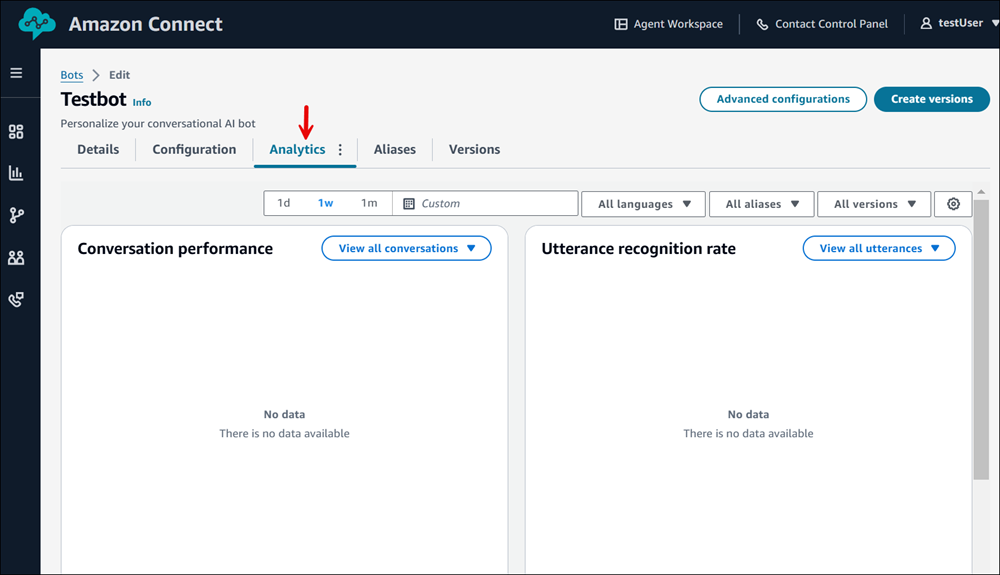
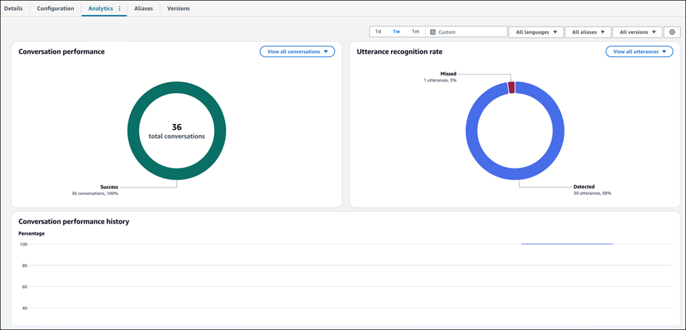

# Evaluate the performance of your conversational AI bot in

Amazon Connect

You can use the comprehensive analytics tools in Amazon Connect to help you evaluate and optimize your
conversational AI bot performance. These insights enable you to identify successful interactions,
pinpoint failure points, and visualize conversation patterns to continuously improve customer
experience.

The analytics dashboard includes key metrics such as Utterance recognition rate and Conversation
performance. These metrics help you understand both the success and failure rates of your bot's
interactions with customers.

###### Note

The Bot Analytics page shows data for conversations triggered only from flows. You can
trigger bots externally using Lex APIs or custom integrations, but data for those
conversations are not reflects on this page.

###### To view analytics for your bot

1. Log in to the Amazon Connect admin website at https://`instance name`.my.connect.aws/. Use an Admin account or an account that has the following permissions in
   its security profile:
   - **Channels and Flows** - **Bots** -
     **View**
   - **Channels and Flows** - **Bots** -
     **Edit**
   - **Analytics and Optimization** - **Historical
     metrics** - **Access**

2. In the left navigation menu, choose **Routing**,
   **Flows**.
3. On the **Flows** page, choose **Bots**, choose the bot
   whose performance you want to evaluate, and then choose
   **Analytics**.

The following image shows sample analytics data.

Use these analytics to identify improvement opportunities, refine your bot's responses, and
enhance the overall customer experience.

For additional metrics and advanced analysis techniques specific to Amazon Lex, see [Monitoring bot
performance in Lex V2](../../../lexv2/latest/dg/monitoring-bot-performance.md "../../../lexv2/latest/dg/monitoring-bot-performance.md").
