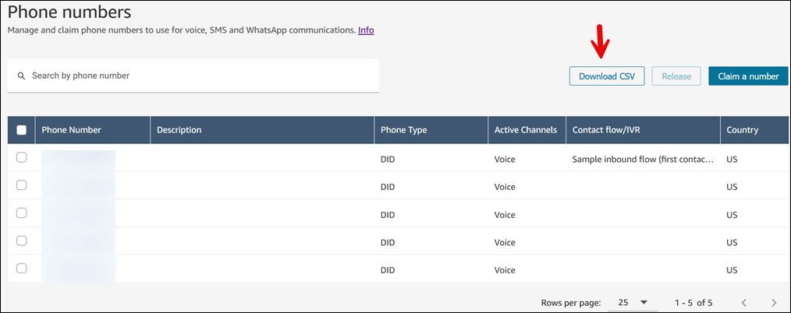

# List or export to a CSV the phone

numbers claimed to your Amazon Connect instance

You can list the phone numbers claimed to your Amazon Connect instance by using the Amazon Connect admin website,
or by using the [ListPhoneNumbersV2](../APIReference/API_ListPhoneNumbersV2.md "../APIReference/API_ListPhoneNumbersV2.md") API.

###### To list phone numbers by using the Amazon Connect admin website

1. Log in to the Amazon Connect admin website at https://`instance name`.my.connect.aws/.
2. On the navigation menu, choose **Channels**,
   **Phone numbers**.

The list of phone numbers claimed to your Amazon Connect instance is displayed.

###### To download phone numbers to a CSV file

1. Log in to the Amazon Connect admin website at https://`instance name`.my.connect.aws/.
2. On the navigation menu, choose **Channels**,
   **Phone numbers**, **Download
   CSV**.
   - ALL of the phone numbers listed on that page are downloaded to the
     CSV file, regardless of which ones are selected.
   - It does not download all of the phone numbers claimed by your
     Amazon Connect instance.
   - To download numbers listed on a page 2 of results, you need to
     paginate to page 2 and then choose **Download CSV**
     again.

